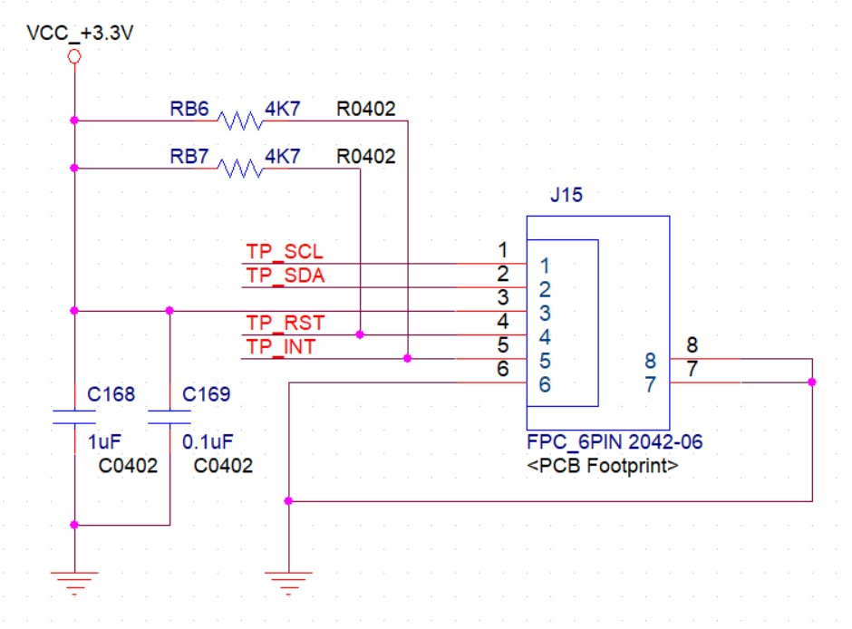

[toc]

---

# 华山派开发板电路设计介绍

## 一、开发板平台介绍

### 1.1 开发板平台简介

华山派开发板是一款针对CV1812H多媒体处理芯片的功能评估板。可用于开发CV1812H强大外设接口，同时也提供了基于CV1812H的硬件参考设计，客户可基于开发板电路快速完成产品的硬件设计。

### 1.2 系统框图

### 1.3 功能概述

开发板包含的功能如下：

​	内置DDR3L，总容量 2Gb

​	支持EMMC和FLASH启动，可根据需求选择存储方式

​	支持外部TF卡

​	支持USB HOST接口，可作为程序调试和下载端口连接电脑

​	支持4路USB 2.0接口，可连接外设

​	支持HDMI接口

​	支持MIPI 屏幕接口

​	支持单目/双目MIPI sensor接口

​	支持Audio out，喇叭规格8Ω/1W或者耳机输出

​	支持Audio in，使用驻极体MIC

​	支持百兆网口

​	支持RISC-V JTAG调试

​	支持WIFI/BT模组

​	支持扩展GPIO，可进行SPI、UART、IIC等通信

​	支持Debug Uart调试

​	支持USB TYPE C接口供电

 

功能模块布局如下：

### 1.4 电源框图

### 1.5  外设IIC地址

|      | 设备Device          | 地址Address |
| ---- | ------------------- | ----------- |
| IIC2 | Sensor   0-GC2053   | 0x37        |
| IIC2 | Sensor  1-GC2093    | 0x7e        |
| IIC3 | TP  Driver IC-GT911 | 0x70        |
| IIC4 | LT9611              | 0x3B        |

## 二、开发板各模块电路

### 2.1 电源输入

开发板供电输入电源为5V，通过TYPC接口输入。5V电源经过BUCK芯片降压为VCC_3.3V、VCC_1.8V等各路电压，供给外设使用。

### 2.2 存储器：EMMC/FLASH

开发板支持EMMC和FLASH两种存储方式，电路图如下：

 

EMMC/FLASH连接到CPU端的接口定义如下：

 

| *SOC-Pin* | *PinName* | *Default Function* |
| --------- | --------- | ------------------ |
| P4        | EMMC_RSTN | EMMC_RSTN          |
| P3        | EMMC_DAT2 | SPINOR_HOLD_X      |
| R4        | EMMC_CLK  | SPINOR_SCK         |
| P2        | EMMC_DAT0 | SPINOR_MOSI        |
| P1        | EMMC_DAT3 | SPINOR_WP_X        |
| R3        | EMMC_CMD  | SPINOR_MISO        |
| R2        | EMMC_DAT1 | SPINOR_CS_X        |

上电前做如下确认：

EMMC启动：R76、R78、R73、R74、R83、R84、R85上件,

​       				R71、R75、R72、R77、R79、R80需要NC；

FLASH启动：R76、R78、R73、R74、R83、R84、R85需要NC,

​       				R71、R75、R72、R77、R79、R80上件；

### 2.3 Debug UART 使用

开发板已留出串口座子，可通过杜邦线连接到串口板:

连接串口板时需要注意：

1、电脑端正确识别到串口板，串口通信软件连接到串口板的COM口；

2、CPU的串口通信的电平为3.3V，串口板也需要是3.3V；

3、开发板的TX连接串口板的RX，开发板的RX连接串口板的TX；

4、连接串口板后设置串口波特率为115200，开发板上电，会输出打印信息。

### 2.4 基本外设

开发板预留了40Pin的外设接口：

开发板的丝印已标出排针座子的Pin定义接口定义如下：

Pin定义如下：

| 编号 | Pin脚定义         | 对应SOC GPIO | 编号 | Pin脚定义         | 对应SOC GPIO |
| ---- | ----------------- | ------------ | ---- | ----------------- | ------------ |
| 1    | VDD_+3.3V         |              | 2    | 5V_IN             |              |
| 3    | IIC3_SDA          | GPIOB[20]    | 4    | 5V_IN             |              |
| 5    | IIC3_SCL          | GPIOB[21]    | 6    | GND               |              |
| 7    | GPIOB22           | GPIOB[22]    | 8    | UART1_TX/JTAG_TDI | GPIOA[28]    |
| 9    | GND               |              | 10   | UART1_RX/JTAG_TDO | GPIOA[29]    |
| 11   | PWR_GPIO3         | PWR_GPIO[3]  | 12   | PWM2              | GPIOB[19]    |
| 13   | PWR_GPIO5         | PWR_GPIO[5]  | 14   | GND               |              |
| 15   | PWR_GPIO15        | PWR_GPIO[15] | 16   | PWR_GPIO16        | PWR_GPIO[16] |
| 17   | VDD_+3.3V         |              | 18   | XGPIOB5           | GPIOB[5]     |
| 19   | SPI2_MOSI         | PWR_GPIO[22] | 20   | GND               |              |
| 21   | SPI2_MISO         | PWR_GPIO[21] | 22   | PWR_GPIO14        | PWR_GPIO[14] |
| 23   | SPI2_SCK          | PWR_GPIO[23] | 24   | SPI2_CS           | PWR_GPIO[18] |
| 25   | GND               |              | 26   | SPI3_CS           | GPIOB[16]    |
| 27   | IIC3_SDA          | GPIOB[20]    | 28   | IIC3_SCL          | GPIOB[21]    |
| 29   | GPIOA20/JTAG_TRST | GPIOA[20]    | 30   | GND               |              |
| 31   | NC                |              | 32   | PWM6/JTAG_TCK     | GPIOA[18]    |
| 33   | PWM7/JTAG_TMS     | GPIOA[19]    | 34   | GND               |              |
| 35   | SPI3_MISO         | GPIOB[14]    | 36   | PWR_GPIO17        | PWR_GPIO[17] |
| 37   | PWR_GPIO1         | PWR_GPIO[1]  | 38   | SPI3_MOSI         | GPIOB[13]    |
| 39   | GND               |              | 40   | SPI3_SCK          | GPIOB[15]    |

由于SPI2接口与WIFI模组的SDIO接口共用，电路图如下：

使用前做如下确认：

调试WIFI模组：R7、R9、R11、R19、R21、R23上件，R24、R25、R26、R27需要NC；

调试SPI2接口：R7、R19、R21、R23需要NC，R24、R25、R26、R27上件；

 

由于JTAG调试与TP接口有共用GPIO，电路图如下：

使用前做如下确认：

JTAG调试：R1305上件，R87需要NC；

TP调试：R1305需要NC，R87上件；

### 2.5 JTAG 调试 

JTAG接口的标准电路图如下：

 

实际调试时，JTAG_TDI、JTAD_TDO、JTAG_TRST、JTAG_TMS、GND正常连接即可；

使用前做如下确认：

JTAG调试：R90上件，R172 NC时，连接到J6的Pin33；

​					R89上件，R173 NC时，连接到J6的Pin32；

TP调试： R90 NC，R172上件时，连接到TP的INT引脚；

​    			 R89 NC，R173上件时，连接到TP的RST引脚；

 

### 2.6 MIPI 屏幕显示

   开发板屏幕的接口位置如下：

​    连接时需要注意屏幕的Pin1脚与开发板上座子的Pin1脚一致，金手指与连接器接触到位：

屏幕驱动涉及到LCD_PWM、LCD_RST、MIPI_TX引脚，电路图如下：

​    

​	LCD_PWM对应SOC的PWR_GPIO[0]；

​    LCD_RST对应SOC的PWR_GPIO[2]；

​	MIPI_TX信号与LT9611共用，使用前需要确认：

​	MIPI显示：R175、R178、R180、R181、R184、R185、R186、R187、R188、R189上件；R191、R194、						R196、R197、R198、R200、R201、R202、R203、R204需要NC；   

HDMI显示：R175、R178、R180、R181、R184、R185、R186、R187、R188、R189需要NC；R191、R194、					  R196、R197、R198、R200、R201、R202、R203、R204上件；   

## 1.7    HDMI显示

开发板使用LT9611将MIPI信号转为HDMI信号输出，通过IIC4完成LT9611的初始化，外挂的FLASH IC默认空贴；

LT9611的复位信号由SOC的PWR_GPIO[7]控制，MIPI_TX与MIPI屏幕共用；

## 1.8    WIFI/BT模组

开发板使用的是WIFI和BT二合一模组，型号BL-M8821CS，位置如下：

与SOC分别通过SDIO和UART通信，模组的CHIP_EN信号由SOC的GPIOA[30]控制；

模组的SDIO信号与SPI2信号共用，电路图如下：

 

使用前做如下确认：

调试WIFI模组：R7、R9、R11、R19、R21、R23上件，R24、R25、R26、R27需要NC；

调试SPI2接口：R7、R19、R21、R23需要NC，R24、R25、R26、R27上件；

BT的UART信号与SOC的UART2连接：

## 1.9    Sensor接口

开发板支持单目/双目sensor输入，由于共用一组MIPI_RX信号，单目/双目sensor不能同时连接，单目/双目座子位置如下：

  

Sensor座子定义如下：

与SOC的GPIO对应关系：

| 编号 | Pin脚定义   | 对应SOC GPIO |
| ---- | ----------- | ------------ |
| 23   | IR_I2C2_SDA | PWR_GPIO[13] |
| 24   | IR_I2C2_SCL | PWR_GPIO[12] |
| 25   | CAM_PWDN0   | GPIOA[1]     |
| 26   | CAM_PWDN1   | GPIOA[4]     |
| 27   | RGB_RST0    | GPIOA[2]     |
| 28   | IR_RST1     | GPIOB[6]     |
| 29   | RGB_MCLK0   | GPIOA[0]     |
| 31   | IR_MCLK1    | GPIOA[3]     |

 

连接时注意排线方向，并核对Pin1标识是否正确；

## 1.10  TP接口

 TP座子位置如下：

     

座子定义如下：

​    

 与SOC Pin脚的对应关系：

| 编号 | Pin脚定义  | 对应SOC GPIO |
| ---- | ---------- | ------------ |
| 1    | TP_IIC_SCL | GPIOB[21]    |
| 2    | TP_IIC_SDA | GPIOB[20]    |
| 3    | VCC_+3.3V  |              |
| 4    | TP_RST     | GPIOA[18]    |
| 5    | TP_INT     | GPIOA[19]    |
| 6    | GND        |              |

TP定义与JTAG接口共用信号，使用前做如下确认：

JTAG调试：R1305上件，R87需要NC；

TP调试：R1305需要NC，R87上件；

连接时注意排线方向，并核对Pin1标识是否正确；

## 1.11  USB接口

开发板留有Micro USB座子，可用于SOC的烧录和升级。

 开发板同时留有2个双口USB 座子，可以连接鼠标、U盘等外设，当Micro USB连接电脑时，双口USB座子不能使用；

## 1.12  RTC

开发板有RTC计时功能，整板断电后RTC仍可以正常计时，调试前需要确认纽扣电池是否焊接，电池位置如下：

 

## 1.13  Audio调试

开发板留有3.5mm耳机座子和喇叭（8Ω/1W）座子，两个座子不能同时使用，座子位置如下：

功放的SPK_EN脚由SOC的GPIOA[15]控制，拉低时无声音输出；

## 1.14  复位按键

开发板留有复位按键，短按重启，位置如下：

 

