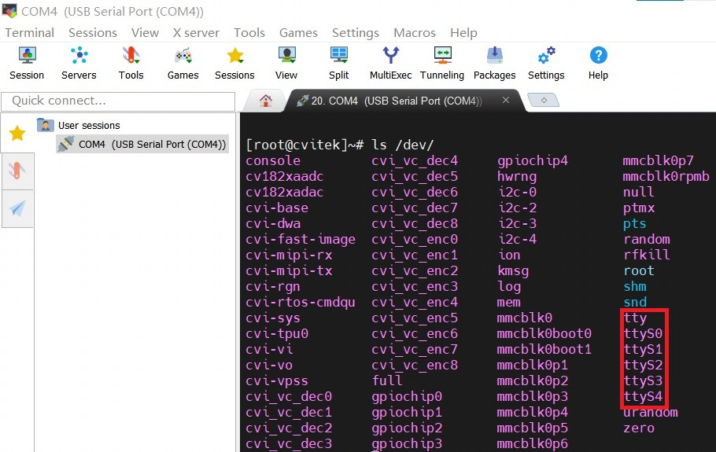
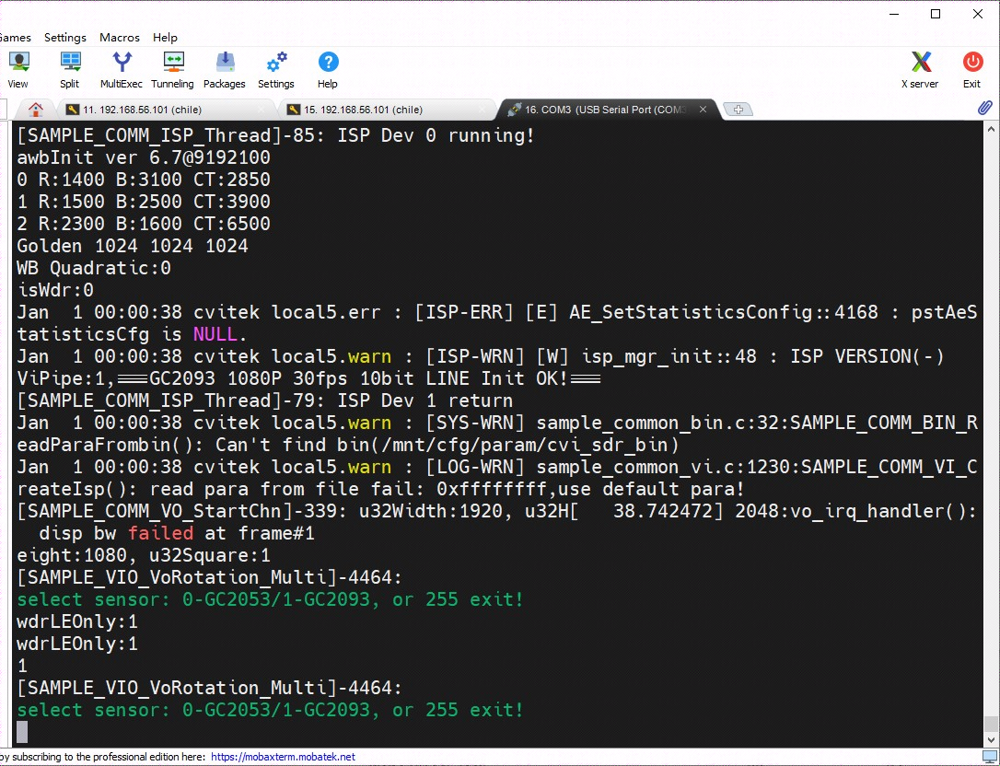
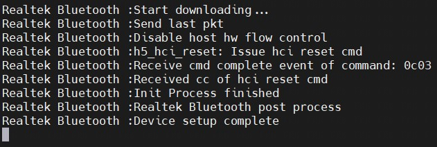
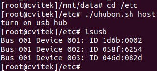
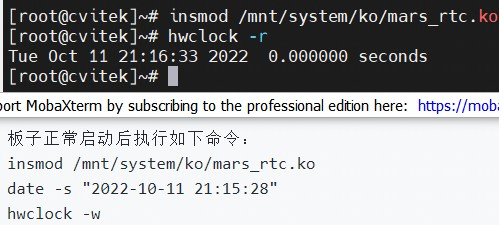
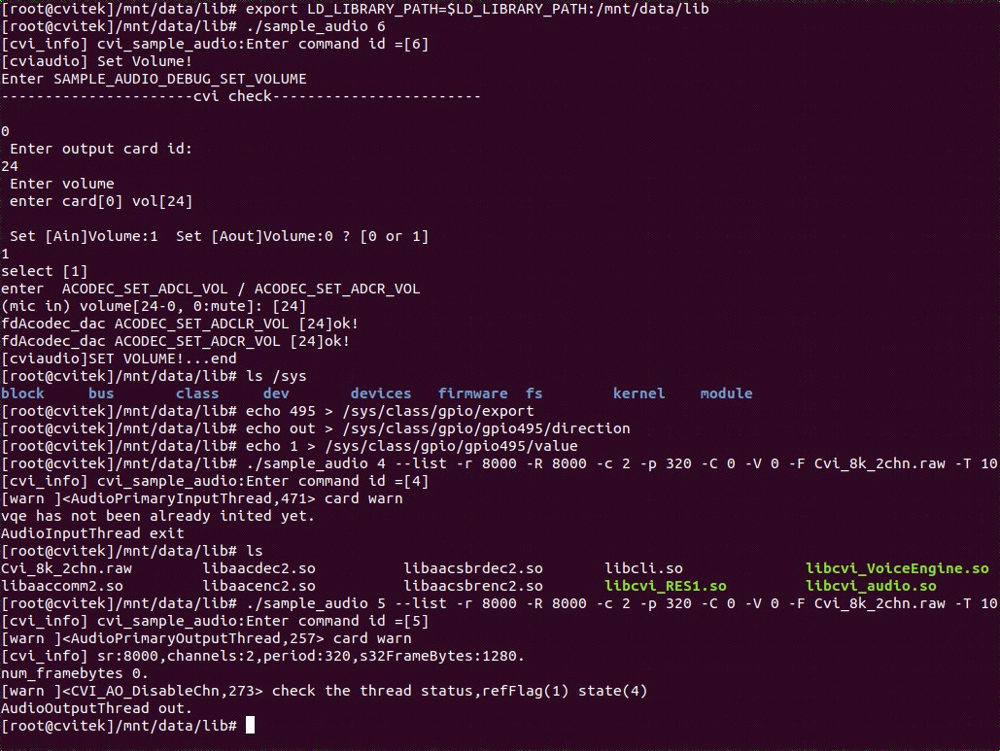

[toc]


---
<div STYLE="page-break-after: always;"></div>

> note：使用前请确保配置好相关环境，未配置见《软件安装编译环境搭建》


## 1、基本外设验证

### 1.1 GPIO外设实验

**<font size=3>实验硬件资源</font>**

	可在开发板双排针J5中进行实验，其对应的GPIO口有GPIOB22，GPIOA20等。

| PinName | PinN | PinN | PinName |
| --- | --- | --- | --- |
|			|1	|2|	|
|IIC_SDA	|3	|4|	|
|IIC_SCL	|5	|6|	|
|GPIOB22	|7	|8|	UART1_TX/JTAG_TDI|
|			|9	|10|	UART1_RX/JTAG_TDO|
|PWR_BGPIO3	|11	|12|	PWM2|
|PWR_BGPIO5	|13	|14|	|
|PWR_BGPIO15|15	|16|	PWR_BGPIO16|
|			|17	|18|	XBGPIO85|
|SPI2_MOSI	|19	|20|	|
|SPI2_MISO	|21	|22|	PWR_BGPIO14|
|SPI2_SCK	|23	|24|	SPI2_CS|
|			|25	|26|	SPI3_CS|
|IIC3_SDA	|27	|28|	IIC3_SCL|
|GPIOA20/JTAG_TRST	|29	|30|	|
|			|31	|32|	PWM6/JTAG_TCK|
|PWM7/JTAG_TMS	|33	|34|	|
|SPI3_MISO	|35	|36|	PWR_BGPIO17|
|PWR_BGPIO1	|37	|38|	SPI3_MOSI|
|			|39	|40|	SPI3_SCK|

<div STYLE="page-break-after: always;"></div>

**<font size=3>GPIO的操作准备如下：</font>**

**<font size=3>操作过程</font>**

​    加载内核。默认GPIO相关模块已全部编入内核，不需要再执行加载命令。
​    在控制台下运行GPIO读写命令或者自行在内核态或者用户态编写GPIO读写程序，就可以对GPIO进行输入输出操作。

**<font size=3>GPIO操作命令示例：</font>**

**步骤1: 在控制台使用echo命令,         指定待操作的GPIO编号N：**

   ```
echo N > /sys/class/gpio/export
N为待操作的GPIO编号，GPIO编号 = GPIO组号值 + 偏移值.
GPIO0、1、2、3对应表中GPIOA、B、C、D
以原理图中GPIO1_2管脚为例,  GPIO1对应GPIO组号值448, 偏移值为2.
因此GPIO编号N为448 + 2 = 450

组号值对应如下:
GPIO0 对应linux组号值为 480
GPIO1 对应linux组号值为 448
GPIO2 对应linux组号值为 416
GPIO3 对应linux组号值为 404
PWR_GPIO 对应linux组号值为 381

echo N > /sys/class/gpio/export 之后, 生成/sys/class/gpio/gpioN目录
   ```
**步骤2: 在控制台使用echo命令设置GPIO方向：**
    设置为输入：echo in > /sys/class/gpio/gpioN/direction
    设置为输出：echo out > /sys/class/gpio/gpioN/direction
    

    例: 设置GPIO1_2 (即编号450)方向为输入：
    echo in > /sys/class/gpio/gpio450/direction
    
    设置GPIO1_2 (即编号450)方向为输出：
    echo out > /sys/class/gpio/gpio450/direction

**步骤3: 在控制台使用cat命令查看GPIO输入值, 或使用echo命令设置GPIO输出值：**

    查看输入值: cat /sys/class/gpio/gpioN/value
    或
    输出低：echo 0 > /sys/class/gpio/gpioN/value
    输出高：echo 1 > /sys/class/gpio/gpioN/value

**步骤4: 使用完毕后, 在控制台使用echo命令释放资源：**

   ```
echo N > /sys/class/gpio/unexport
   ```

<div STYLE="page-break-after: always;"></div>

###  1.2,  UART操作指南

**<font size=3>UART的操作准备如下：</font>**

**<font size=3>实验硬件资源</font>**

​    对应1.1章节所列J5中的UART1_TX，UART1_RX

**<font size=3>操作过程</font>**

​    加载内核。默认UART相关模块已全部编入内核，不需要再执行加载命令。

**<font size=3>操作示例</font>**

​    开发板烧录固件后通过串口线连接电脑，有正常打印则代表串口正常工作。
​    在控制台下运行命令：ls /dev/ 可查看对应的UART列表有如：ttyS0, ttyS1,...,ttyS4
​    更多串口编程操作可查找网络资料。


> 输出如下：




### 1.3,  显示屏操作指南

**<font size=3>显示屏操作准备如下</font>**

​    模块编译：源码路径为sophpi-huashan/cvi_media_sdk/middleware/v2/sample/mipi_tx/
​    编译成功后会生成可执行文件sample_dsi,将其拷贝至SD卡后，并在板端进行进行验证。

<div STYLE="page-break-after: always;"></div>

**<font size=3>实验硬件资源准备</font>**

​    实验前需要通过LCD接口（对应开发板J16）连接开发板至屏幕HX8394。

**<font size=3>操作示例</font>**

    #挂载sd卡
    mount /dev/mmcblk1p1 /mnt/sd
    cp /mnt/sd/sample_dsi /mnt/data/
    
    在控制台中依次执行下面命令： 
    ./sample_dsi
     devmem 0x0a088000 32 0xC0  
     devmem 0x0a088094 32 0x0701000a
     其中第二条命令表示通过设置寄存器开启图像输出
     第三条命令表示通过设置寄存器打开ColorBar
**<font size=3>实验效果</font>**

> LCD屏幕上有显示彩条


<div STYLE="page-break-after: always;"></div>

### 1.4,  HDMI及双摄显示操作指南


**<font size=3>实验硬件资源准备</font>**

​    1，HDMI线连接带有HDMI接口的高清屏幕。
​    2，FPC线连接开发板J13至双路Sensor模组GC2053+GC2093。

**<font size=3>HDMI显示操作准备如下</font>**

​    模块编译：源码路径分别为
​    `sophpi-huashan/cvi_media_sdk/middleware/v2/sample/display_test/`
​    `sophpi-huashan/cvi_media_sdk/middleware/v2/sample/vio/`
​    编译成功后会在上面两个路径生成可执行文件`lt9611_test和sample_vio`
​	sensor配置文件在`sophpi-huashan/cvi_media_sdk/middleware/v2/sample/sensor_cfg`目录下,并将`sensor_cfg.ini.gc2053+gc2093`重命名为`sensor_cfg.ini`
​    将三个文件拷贝至SD卡后，并在板端进行进行验证。
​    板子通过HDMI接屏幕，且双路sensor模组GC2053+GC2093连接开发板并上电。

**<font size=3>操作示例</font>**   

​    在控制台中依次执行下面命令
​    

    #挂载sd卡
    mount /dev/mmcblk1p1 /mnt/sd
    
    在挂载SD卡，并进入/mnt/sd目录后依次执行下面命令
    cp sensor_cfg.ini lt9611_test sample_vio /mnt/data
    ./lt9611_test
    ./sample_vio 19 
    1 //切换到GC2093进行显示
    0 //切换到GC2053进行显示
<div STYLE="page-break-after: always;"></div>

**<font size=3>实验效果</font>** 
    HDMI屏幕上能切换显示GC2053及GC2093图像

> 屏幕显示输出如下


<div STYLE="page-break-after: always;"></div>

> 终端输出如下




### 1.5,  WIFI初始化

**<font size=3>WIFI初始化准备如下：</font>**
    模块编译：源码路径为 osdrv/extdrv/wireless/realtek/rtl8821cs/
    编译成功后会生成8821cs.ko，其默认会包含在固件当中不需要单独通过SD拷贝到板子端。
**<font size=3>操作示例</font>**
    在板端依次执行下面命令
    insmod /mnt/system/ko/3rd/8821cs.ko
    ifconfig -a
**<font size=3>实验效果</font>**
    串口打印会显示WIFI对应的网络接口

```sh
wlan0     Link encap:Ethernet  HWaddr       48:98:CA:BC:1C:C6
BROADCAST MULTICAST  MTU:1500  Metric:1
RX packets:0 errors:0 dropped:0 overruns:0 frame:0
TX packets:0 errors:0 dropped:0 overruns:0 carrier:0
collisions:0 txqueuelen:1000
RX bytes:0 (0.0 B)  TX bytes:0 (0.0 B)
```

<div STYLE="page-break-after: always;"></div>

### 1.6,  蓝牙验证

**<font size=3>蓝牙实验准备如下：</font>**    

​    在编译SDK后，会生成实验所其依赖的文件及路径为:
​    sophpi-huashan/cvi_media_sdk/middleware/v2/sample/rtk_hciattach/rtk_hciattach
​    将rtk_hciattach拷贝至SD卡后，接入板子上电进行验证

**<font size=3>操作示例</font>**

​    开发板挂载SD卡并进入SD卡目录后，执行下面命令：
​    ./rtk_hciattach -n -s 115200 ttyS2 rtk_h5 

**<font size=3>实验效果</font>** 

​    串口如看到下面打印信息则代表蓝牙固件下载成功，完成正常初始化
```
	Realtek Bluetooth :Start downloading...
	Realtek Bluetooth :Send last pkt
	Realtek Bluetooth :Disable host hw flow control
	Realtek Bluetooth :h5_hci_reset: Issue hci reset cmd
	Realtek Bluetooth :Receive cmd complete event of command: 0c03
	Realtek Bluetooth :Received cc of hci reset cmd
	Realtek Bluetooth :Init Process finished
	Realtek Bluetooth :Realtek Bluetooth post process
	Realtek Bluetooth :Device setup complete
```


> 终端输出如下




### 1.7,  触摸屏实验

**<font size=3>触摸屏实验准备如下：</font>** 

​    编译过源码后，执行文件在以下路径:
​    sophpi-huashan/cvi_media_sdk/middleware/v2/sample/tp/tp

    将可执行文件tp拷贝至SD卡后，接入板子上电进行验证
<div STYLE="page-break-after: always;"></div>

**<font size=3>操作示例及结果</font>** 

​    开发板挂载SD卡并进入SD卡目录后，执行下面命令
​    insmod /mnt/system/ko/3rd/gt9xx.ko
​    ./tp test


> 终端输出如下

```sh
[root@cvitek]/mnt/data/touchpad# ./tp test
pls input panel resolution (ex: 1280 720):
1280 720															# （输入值）输入分辨率
Set screen resolution to WxH(1280x720)
0																	# （输入值）选择操作节点
pls input operate node id[0/1/2] :  0: tp_event_0 init
 1: tp_0 postion get looping
pls input operate case from[0~1]:
0																	# （输入值）触摸初始化
operate tp node :/dev/input/event0.
 0: tp_event_0 init
 1: tp_0 postion get looping
pls input operate case from[0~1]:
1																	# （输入值）操作类型
 0: tp_event_0 init
 1: tp_0 postion get looping
pls input operate case from[0~1]:
event info, type:1, code:14a, tp_event.value:1
default type:1,code:14a,tp_event.value:1
tp_X_y(0,0) after mapping(-5,-20)
event info, type:3, code:35, tp_event.value:279
X type:3,code:35,tp_event.value:279
tp_X_y(279,0) after mapping(274,-20)
event info, type:3, code:36, tp_event.value:697
Y type:3,code:36,tp_event.value:697
tp_X_y(279,697) after mapping(274,677)								# mapping(x,y)触摸点坐标值

```


<div STYLE="page-break-after: always;"></div>

### 1.8, USB HUB实验

**<font size=3>USB HUB实验准备如下：</font>**

​    此实验对应的文件uhubon.sh默认会编译进固件当中，板子正常启动后即可验证

**<font size=3>操作示例</font>** 

> 下面需要改动：echo host >  /proc/cviusb/otg_role

    板子正常启动后执行如下命令：
    cd /etc
    ./uhubon.sh host
    lsusb
**<font size=3>实验效果</font>**

​    串口如看到下面打印信息则代表USB HUB完成正常初始化
​    `Bus 001 Device 001: ID 1d6b:0002`
​    `Bus 001 Device 002: ID 058f:6254`

> 终端输出如下




### 1.9,  RTC实验

**<font size=3>RTC实验准备如下：</font>**

​    此实验所其依赖的文件会以模块的形式存储在固件当中，在板端如下路径可查阅：
​    `/mnt/system/ko/mars_rtc.ko`

**<font size=3>操作示例</font>**

```shell
板子正常启动后执行如下命令：    
insmod /mnt/system/ko/mars_rtc.ko  			# 加载模块
date -s "2022-10-11 21:15:28"				
hwclock -w
断电等待指定时间后上电，并执行如下命令：
insmod /mnt/system/ko/mars_rtc.ko
hwclock -r 

```

<div STYLE="page-break-after: always;"></div>

**<font size=3>实验效果</font>**

​    硬件时钟时间有自动续上

> 终端输出如下




### 1.10,  AUDIO实验：声音的录制与回放

**<font size=3>AUDIO实验准备如下：</font>**

​    在编译SDK后，会生成实验所其依赖的文件及路径为:
​    middleware/v2/sample/audio/sample_audio
​    middleware/v2/lib/3rd/libcli.so
​    以及middleware/v2/lib/目录下的如下库文件：

```sh
libaaccomm2.so
libcvi_vqe.so
libaacdec2.so
libcvi_RES1.so 
libsys.so
libaacenc2.so
libcvi_VoiceEngine.so
libtinyalsa.so
libaacsbrdec2.so
libcvi_audio.so
libaacsbrenc2.so
libcvi_ssp.so
```
​    将此依赖和测试程序sample_audio拷贝至SD卡
**<font size=3>实验硬件连线</font>**

​    硬件板子连接J12至MIC，J11至喇叭   

<div STYLE="page-break-after: always;"></div>

**<font size=3>操作示例</font>**

**步骤1：板端测试环境准备**

​	挂载SD卡

````
mount /dev/mmcblk1p1 /mnt/sd
````

​    在挂载SD卡后按如下步骤准备测试环境
​    a), 在`/mnt/data`目录下新建目录`lib`
​    b), 将上述音频库文件拷贝至`/mnt/data/lib`
​    c), 申明库文件引用路径

    export LD_LIBRARY_PATH=$LD_LIBRARY_PATH:/mnt/data/lib

 **步骤2：设置音频音量**

​	运行测试程序sample_audio设置音量值为24（可自由配置）：

```
 cd /mnt/sd
 ./sample_audio 6
    0  						# card id
    24 						# volume 
    1  						# Select Ain
```

**步骤3：确认是否使能speak**
	开发板默认关闭speak，若想开启，需拉高相关gpio(具体详情请询问FAE人员)
	例：此专案cv1812h 的SPK_EN为495，则通过输入以下命令

```
echo 495 > /sys/class/gpio/export
echo out > /sys/class/gpio/gpio495/direction
echo 1 > /sys/class/gpio/gpio495/value
```

**步骤4：确认录音正常**
    [录音正常测试]：

```
sample_audio 4   
```
输入命令
```
./sample_audio 4 --list -r 8000 -R 8000 -c 2 -p 320 -C 0 -V 0 -F Cvi_8k_2chn.raw -T 10
# 预设录音秒数:10，然后对着mic朗读一段文字或播放一段音乐。
# 产出Cvi_8k_2chn.raw 档案.
```

<div STYLE="page-break-after: always;"></div>

 **步骤5：确认播放正常** 
 	[播放正常测试]：

```
sample_audio 5
```
	 输入命令：
```
    ./sample_audio 5 --list -r 8000 -R 8000 -c 2 -p 320 -C 0 -V 0 -F Cvi_8k_2chn.raw -T 10
```

**<font size=3>实验效果</font>**
    播音时确认喇叭有出声且大小合适没有爆音，杂音，明显失真等

> 终端打印输出




<div STYLE="page-break-after: always;"></div>

## 2、通用操作命令

#### 2.1, SD卡挂载:
    mount /dev/mmcblk1p1 /mnt/sd
#### 2.2, IP配置与NFS挂载:
    通过网线将开发板连接主机电脑后，上电进入板子命令模式执行如下命令：
    a), 配置网口IP，设置网口IP为192.168.1.120
    ifconfig eth0 192.168.1.120 netmask 255.255.255.0 up
    b), 确保板子网口IP和主机虚拟机在同一网段，且相互可Ping通。
    以下192.168.1.10是主机虚拟机IP
    mount -t nfs -o nolock 192.168.1.10:/home/<username>/share /mnt/nfs

<div STYLE="page-break-after: always;"></div>

## 3、常见外设问题分析方法

### 3.1, MIPI屏幕驱动问题排查
    1，检查MIPI屏幕硬件对应的POWER, RESET, BACKLIGHT引脚是否在cvi_board_init.c中通过pinmux正确配置
    2，所接屏幕对应驱动配置 combo_dev_cfg_s中的Lane_id及lane_pn_swap是否和原理图设计一致。
    3，是否可以通过i2cdetect命令在终端可以扫描到I2C Address
    4，输出彩图实验时需要通过寄存器开启VO及ColorBar
    devmem 0x0a088000 32 0xC0  
    devmem 0x0a088094 32 0x0701000a

### 3.2, I2c_designware timed out
    i2cdetect工具在扫描指定总线的I2C设备时如出现timed out问题，大部分原因是出现引脚重复定义的情况.
    譬如如下两组Pin同时定义为I2C3。
    PINMUX_CONFIG(VIVO_D1, IIC3_SDA);
    PINMUX_CONFIG(VIVO_D0, IIC3_SCL);
    
    PINMUX_CONFIG(SD1_CLK, IIC3_SDA);
    PINMUX_CONFIG(SD1_CMD, IIC3_SCL);
    问题排查:如代码不好确认，可通过查找《CVXXX__PINOUT_V0.1_CN》管脚功能定义手册，
    查找II2C3_SDA有关的管脚及其寄存器，根据devmem命令查看对应寄存器是否有重复设定IIC3的情况。

### 3.3,  Sensor问题排查
    1，确认Sensor电源供应正确.
    2，确认Sensor输入参考时钟来源(主芯片或外部晶振）
    3，确认I2C可擦写Sensor寄存器，I2C地址和Rset引脚在Code中是否有正确配置。
    4，如i2cdetect扫不到Sensor不一定是Sensor问题，可能是sensori2c地址超越了i2cdetect工具扫描范围。
    5, 其MIPI Lane线序是否在sensor_cfg.ini中正确配置