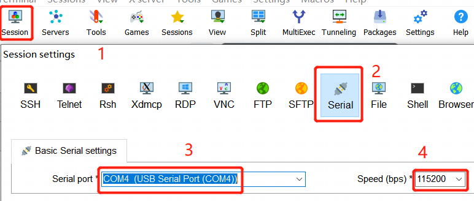
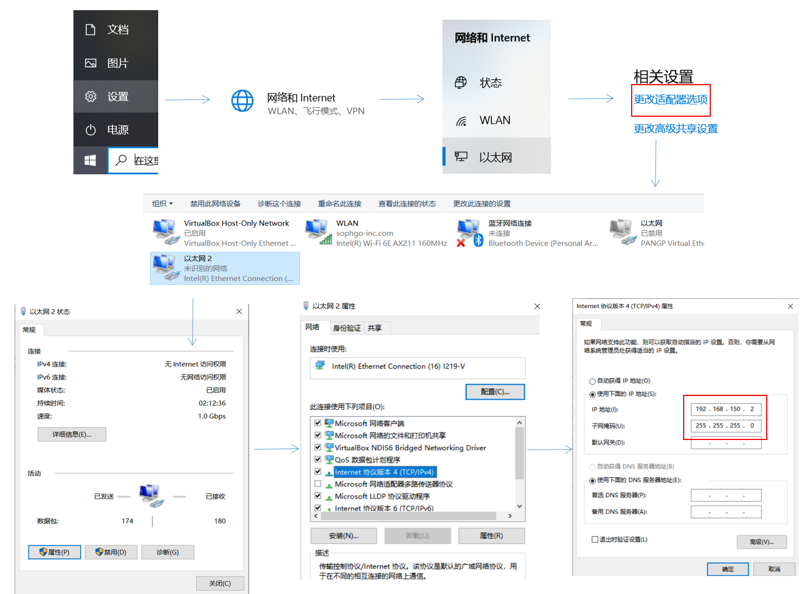
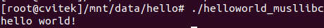

[toc]

---
<div STYLE="page-break-after: always;"></div>

> note：使用前请确保配置好相关环境，未配置见《软件安装编译环境搭建》


# 编译开发示例：HelloWorld操作指南

## 1. 连接电脑/虚拟机和华山派

使用网线，type-c线和串口板分别连接电脑和华山派，注意插稳

下载并安装[MobaXterm](https://mobaxterm.mobatek.net/download-home-edition.html)，打开软件后按照以下步骤创建串口终端


在串口终端中输入以下命令：

```sh
# eth0 后ip地址可自行选择，稍后电脑端ip配置注意使用同一网段，如192.168.150.X
ifconfig eth0 192.168.150.3 netmask 255.255.255.0
# 使用如下命令进行文件传输
scp filepath usrname@ip:filepath
```

电脑端按照以下步骤设置ip（示例使用笔记本电脑，若使用台式机注意连接的是哪个网口）


在虚拟机中按`ctrl+alt+t`新建终端，输入以下命令通过ssh连接华山派

```sh
ssh root@192.168.150.3
```

密码为：cvitek

**！注意：华山派断电重启后网口配置的ip会重置，需要重新在串口终端设置ip**

```sh
# 新建sample文件夹
cd /mnt/data
mkdir hello
```

<div STYLE="page-break-after: always;"></div>

## 2. Ubuntu虚拟机端编译

### 	2.1 构建代码

在Ubuntu虚拟机端按`ctrl+alt+t`新建终端，输入以下命令：

```sh
# 进入项目路径，根据自己情况修改
cd sophpi-huashan/cvi_media_sdk
# 运行所需环境
source build/cvisetup.sh
defconfig cv1812h_wevb_0007a_emmc

# 编译hello.c
cd middleware/v2/sample/
mkdir hello
cd hello
vi helloworld.c
```

复制以下内容，然后在编写终端点击鼠标滚轮粘贴：

```c
#include <stdio.h>
    int main(void)
    {
            printf("hello world!\n");
            return 0;
    }
```

### 	2.2 配置交叉编译工具链

```sh
export PATH=$PATH:(host-tools所在绝对路径)/host-tools/gcc/riscv64-linux-musl-x86_64/bin
export PATH=$PATH:(host-tools所在绝对路径)/host-tools/gcc/riscv64-linux-x86_64/bin
export PATH=$PATH:(host-tools所在绝对路径)/host-tools/gcc/riscv64-elf-x86_64/bin
```

> 重启或者重开终端窗口需要再次声明路径

### 	2.3 编译源码

##### 先确定板端用的是 musl libc 还是 glibc ，在开发板终端输入

```sh
cat /proc/version
```

可以看到选择的是`riscv64-unknown-linux-musl-gcc`还是`riscv64-unknown-linux-gnu-gcc`

<div STYLE="page-break-after: always;"></div>

##### 编译musl libc 版本

```sh
riscv64-unknown-linux-musl-gcc helloworld.c -o helloworld_musllibc -march=rv64imafdcvxthead -mcmodel=medany -mabi=lp64d
```

##### 编译glibc 版本

```sh
riscv64-unknown-linux-gnu-gcc helloworld.c -o helloworld_glibc -march=rv64imafdcvxthead -mcmodel=medany -mabi=lp64dv
```


## 3. 将生成的可执行文件移至华山派运行

将生成的`helloworld_musllibc`或`helloworld_glibc`移至开发板中运行

以scp传输为例：

```sh
# 文件路径及ip自行修改
scp helloworld_musllibc root@192.168.150.3:/mnt/data/hello
```

> note：开发板每次重启后需要重设ip

在开发板终端输入（串口和SSH均可）

```sh
cd /mnt/data/hello
./helloworld_musllibc #或./helloworld_glibc
```

 