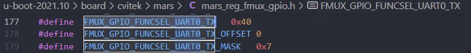
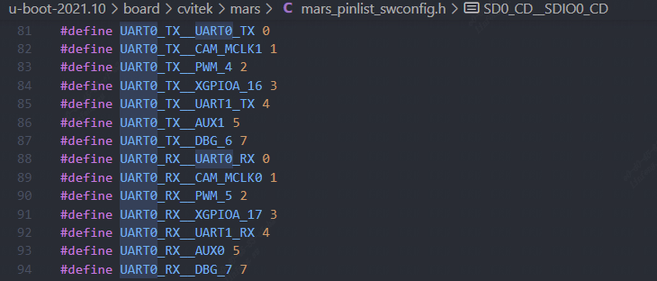
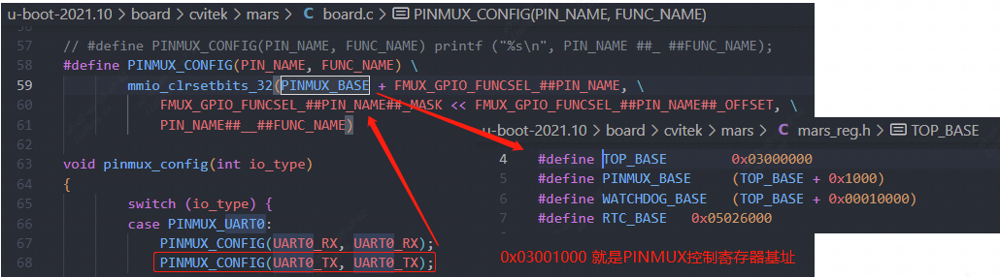
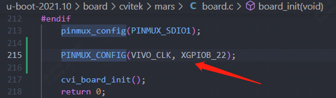
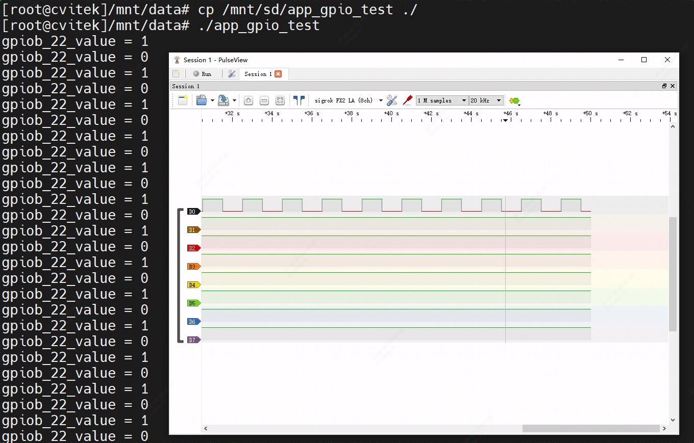

[toc]

---
<div STYLE="page-break-after: always;"></div>

> note：使用前请确保配置好相关环境，未配置见《软件安装编译环境搭建》

#   GPIO操作实验


## 1、实验硬件资源

    可在开发板双排针J5中进行实验，其对应的GPIO口有GPIOB22，GPIOA20等。
| PinName | PinN | PinN | PinName |
| --- | --- | --- | --- |
|			|1	|2|	|
|IIC_SDA	|3	|4|	|
|IIC_SCL	|5	|6|	|
|GPIOB22	|7	|8|	UART1_TX/JTAG_TDI|
|			|9	|10|	UART1_RX/JTAG_TDO|
|PWR_BGPIO3	|11	|12|	PWM2|
|PWR_BGPIO5	|13	|14|	|
|PWR_BGPIO15|15	|16|	PWR_BGPIO16|
|			|17	|18|	XBGPIO85|
|SPI2_MOSI	|19	|20|	|
|SPI2_MISO	|21	|22|	PWR_BGPIO14|
|SPI2_SCK	|23	|24|	SPI2_CS|
|			|25	|26|	SPI3_CS|
|IIC3_SDA	|27	|28|	IIC3_SCL|
|GPIOA20/JTAG_TRST	|29	|30|	|
|			|31	|32|	PWM6/JTAG_TCK|
|PWM7/JTAG_TMS	|33	|34|	|
|SPI3_MISO	|35	|36|	PWR_BGPIO17|
|PWR_BGPIO1	|37	|38|	SPI3_MOSI|
|			|39	|40|	SPI3_SCK|

在操作GPIO之前，先了解芯片的管脚复用功能：

每一个管脚对应一个32位的复用功能寄存器（例如下面0x40就是寄存器的偏移地址），并且低三位(`b111=0x7`)作为复用功能的选择位



以`UART0_TX`管脚为例，可以它看到一共有8个复用功能，



通过函数设置PINMUX寄存器值来设置相关复用功能，其中`mmio_clrsetbits_32`函数的第一个参数为PINMUX控制寄存器的起始地址：`0x03001000`



所以，`PINMUX_CONFIG(UART0_TX, UART0_TX)`等于`mmio_clrsetbits_32(0x03001040, 0x7, 0)`，实际上就是将地址`0x03001040`处寄存器的低三位清零，并重新设置值为`0`（`UART0_TX`管脚的`UART0_TX`复用功能）。

##  2、GPIO的操作准备如下：

    使用SDK发布的kernel。

##  3、操作过程
    加载内核。默认GPIO相关模块已全部编入内核，不需要再执行加载命令。
    在控制台下运行GPIO读写命令或者自行在内核态或者用户态编写GPIO读写程序，就可以对GPIO进行输入输出操作。

### 3.1、GPIO操作命令示例：
**步骤1: 在控制台使用echo命令,指定待操作的GPIO编号N：**
    `echo N > /sys/class/gpio/export`
    N为待操作的GPIO编号，GPIO编号 = GPIO组号值 + 偏移值.
    GPIO1、2、3、4对应表中GPIOA、B、C、D
    以表中GPIOB22管脚为例,  GPIOB对应GPIO组号值448, 偏移值为22.
    因此GPIO编号N为448 + 22 = 470
    

    组号值对应如下:
    GPIO0 对应linux组号值为 480
    GPIO1 对应linux组号值为 448
    GPIO2 对应linux组号值为 416
    GPIO3 对应linux组号值为 404
    PWR_GPIO 对应linux组号值为 381
    
    echo N > /sys/class/gpio/export 之后, 生成/sys/class/gpio/gpioN目录

**步骤2: 在控制台使用echo命令设置GPIO方向：**
    设置为输入：`echo in > /sys/class/gpio/gpioN/direction`
    设置为输出：`echo out > /sys/class/gpio/gpioN/direction`
    

    例: 设置GPIOB22 (即编号470)方向为输入：
    echo in > /sys/class/gpio/gpio470/direction
    
    设置GPIOB22 (即编号470)方向为输出：
    echo out > /sys/class/gpio/gpio470/direction

**步骤3: 在控制台使用cat命令查看GPIO输入值, 或使用echo命令设置GPIO输出值：**

    查看输入值: cat /sys/class/gpio/gpioN/value
    或
    输出低：echo 0 > /sys/class/gpio/gpioN/value
    输出高：echo 1 > /sys/class/gpio/gpioN/value

**步骤4: 使用完毕后, 在控制台使用echo命令释放资源：**
   ` echo N > /sys/class/gpio/unexport`


### 3.2、GPIO操作代码示例：

`sophpi-huashan/cvi_media_sdk/middleware/v2/sample` 目录下有对 `gpio` 操作经行一个封装：

可参考： 

`sophpi-huashan/cvi_media_sdk/middleware/v2/sample/ipcam/mars/modules/peripheral/gpio/app_ipcam_gpio.c `

`sophpi-huashan/cvi_media_sdk/middleware/v2/sample/ipcam/mars/modules/peripheral/gpio/app_ipcam_gpio.h` 

或者`sophpi-huashan/product-sample/access-guard-turnkey/cpsl/hal/gpio/src/cvi_hal_gpio.c` 

`sophpi-huashan/product-sample/access-guard-turnkey/cpsl/hal/gpio/include/cvi_hal_gpio.h`


我们创建一个gpio demo示例，在`sophpi-huashan/cvi_media_sdk/middleware/v2/sample`路径下新建`gpio_test`文件夹

```sh
mkdir gpio_test && cd gpio_test
```

创建 `cvi_hal_gpio.c`和`cvi_hal_gpio.h`，内容可以直接复制`sophpi-huashan/product-sample/access-guard-turnkey/cpsl/hal/gpio/src/cvi_hal_gpio.c`和`cvi_hal_gpio.h`

```sh
touch cvi_hal_gpio.c cvi_hal_gpio.h app_gpio_test.c								#创建问价
cat ../../../../../product-sample/access-guard-turnkey/cpsl/hal/gpio/src/cvi_hal_gpio.c >> cvi_hal_gpio.c 	#复制内容
cat ../../../../../product-sample/access-guard-turnkey/cpsl/hal/gpio/include/cvi_hal_gpio.h >> cvi_hal_gpio.h
```

对`cvi_hal_gpio.c`和`cvi_hal_gpio.h`做一些修改：

`cvi_hal_gpio.c`，注释以下代码

```c
···
static int GpioGetValue(unsigned int gpio, unsigned int *value)
{
        int fd;
        char buf[MAX_BUF];
        char ch;

        snprintf(buf, sizeof(buf), SYSFS_GPIO_DIR "/gpio%d/value", gpio);

        if (access(buf, 0) == -1) {
                //BM_LOG(LOG_DEBUG_ERROR, cout << buf << " not exist!" << endl);
                GpioExport(gpio);
        }
    	
    	// 注释以下
	    fd = GpioSetDirection(gpio, 0); //input
        if (fd < 0) {
                printf("gpio %d get-value error\n", gpio);
                return fd;
        }
    	// 注释以上

···
```

`cvi_hal_gpio.h`，注释并添加

```c
···
    
// int CVI_GPIO_Export(CVI_HAL_GPIO_NUM_E gpio);
// int CVI_HAL_GpioUnexport(CVI_HAL_GPIO_NUM_E gpio);
int CVI_HAL_GPIO_Export(CVI_HAL_GPIO_NUM_E gpio);
int CVI_HAL_GPIO_Unexport(CVI_HAL_GPIO_NUM_E gpio);

···
```

编写`app_gpio_test.c`代码：

```c
#include <stdio.h>
#include <stdlib.h>
#include "cvi_hal_gpio.h"
#include <unistd.h>
#include <signal.h>

// Ctrl+C会接收到SIGINT信号，及时释放GPIO
void sigint_cb(int arg) {
	CVI_HAL_GPIO_Unexport(CVI_HAL_GPIOB_22);
	exit(0);
}

int main(int argc, char** argv)
{
    	// 注册SIGINT信号
		signal(SIGINT, sigint_cb);

        CVI_HAL_GPIO_VALUE_E gpiob_22_value;
        CVI_HAL_GPIO_Export(CVI_HAL_GPIOB_22);
        // 设置CVI_HAL_GPIOB_22为输出
        CVI_HAL_GpioDirectionOutput(CVI_HAL_GPIOB_22);
        
        for(int i=0; i<100; i++) {
    		// 设置为高电平
            CVI_HAL_GpioSetValue(CVI_HAL_GPIOB_22,CVI_HAL_GPIO_VALUE_H);
    		// 查看CVI_HAL_GPIOB_22的值
       		CVI_HAL_GpioGetValue(CVI_HAL_GPIOB_22, &gpiob_22_value);
			printf("gpiob_22_value = %d\n", gpiob_22_value);
            sleep(1);
    
			// 设置为低电平
            CVI_HAL_GpioSetValue(CVI_HAL_GPIOB_22,CVI_HAL_GPIO_VALUE_L);
			// 查看CVI_HAL_GPIOB_22的值
			CVI_HAL_GpioGetValue(CVI_HAL_GPIOB_22, &gpiob_22_value);
        	printf("gpiob_22_value = %d\n", gpiob_22_value);
            sleep(1);
        }
        // 释放
        CVI_HAL_GPIO_Unexport(CVI_HAL_GPIOB_22);
        return 0;
}
```

编译前声明环境，在`sophpi-huashan/cvi_media_sdk`下执行：

```sh
source build/cvisetup.sh
defconfig cv1812h_wevb_0007a_emmc
```

编译命令，在`sophpi-huashan/cvi_media_sdk/middleware/v2/sample/gpio_test`下执行，生成可执行文件`app_gpio_test`：

```sh
riscv64-unknown-linux-musl-gcc cvi_hal_gpio.c app_gpio_test.c -o app_gpio_test -march=rv64imafdcvxthead -mcmodel=medany -mabi=lp64d
```

- **设置管脚复用方法一**

在把可执行文件下载到开发板之前，我们先将`VIVO_CLK`管脚复为`XGPIOB_22`，添加如下代码：




```sh
# 重新编译源码，在sophpi-huashan/cvi_media_sdk目录下执行
build_all
# 然后重新烧录，烧录操作见烧录章节
```

- **设置管脚复用方法二**

```sh
# 将cvi_pinmux添加到文件系统
cp ./cvi_media_sdk/ramdisk/rootfs/public/pinmux/musl_riscv64/usr/sbin/cvi_pinmux ./cvi_media_sdk/ramdisk/rootfs/overlay/mars_musl_riscv64/usr/local/bin/
# 重新编译源码，在sophpi-huashan/cvi_media_sdk目录下执行
build_all
# 然后重新烧录，烧录操作见烧录章节
```

烧录好固件之后，可以在相关目录先看到刚才添加的可执行文件`cvi_pinmux`

```sh
[root@cvitek]~# ls /usr/local/bin/
autologin   cvi_pinmux
[root@cvitek]~# cvi_pinmux
cvi_pinmux for Mars
./cvi_pinmux -p          <== List all pins
./cvi_pinmux -l          <== List all pins and its func
./cvi_pinmux -r pin      <== Get func from pin
./cvi_pinmux -w pin/func <== Set func to pin

# 执行可执行文件，查看VIVO_CLK引脚复用功能
[root@cvitek]~# cvi_pinmux -r VIVO_CLK
VIVO_CLK function:
[ ] VI2_CLK
[ ] VI1_CLK
[ ] VO_CLK1
[v] XGPIOB_22
[ ] RMII0_TXEN
[ ] CAM_MCLK0
[ ] WG1_D1
[ ] UART2_RX

register: 0x3001160
value: 3

# 默认是选择XPGPIOB_22,如果不是可以用命令修改：
[root@cvitek]~# cvi_pinmux -w VIVO_CLK/XGPIOB_22
pin VIVO_CLK
func XGPIOB_22
register: 3001160
value: 3
```

在上面设置好管脚复用之后，把可执行文件`app_gpio_test`（在目录`sophpi-huashan/cvi_media_sdk/middleware/v2/sample/gpio_test`下）拷贝到开发板，在开发板上运行：

```sh
[root@cvitek]/mnt/data# ./app_gpio_test
```

## 4、验证方法：测量硬件对应引脚电平


