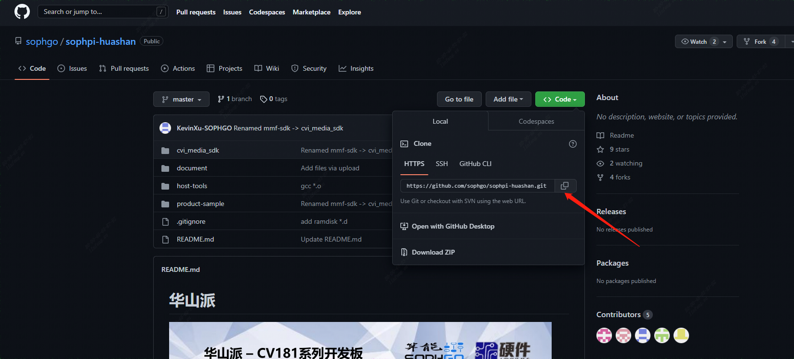
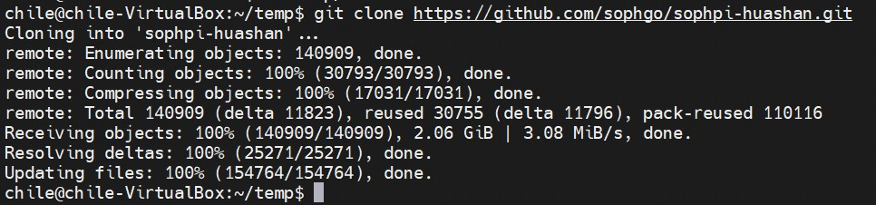
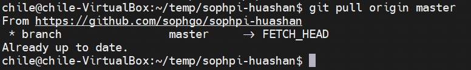

[toc]
---

# 获取代码最新代码

##   1、如何获取代码

> 进入源码网址

    通过git clone + github地址
    
    git clone https://github.com/sophgo/sophpi-huashan.git

## 2、如何更新代码

    在sophpi-huashan的repo路径下打开终端
    
    git pull origin master		# 从origin远程仓库拉取master分支

