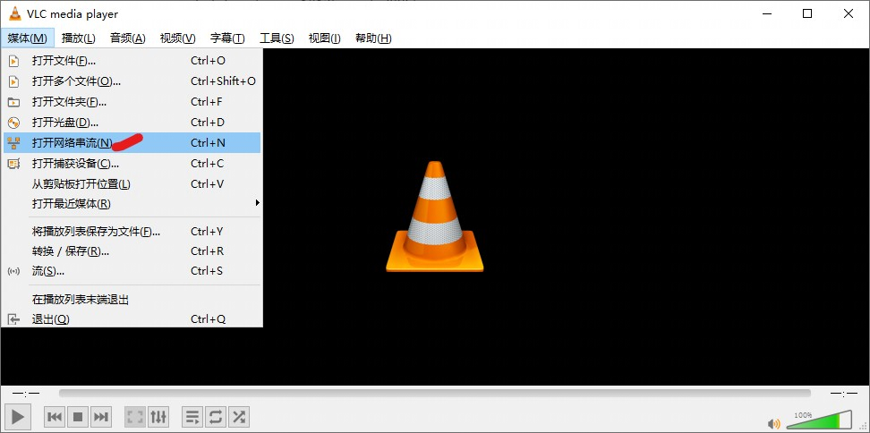
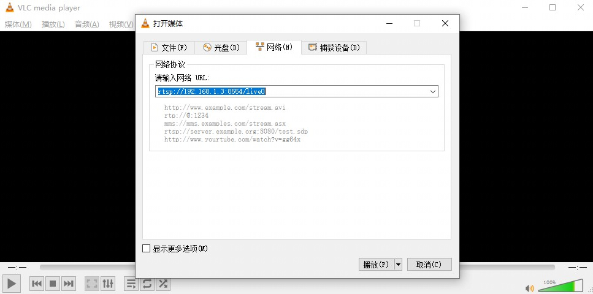

[toc]

---
<div STYLE="page-break-after: always;"></div>

> note：使用前请确保配置好相关环境，未配置见《软件安装编译环境搭建》

> param_config.ini文件！！！！！！！！！！！！！！！！！！！！！！！！！！！！！！！！！！！（等待ov5764的ini文件更新）


# IPCam网络摄像头


## 1、如何编译IPcam
    # 配置编译环境
    1.cd cvi_media_sdk/
    2.source build/cvisetup.sh 
    3.defconfig cv1812h_wevb_0007a_emmc
    4.build_all								# 编译sdk

## 2、配置板端资源以及环境
```sh
1.通过NFS或者sd卡把下面内容拷贝到板端/mnt/data/
  cvi_media_sdk/middleware/v2/sample/ipcam/mars/ipcam_mars
  cvi_media_sdk/middleware/v2/sample/ipcam/parameter/mars/param_config_ai.ini
  cvi_media_sdk/middleware/v2/sample/ipcam/resource/ai_models/mars
  cvi_media_sdk/middleware/v2/sample/sensor_cfg/sensor_cfg.ini.gc2053+gc2093
  cvi_media_sdk/middleware/v2/sample/sensor_cfg/sensor_cfg.ini.ov5647
  
  并且把mars 目录名改成ai_models、sensor_cfg.ini.gc2053+gc2093/sensor_cfg.ini.ov5647改名为sensor_cfg.ini:
  mv mars ai_models
  mv sensor_cfg.ini.gc2053+gc2093 sensor_cfg.ini
2.isp参数文件和库文件路径：
  export LD_LIBRARY_PATH=$LD_LIBRARY_PATH:/mnt/system/lib/
  cp /mnt/cfg/tmp_secure/cvi_sdr_bin /mnt/data
2.连接网线并且配置板端网路：
  ifconfig eth0 192.168.1.3 netmask 255.255.255.0
  并且把PC端的网络配置成 在同一网段。
3.运行IPCam
  ./ipcam_mars -i param_config_ai.ini &
4.通过PC端的VLC连接板端的rtsp 看视频流
  连接地址为：
   rtsp://192.168.1.3:8554/live0 # 大码流
   rtsp://192.168.1.3:8554/live1 # 小码流
```

> windows下VLC播放器设置






## 3、参数配置及运行效果

### 3.1参数配置文件
>  打开文件param_config_ai.ini，部分配置如下，默认即可

**屏幕显示对象配置**

```
......

[osdc_objs_info]
cnt        = 3			; 绘制对象数目

[osdc_obj_info0]
bShow           = 1		; 显示使能
type            = 0 ; 0: rect, 1: bitmap, 2: line, 3: buff	
                    ; 显示元素类型 0：矩形 1：位图 2：线 3：缓冲区
color           = 0xff00ffff	; 颜色
x1           	  = 500						; 显示区域的左上角点坐标（横轴）
y1          	  = 500						; 显示区域的左上角点坐标（纵轴）
width        	  = 100						; 显示区域宽度 
height        	= 100					  ; 显示区域高度 
filled        	= 0						  ; 是否填充
thickness       = 4						  ; 显示边线粗细

[osdc_obj_info1]
bShow           = 1
type            = 2 ; 0: rect, 1: bitmap, 2: line, 3: buff
color           = 0xff00ffff
x1           	= 800
y1          	= 800
x2              = 1000
y2              = 1000
thickness       = 4

[osdc_obj_info2]
bShow           = 1
type            = 0 ; 0: rect, 1: bitmap, 2: line, 3: buff
color           = 0xff00ffff
x1           	= 1000
y1          	= 1000
width        	= 200
height        	= 200
filled        	= 1
thickness       = 4

......
```


**屏幕显示元素配置**

```
......

; osd config
[osd_config]
osd_enable_all  = 1			; 是;否使能所有显示元素
osd_cnt         = 12		; 屏;显示元素数目

; osd attach to main streaming
[osd0]
show            = 1			; 显示使能
handle          = 0			; 句柄号
type            = 2 ; 0:TYPE_PICTURE, 1: TYPE_STRING, 2:TYPE_TIME 
					; 0：图片类型	   1：字符类型	    2：实时时间类型

mod_id          = 6 ; 6: CVI_ID_VPSS	; 模块号	
dev_id          = 0						; 设备号
chn_id          = 0						; 通道号
s32x            = 20					; 显示区域起始点坐标
s32y            = 20
rec_width       = 24					; 显示区域宽度
rec_heigh       = 24					; 显示区域高度

[osd1]
show            = 1
handle          = 1
type            = 1 ; 0:TYPE_PICTURE, 1: TYPE_STRING, 2:TYPE_TIME
mod_id          = 6 ; 6: CVI_ID_VPSS
dev_id          = 0
chn_id          = 0
s32x            = 20
s32y            = 60
rec_width       = 24
rec_heigh       = 24
str             = "cvitek main streaming demo"		; 字符内容

[osd2]
show            = 1
handle          = 2
type            = 1 ; 0:TYPE_PICTURE, 1: TYPE_STRING, 2:TYPE_TIME
mod_id          = 6 ; 6: CVI_ID_VPSS
dev_id          = 0
chn_id          = 0
s32x            = 20
s32y            = 100
rec_width       = 24
rec_heigh       = 24
str             = "北京晶视智能科技有限公司"

......

```


**配置模型参数**(以face_detection为例)

```
......

[ai_fd_config]
fd_enable        = 1		; 人脸检测使能
fr_enable        = 1		; 人脸识别使能
mask_enable      = 0		; 口罩使能
capture_enable    = 1		; 捕获使能（开启的话需要挂载sd卡到/mnt/sd，系统检测到人脸一定时间会保存图片到sd卡）
face_ae_enable   = 0		; 
vpss_grp         = 4		; 视频处理子系统组号
vpss_chn         = 0		; 通道号
fd_poolid        = 6		; 
grp_width        = 960		;	
grp_height       = 540		;
model_width      = 768		; 模型宽度
model_height     = 432		; 模型高度
vpssPreProcSkip  = 0		; 跳过视频处理预处理使能
threshold_fd     = 0.7		; 人脸检测阈值
threshold_fr     = 0.7		; 人脸识别阈值
threshold_mask   = 0.7		; 戴口罩人脸检测阈值
model_id_fd      = 30 ;0:CVI_AI_SUPPORTED_MODEL_RETINAFACE;30:CVI_AI_SUPPORTED_MODEL_FACEMASKDETECTION
model_id_fr      = 6 ;3:CVI_AI_SUPPORTED_MODEL_FACERECOGNITION
model_id_mask    = 7 ;7:CVI_AI_SUPPORTED_MODEL_MASKCLASSIFICATION
model_path_fd    = "/mnt/data/ai_models/retinaface_mask.cvimodel"		; 模型路径
model_path_fr    = "/mnt/data/ai_models/cviface-v5-s.cvimodel"
model_path_mask  = "/mnt/data/ai_models//mask_classifier.cvimodel"

......
```


### 3.2运行效果

该系统实现了人脸检测和识别、运动检测、行人检测等功能

#### 3.2.1 OV5764摄像头

> face detection with mask


> pedestrian detection with (red if intrusion)


#### 3.2.1 GC2093摄像头

同上。