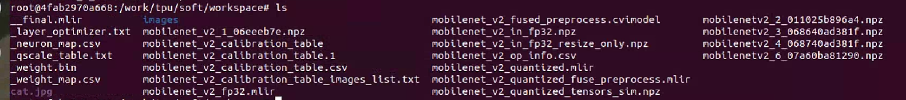
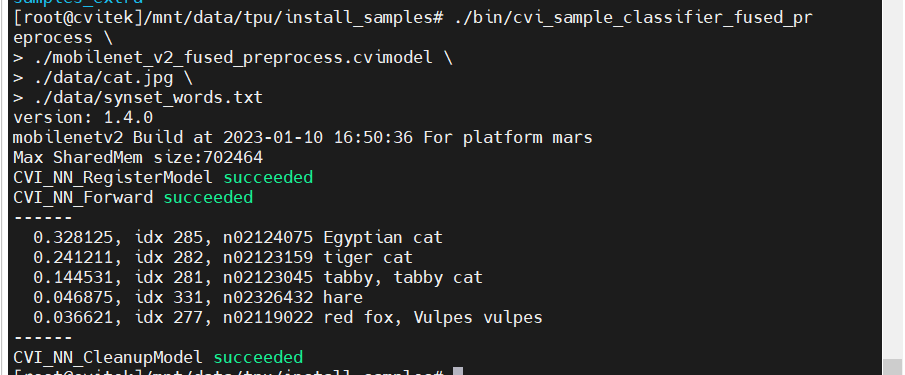

## 基于华山派开发板的图像分类


### 配置Docker开发环境

安装并配置docker：

```sh
sudo apt install docker.io
systemctl start docker
systemctl enable docker
sudo groupadd docker
sudo usermod -aG docker $USER
newgrp docker (use before reboot)
```

从docker hub获取镜像文件：

```sh
docker pull cvitek/cvitek_dev:1.7-ubuntu-18.04
```

执行下述命令运行docker：

```sh
docker run -itd -v $PWD:/work --name cvitek cvitek/cvitek_dev:1.7-ubuntu-18.04
docker exec -it cvitek bash
```

下载tpu开发所需要的包文件：

```sh
wget --user='cvitek_mlir_2022' --password='Bxc~b6n!Zn' ftp://218.17.249.213/home/tpu_rel_v1.5.0-868-g743c9d53a/cvimodel_samples_cv181x.tar.gz

wget --user='cvitek_mlir_2022' --password='Bxc~b6n!Zn' ftp://218.17.249.213/home/tpu_rel_v1.5.0-868-g743c9d53a/cvitek_tpu_samples.tar.gz

wget --user='cvitek_mlir_2022' --password='Bxc~b6n!Zn' ftp://218.17.249.213/home/tpu_rel_v1.5.0-868-g743c9d53a/cvitek_tpu_sdk_cv181x_musl_riscv64.tar.gz

wget --user='cvitek_mlir_2022' --password='Bxc~b6n!Zn' ftp://218.17.249.213/home/cvitek_mlir_ubuntu-18.04_v1.5.0-872-g4818dc6ef.tar.gz
```


在部署模型之前，我们需要准备以下：

开发板的TPU sdk，训练并转换好的模型，测试图片，测试程序demo

`cvitek_tpu_sdk_cv181x_musl_riscv64.tar.gz`	--TPU SDK

`cvitek_tpu_samples.tar.gz` 							   --Demo例程

`cvimodel_samples_cv181x.tar.gz` 					  --训练好的模型样例


### MobileNet-Caffe 模型转换

1.到官网下载mobilev2模型并在docker下转换模型(可选) 

```
git clone https://github.com/shicai/MobileNet-Caffe.git
```


2.解压文件，配置脚本

> 需准备以下文件:

>  cvitek_mlir_ubuntu-18.04.tar.gz

```sh
tar zxf cvitek_mlir_ubuntu-18.04.tar.gz
source cvitek_mlir/cvitek_envs.sh
```


3.创建工作文件夹，复制图片和images文件夹

```sh
mkdir workspace && cd workspace
cp $MLIR_PATH/tpuc/regression/data/cat.jpg .
cp -rf $MLIR_PATH/tpuc/regression/data/images .
```


4.转换模型

> 注意: 以下的/work/mydemo/MobileNet/MobileNet-Caffe 是第一步下载的文件的路径

~~~SHELL
model_transform.py \
--model_type caffe \
--model_name mobilenet_v2 \
--model_def /work/mydemo/MobileNet/MobileNet-Caffe/mobilenet_v2_deploy.prototxt \
--model_data /work/mydemo/MobileNet/MobileNet-Caffe/mobilenet_v2.caffemodel \
--image ./cat.jpg \
--image_resize_dims 256,256 \
--net_input_dims 224,224 \
--mean 103.94,115.78,123.68 \
--input_scale 0.017 \
--model_channel_order "bgr" \
--tolerance 0.99,0.99,0.99 \
--excepts prob \
--mlir mobilenet_v2_fp32.mlir

run_calibration.py \
mobilenet_v2_fp32.mlir \
--dataset=./images \
--input_num=100 \
-o mobilenet_v2_calibration_table

model_deploy.py \
--model_name mobilenet_v2 \
--mlir mobilenet_v2_fp32.mlir \
--calibration_table mobilenet_v2_calibration_table \
--fuse_preprocess \
--pixel_format BGR_PLANAR \
--aligned_input false \
--chip mars \
--quantize INT8 \
--image cat.jpg \
--tolerance 0.9,0.9,0.6 \
--correctness 0.95,0.95,0.9 \
--cvimodel mobilenet_v2_fused_preprocess.cvimodel
```
~~~

> 成功运行会有以下文件




5.复制生成mobilenet_v2_fused_preprocess.cvimode和cvitek_tpu_samples/install_samples到开发板运行

> 注意：将mobilenet_v2_fused_preprocess.cvimode 复制到install_samples文件夹下


```sh
//开发板上操作：
cd install_samples
./bin/cvi_sample_classifier_fused_preprocess \
./mobilenet_v2_fused_preprocess.cvimodel \
./data/cat.jpg \
./data/synset_words.txt
```

运行成功效果显示：




### 编译demo

在主机端，我们搭建好编译环境

新建一个文件夹，把这些文件放到一起

```sh
root@e921088633cc:/work# mkdir tpu && cd tpu
root@e921088633cc:/work/tpu# ls
cvitek_tpu_samples.tar.gz  		cvitek_tpu_sdk_cv181x_musl_riscv64.tar.gz
cvimodel_samples_cv181x.tar.gz
```

准备sdk环境：

```sh
tar zxf cvitek_tpu_sdk_mars_musl_riscv64.tar.gz   //cvitek_tpu_sdk_cv181x_musl_riscv64
export TPU_SDK_PATH=$PWD/cvitek_tpu_sdk
cd cvitek_tpu_sdk && source ./envs_tpu_sdk.sh && cd ..
```

解压例程：

```sh
tar zxf cvitek_tpu_samples.tar.gz
cd cvitek_tpu_samples
```

在编译demo之前，做以下修改，

> 注意`cvitek_tpu_sdk/cmake/toolchain-riscv64-linux-musl-x86_64.cmake`文件需要做一些修改，将交叉工具链改成全路径


编译例程，


```sh
mkdir build_soc
cd build_soc

cmake -G Ninja \
    -DCMAKE_BUILD_TYPE=RELEASE \
    -DCMAKE_C_FLAGS_RELEASE=-O3 -DCMAKE_CXX_FLAGS_RELEASE=-O3 \
    -DCMAKE_TOOLCHAIN_FILE=$TPU_SDK_PATH/cmake/toolchain-riscv64-linux-musl-x86_64.cmake \
    -DTPU_SDK_PATH=$TPU_SDK_PATH \
    -DOPENCV_PATH=$TPU_SDK_PATH/opencv \
    -DCMAKE_INSTALL_PREFIX=../install_samples \
    ..
    
cmake --build . --target install
```

编译完成之后会生成相应的可执行文件，以物体分类模型为例，

```sh
root@e921088633cc:/work/tpu/cvitek_tpu_samples/build_soc/classifier_fused_preprocess# ls
CMakeFiles  cmake_install.cmake  cvi_sample_classifier_fused_preprocess
```

代码工作原理，`cvitek_tpu_samples/classifier_fused_preprocess/classifier_fused_preprocess.cpp` 

**加载模型**，

```cpp
// load model file
  const char *model_file = argv[1];
  CVI_MODEL_HANDLE model = nullptr;
  int ret = CVI_NN_RegisterModel(model_file, &model);
  if (CVI_RC_SUCCESS != ret) {
    printf("CVI_NN_RegisterModel failed, err %d\n", ret);
    exit(1);
  }
```

**获取模型输入输出Tensor**，

```cpp
// get input output tensors
  CVI_TENSOR *input_tensors;
  CVI_TENSOR *output_tensors;
  int32_t input_num;
  int32_t output_num;
  CVI_NN_GetInputOutputTensors(model, &input_tensors, &input_num, &output_tensors,
                               &output_num);
  CVI_TENSOR *input = CVI_NN_GetTensorByName(CVI_NN_DEFAULT_TENSOR, input_tensors, input_num);
  assert(input);
  CVI_TENSOR *output = CVI_NN_GetTensorByName(CVI_NN_DEFAULT_TENSOR, output_tensors, output_num);
  assert(output);

```

**读取输入图片并进行简单处理**，

```cpp
// imread
  cv::Mat image;
  image = cv::imread(argv[2]);
  if (!image.data) {
    printf("Could not open or find the image\n");
    return -1;
  }

  // resize
  cv::resize(image, image, cv::Size(IMG_RESIZE_DIMS, IMG_RESIZE_DIMS)); // linear is default

  //Packed2Planar
  cv::Mat channels[3];
  for (int i = 0; i < 3; i++) {
    channels[i] = cv::Mat(image.rows, image.cols, CV_8SC1);
  }
  cv::split(image, channels);

  int8_t *ptr = (int8_t *)CVI_NN_TensorPtr(input);
  int channel_size = height * width;
  for (int i = 0; i < 3; ++i) {
    memcpy(ptr + i * channel_size, channels[i].data, channel_size);
  }
```

**模型推理**，

```cpp
// run inference
  CVI_NN_Forward(model, input_tensors, input_num, output_tensors, output_num);
  printf("CVI_NN_Forward succeeded\n");
```

**后处理并显示**，

```cpp
int32_t top_num = 5;
  float *prob = (float *)CVI_NN_TensorPtr(output);
  int32_t count = CVI_NN_TensorCount(output);
  // find top-k prob and cls		取最高的label
  std::vector<size_t> idx(count);
  std::iota(idx.begin(), idx.end(), 0);
  std::sort(idx.begin(), idx.end(), [&prob](size_t idx_0, size_t idx_1) {return prob[idx_0] > prob[idx_1];});
  // show results.
  printf("------\n");
  for (size_t i = 0; i < top_num; i++) {
    int top_k_idx = idx[i];
    printf("  %f, idx %d", prob[top_k_idx], top_k_idx);
    if (!labels.empty())
      printf(", %s", labels[top_k_idx].c_str());
    printf("\n");
  }
```


### 在开发板上验证

运行release提供的sample预编译程序，需要如下文件：

`cvitek_tpu_sdk_mars_musl_riscv64.tar.gz`

`cvimodel_samples_cv181x.tar.gz`(需要用到其中的yolov5s模型)

`cvi_sample_classifier_fused_preprocess`(前面编译生成的可执行文件)

测试图片 `cat.jpg` （cvitek_tpu_samples/data路径下）

`synset_words.txt` (物体类，cvitek_tpu_samples/data路径下)


整理如下


在上级目录`tpu_rt`下声明环境

```sh
export TPU_ROOT=$PWD/cvitek_tpu_sdk
cd cvitek_tpu_sdk && source ./envs_tpu_sdk.sh && cd ..
```

运行

```sh
./cvi_sample_classifier_fused_preprocess mobilenet_v2_fused_preprocess.cvimodel cat.jpg synset_words.txt
```

测试图片以及输出如下，


### 在Docker仿真环境下验证

需要以下文件：

- `cvitek_mlir_ubuntu-18.04_v1.5.0-872-g4818dc6ef.tar.gz`（NN工具链）
- `cvitek_tpu_samples.tar.gz`（demo程序）
- `cvimodel_samples_cv181x.tar.gz`（模型文件）

TPU sdk准备：

```sh
tar zxf cvitek_mlir_ubuntu-18.04_v1.5.0-872-g4818dc6ef.tar.gz
source cvitek_mlir/cvitek_envs.sh
```

编译samples，安装至install_samples目录：

```sh
tar zxf cvitek_tpu_samples.tar.gz
cd cvitek_tpu_samples
mkdir build
cd build
cmake -G Ninja \
    -DCMAKE_BUILD_TYPE=RELEASE \
    -DCMAKE_C_FLAGS_RELEASE=-O3 -DCMAKE_CXX_FLAGS_RELEASE=-O3 \
    -DTPU_SDK_PATH=$MLIR_PATH/tpuc \
    -DCNPY_PATH=$MLIR_PATH/cnpy \
    -DOPENCV_PATH=$MLIR_PATH/opencv \
    -DCMAKE_INSTALL_PREFIX=../install_samples \
    ..
    
cmake --build . --target install
```

运行samples程序：

```sh
cd ../../
# envs
tar zxf cvimodel_samples_cv181x.tar.gz

./cvitek_tpu_samples/build/classifier_fused_preprocess/cvi_sample_classifier_fused_preprocess ./cvimodel_samples/mobilenet_v2_fused_preprocess.cvimodel ./cvitek_tpu_samples/data/cat.jpg ./cvitek_tpu_samples/data/synset_words.txt
```


