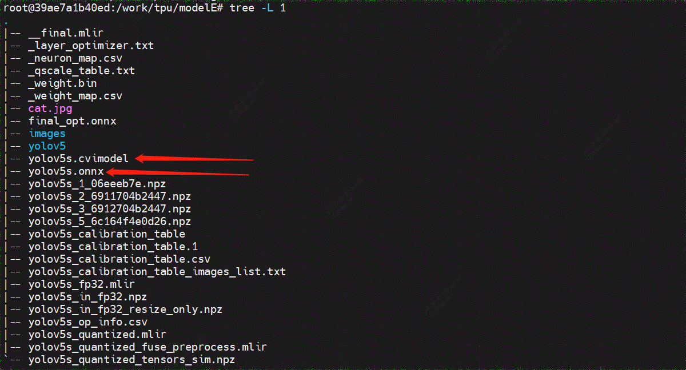
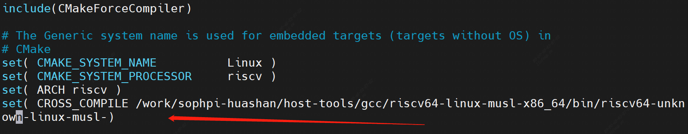
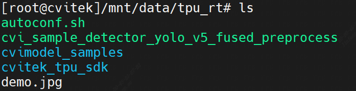
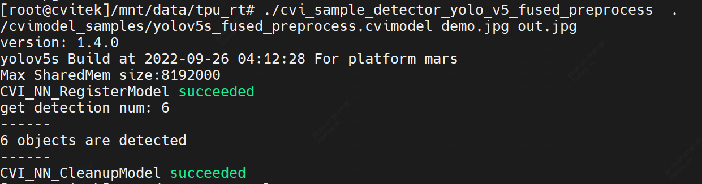
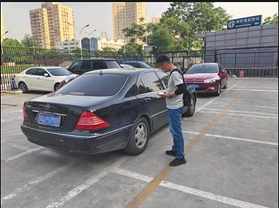
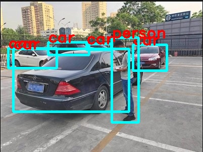
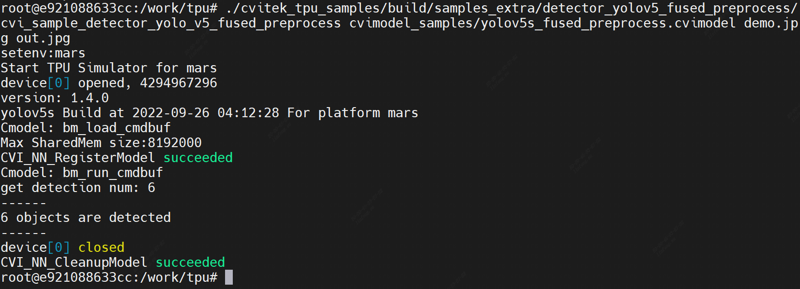

## 基于华山派开发板的yolov5目标检测


### 配置Docker开发环境

安装并配置docker：

```sh
sudo apt install docker.io
systemctl start docker
systemctl enable docker
sudo groupadd docker
sudo usermod -aG docker $USER
newgrp docker (use before reboot)
```

从docker hub获取镜像文件：

```sh
docker pull cvitek/cvitek_dev:1.7-ubuntu-18.04
```

执行下述命令运行docker：

```sh
docker run -itd -v $PWD:/work --name cvitek cvitek/cvitek_dev:1.7-ubuntu-18.04
docker exec -it cvitek bash
```

下载tpu开发所需要的包文件：

```sh
mkdir tpu && cd tpu
wget --user='cvitek_mlir_2022' --password='Bxc~b6n!Zn' ftp://218.17.249.213/home/tpu_rel_v1.5.0-868-g743c9d53a/cvimodel_samples_cv181x.tar.gz

wget --user='cvitek_mlir_2022' --password='Bxc~b6n!Zn' ftp://218.17.249.213/home/tpu_rel_v1.5.0-868-g743c9d53a/cvitek_tpu_samples.tar.gz

wget --user='cvitek_mlir_2022' --password='Bxc~b6n!Zn' ftp://218.17.249.213/home/tpu_rel_v1.5.0-868-g743c9d53a/cvitek_tpu_sdk_cv181x_musl_riscv64.tar.gz

wget --user='cvitek_mlir_2022' --password='Bxc~b6n!Zn' ftp://218.17.249.213/home/cvitek_mlir_ubuntu-18.04_v1.5.0-872-g4818dc6ef.tar.gz
```


在部署模型之前，我们需要准备以下：

开发板的TPU sdk，训练并转换好的模型，测试图片，测试程序demo

`cvitek_tpu_sdk_cv181x_musl_riscv64.tar.gz`	--TPU SDK

`cvitek_tpu_samples.tar.gz` 							   --Demo例程

### yolov5模型转化

```sh
# 创建一个临时文件夹
mkdir modelE && cd modelE
# 下载yolov5 v5.0源码
git clone -b v5.0 https://github.com/ultralytics/yolov5.git

# 退出docker bash，在主机导出onnx模型
exit
cd tpu/modelE/yolov5
pip3 install -r requirements.txt
```

然后导出onnx模型。

> yolov5 v5.0版本之后输出维度有差别

```sh
python3 export.py --weights ./weights/yolov5s.pt 
cd ..
# 再进入docker环境
docker exec -it cvitek bash 
cd tpu/
tar zxf cvitek_mlir_ubuntu-18.04.tar.gz
source cvitek_mlir/cvitek_envs.sh

# 新建临时目录，并将onnx模型放进来
mkdir modelE && cd modelE
cp $MLIR_PATH/tpuc/regression/data/cat.jpg .		# 一些测试图片
cp -rf $MLIR_PATH/tpuc/regression/data/images .
mv ../yolov5/yolov5s.onnx .

# 转换为mlir
model_transform.py \
  --model_type onnx \
  --model_name yolov5s \
  --model_def ./yolov5s.onnx \
  --image ./cat.jpg \
  --image_resize_dims 640,640 \
  --keep_aspect_ratio true \
  --raw_scale 1.0 \
  --model_channel_order "rgb" \
  --tolerance 0.99,0.99,0.99 \
  --mlir yolov5s_fp32.mlir
  
# 生成测试表
run_calibration.py \
	yolov5s_fp32.mlir \
	--dataset=./images \
	--input_num=100 \
	-o yolov5s_calibration_table
	
# bf16量化
model_deploy.py \
	--model_name yolov5s \
	--mlir yolov5s_fp32.mlir \
	--calibration_table yolov5s_calibration_table \
	--fuse_preprocess \
	--pixel_format RGB_PLANAR \
	--aligned_input false \
	--excepts output \
	--chip mars \
	--quantize INT8 \
	--image cat.jpg \
	--tolerance 0.9,0.9,0.3 \
	--correctness 0.95,0.95,0.9 \
	--cvimodel yolov5s.cvimodel
```

然后将生成的cvimodel文件拷贝到开发板。

```sh
scp yolov5s.cvimodel root@192.168.1.3:/mnt/data/
```

或者sd拷贝。

整个过程文件目录如下：



### 编译demo

准备sdk环境：

```sh
cd .. # 到tpu/目录下
tar zxf cvitek_tpu_sdk_mars_musl_riscv64.tar.gz
export TPU_SDK_PATH=$PWD/cvitek_tpu_sdk
cd cvitek_tpu_sdk && source ./envs_tpu_sdk.sh && cd ..
```

解压例程：

```sh
tar zxf cvitek_tpu_samples.tar.gz
cd cvitek_tpu_samples
```

在编译demo之前，做以下修改，
> 注意`cvitek_tpu_sdk/cmake/toolchain-riscv64-linux-musl-x86_64.cmake`文件需要做一些修改，将交叉工具链改成全路径



然后编译例程，
```sh
mkdir build_soc
cd build_soc

cmake -G Ninja \
    -DCMAKE_BUILD_TYPE=RELEASE \
    -DCMAKE_C_FLAGS_RELEASE=-O3 -DCMAKE_CXX_FLAGS_RELEASE=-O3 \
    -DCMAKE_TOOLCHAIN_FILE=$TPU_SDK_PATH/cmake/toolchain-riscv64-linux-musl-x86_64.cmake \
    -DTPU_SDK_PATH=$TPU_SDK_PATH \
    -DOPENCV_PATH=$TPU_SDK_PATH/opencv \
    -DCMAKE_INSTALL_PREFIX=../install_samples \
    ..
    
cmake --build . --target install
```


编译完成之后会生成相应的可执行文件，以yolov5为例，

```sh
root@e921088633cc:/work/tpu/cvitek_tpu_samples/build_soc/samples_extra/detector_yolov5_fused_preprocess# ls
CMakeFiles  cmake_install.cmake  cvi_sample_detector_yolo_v5_fused_preprocess

# 拷贝到开发板
scp samples_extra/detector_yolov5_fused_preprocess/cvi_sample_detector_yolo_v5_fused_preprocess root@192.168.1.3:/mnt/data
```

代码简述，`cvitek_tpu_samples/samples_extra/detector_yolov5_fused_preprocess/detector_yolov5_fused_preprocess.cpp` 

**加载模型**，

```cpp
ret = CVI_NN_RegisterModel(argv[1], &model);
  if (ret != CVI_RC_SUCCESS) {
    printf("CVI_NN_RegisterModel failed, err %d\n", ret);
    exit(1);
  }
```

**获取模型输入输出Tensor**，

```cpp
  // get input output tensors
  CVI_NN_GetInputOutputTensors(model, &input_tensors, &input_num, &output_tensors,
                               &output_num);

  input = CVI_NN_GetTensorByName(CVI_NN_DEFAULT_TENSOR, input_tensors, input_num);
  assert(input);
  output = output_tensors;

  output_shape = reinterpret_cast<CVI_SHAPE *>(calloc(output_num, sizeof(CVI_SHAPE)));
  for (int i = 0; i < output_num; i++)
  {
    output_shape[i] = CVI_NN_TensorShape(&output[i]);
  }

  // nchw
  input_shape = CVI_NN_TensorShape(input);
  height = input_shape.dim[2];
  width = input_shape.dim[3];
```

**读取输入图片并进行简单处理**，

```cpp
  // imread
  cv::Mat image;
  image = cv::imread(argv[2]);
  if (!image.data) {
    printf("Could not open or find the image\n");
    return -1;
  }
  cv::Mat cloned = image.clone();

  // resize & letterbox
  int ih = image.rows;
  int iw = image.cols;
  int oh = height;
  int ow = width;
  double resize_scale = std::min((double)oh / ih, (double)ow / iw);
  int nh = (int)(ih * resize_scale);
  int nw = (int)(iw * resize_scale);
  cv::resize(image, image, cv::Size(nw, nh));			// resize输入图片以符合模型输入
  int top = (oh - nh) / 2;
  int bottom = (oh - nh) - top;
  int left = (ow - nw) / 2;
  int right = (ow - nw) - left;
  cv::copyMakeBorder(image, image, top, bottom, left, right, cv::BORDER_CONSTANT,	// 图片边界
                     cv::Scalar::all(0));
  cv::cvtColor(image, image, cv::COLOR_BGR2RGB);		// 色彩空间转换

  //Packed2Planar
  cv::Mat channels[3];
  for (int i = 0; i < 3; i++) {
    channels[i] = cv::Mat(image.rows, image.cols, CV_8SC1);
  }
  cv::split(image, channels);											// 拆分颜色通道

  // fill data
  int8_t *ptr = (int8_t *)CVI_NN_TensorPtr(input);
  int channel_size = height * width;
  for (int i = 0; i < 3; ++i) {
    memcpy(ptr + i * channel_size, channels[i].data, channel_size);			// 连续存储
  }
```

**模型推理**，

```cpp
// run inference
  CVI_NN_Forward(model, input_tensors, input_num, output_tensors, output_num);
```

**后处理并显示**，

```cpp
  // do post proprocess
  int det_num = 0;
  int count = 0;
  detection dets[MAX_DET];
  std::vector<detectLayer> layers;
  detection * dets_ptr = dets;

  int stride[3] = {8, 16, 32};
  // for each detect layer
  for (int i = 0; i < output_num; i++)
  {
    // layer init
    detectLayer layer;
    layer.output = &output[i];
    layer.bbox_len = bbox_len;
    layer.num_anchors = output_shape[i].dim[1];
    layer.h = output_shape[i].dim[2];
    layer.w = (int)(output_shape[i].dim[3] / bbox_len);
    layer.layer_idx = i;
    layers.push_back(layer);

    count = getDetections(&layer, height, width,
                          classes_num, conf_thresh, dets_ptr);
    det_num += count;
    dets_ptr += count;
    float *output_ptr = (float *)CVI_NN_TensorPtr(&output[i]);
  }
  // correct box with origin image size
  NMS(dets, &det_num, iou_thresh);				// 非极大值抑制（non-maximum suppression，NMS）算法去除冗余的检测框
  correctYoloBoxes(dets, det_num, cloned.rows, cloned.cols, height, width);
  printf("get detection num: %d\n", det_num);

  // draw bbox on image
  for (int i = 0; i < det_num; i++) {
    box b = dets[i].bbox;
    // xywh2xyxy
    int x1 = (b.x - b.w / 2);
    int y1 = (b.y - b.h / 2);
    int x2 = (b.x + b.w / 2);
    int y2 = (b.y + b.h / 2);
    cv::rectangle(cloned, cv::Point(x1, y1), cv::Point(x2, y2), cv::Scalar(255, 255, 0),
                  3, 8, 0);
    cv::putText(cloned, coco_names[dets[i].cls], cv::Point(x1, y1),
                cv::FONT_HERSHEY_DUPLEX, 1.0, cv::Scalar(0, 0, 255), 2);
  }

  // save or show picture
  cv::imwrite(argv[3], cloned);
```


### 在开发板上验证

运行release提供的sample预编译程序，需要如下文件：

`cvitek_tpu_sdk_mars_musl_riscv64.tar.gz`

`cvimodel_samples_mars.tar.gz`(需要用到其中的yolov5s模型)

`cvi_sample_detector_yolo_v5_fused_preprocess`(前面编译生成的可执行文件)

测试图片 `demo.jpg`（随意截取一张）


整理如下



声明环境

```sh
export TPU_ROOT=$PWD/cvitek_tpu_sdk
cd cvitek_tpu_sdk && source ./envs_tpu_sdk.sh && cd ..
```

运行

```sh
./cvi_sample_detector_yolo_v5_fused_preprocess  ./yolov5s.cvimodel demo.jpg out.jpg
```

输出如下，并且输出了图片



对比前后图片如下




### 在Docker仿真环境下验证

需要以下文件：

- `cvitek_mlir_ubuntu-18.04_v1.5.0-872-g4818dc6ef.tar.gz`（NN工具链）
- `cvitek_tpu_samples.tar.gz`（demo程序）
- `demo.jpg`（测试图片）

TPU sdk准备：

```sh
tar zxf cvitek_mlir_ubuntu-18.04_v1.5.0-872-g4818dc6ef.tar.gz
source cvitek_mlir/cvitek_envs.sh
```

编译samples，安装至install_samples目录：

```sh
tar zxf cvitek_tpu_samples.tar.gz
cd cvitek_tpu_samples
mkdir build
cd build
cmake -G Ninja \
    -DCMAKE_BUILD_TYPE=RELEASE \
    -DCMAKE_C_FLAGS_RELEASE=-O3 -DCMAKE_CXX_FLAGS_RELEASE=-O3 \
    -DTPU_SDK_PATH=$MLIR_PATH/tpuc \
    -DCNPY_PATH=$MLIR_PATH/cnpy \
    -DOPENCV_PATH=$MLIR_PATH/opencv \
    -DCMAKE_INSTALL_PREFIX=../install_samples \
    ..
    
cmake --build . --target install
```

运行samples程序：

```sh
cd ../../
# envs
tar zxf cvimodel_samples_cv181x.tar.gz

./cvitek_tpu_samples/build/samples_extra/detector_yolov5_fused_preprocess/cvi_sample_detector_yolo_v5_fused_preprocess cvimodel_samples/yolov5s_fused_preprocess.cvimodel demo.jpg out.jpg
```



输出图片


