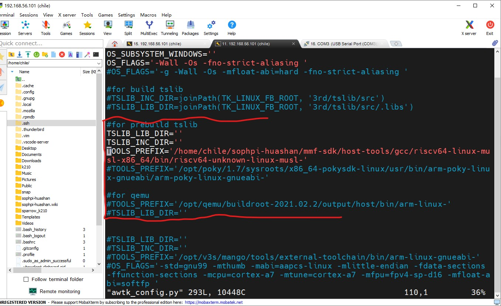
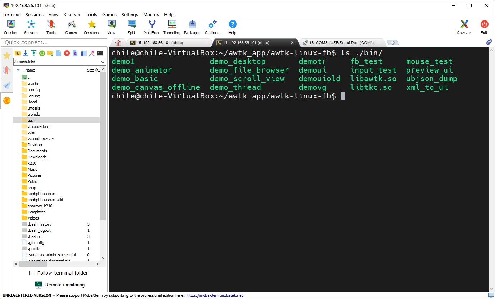
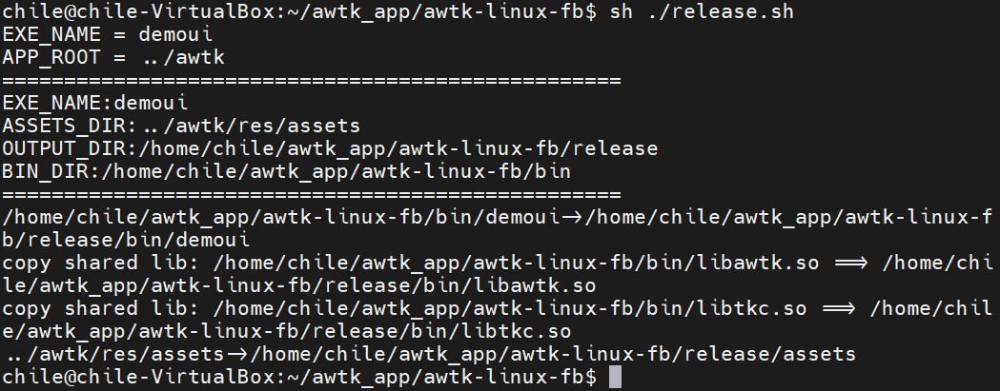
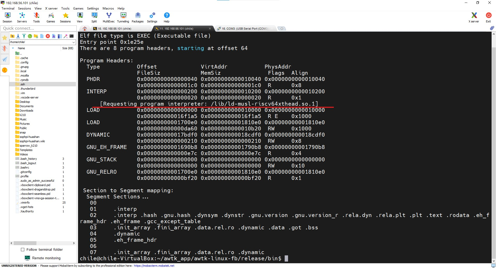
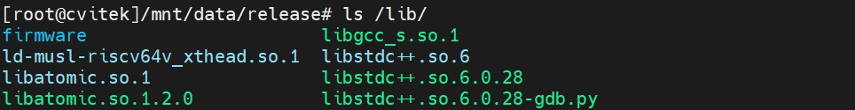
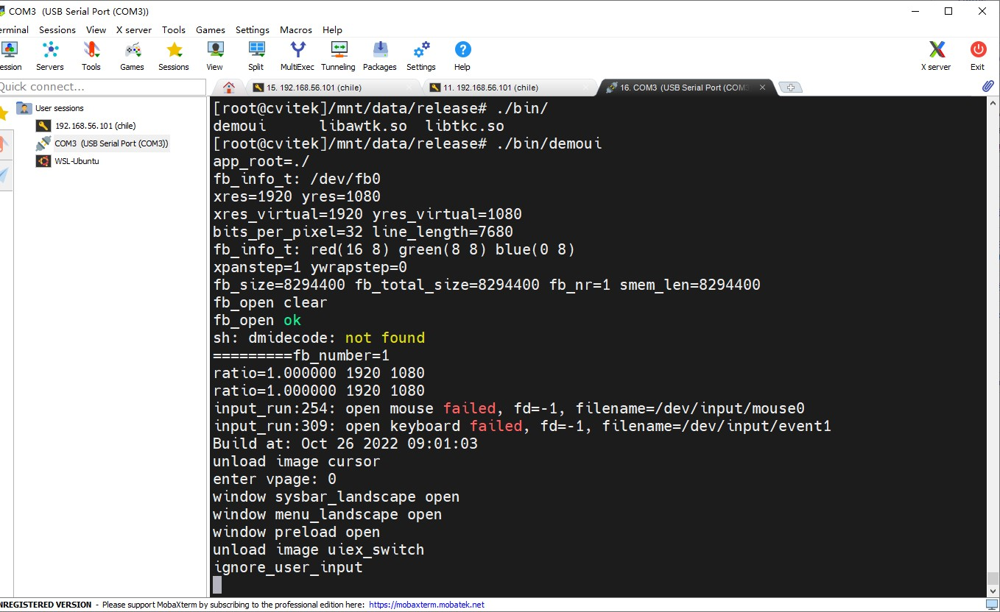
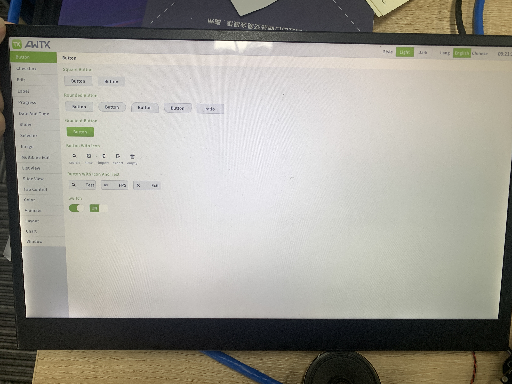

[toc]

# AWTK移植操作指南


## 1、获取源码

> awtk-examples停止维护，不需要

```sh
mkdir awtk_app
cd awtk_app
git clone https://github.com/zlgopen/awtk.git
git clone https://github.com/zlgopen/awtk-examples.git
git clone https://github.com/zlgopen/awtk-linux-fb.git
cd awtk-linux-fb
```

## 2、修改配置文件

> 编辑 awtk_config.py 设置工具链的路径
``` 
TSLIB_LIB_DIR='' #这两个是触摸依赖库，本教程未使用
TSLIB_INC_DIR='' 
# 最后一步配置交叉编译链工具路径
TOOLS_PREFIX='/home/chile/sophpi-huashan/cvi_media_sdk/host-tools/gcc/riscv64-linux-musl-x86_64/bin/riscv64-unknown-linux-musl-'

```




> 编辑 awtk-port/main_loop_linux.c 修改输入设备的文件名（根据实际情况，本次默认）
```
#define FB_DEVICE_FILENAME "/dev/fb0"
#define TS_DEVICE_FILENAME "/dev/input/event0"
#define KB_DEVICE_FILENAME "/dev/input/event1"
#define MICE_DEVICE_FILENAME "/dev/input/mouse0"
```


## 3、编译生成可执行文件

> 编译（请先安装 scons)
> sudo apt install scons
```
scons
```
生成内置 demoui 例子，生成结果在 build/bin 文件夹下的 demoui 文件，如下图




## 4、生成发布包

> 对于内置的 demoui 例子
```
sh ./release.sh
```
生成`release/`文件夹以及其的压缩包`release.tar.gz`，如下图





> 重点：修改可执行文件的Interpreter路径，否则可执行文件在开发板上会出现
> -sh: xxx not found 现象

执行 ` readelf -l ./release/bin/demoui`，输出下图





在板端执行 ` ls /lib/` 




所以需要将 `/lib/ld-musl-riscv64xthead.so.1` 改成 ` /lib/ld-musl-riscv64v_xthead.so.1`


**方式一**：

```
## 如果没有patchelf，安装patchelf工具修改可执行文件
sudo apt install patchelf
## 

cd release/bin
patchelf --set-interpreter /lib/ld-musl-riscv64v_xthead.so.1 ./release/bin/demoui

# #打包成release.tar，之后方便传到开发板
tar -cf release.tar release
```

> 方式一 end


**方式二(推荐)：**

>  添加动态链接库加载器参数
>
>  -Wl,-dynamic-linker,/lib/ld-musl-riscv64v_xthead.so.1

```
vi awtk_config.py
#输出如下
...

OS_LIBS = ['stdc++', 'pthread', 'rt', 'm', 'dl']

#for android
#TSLIB_LIB_DIR=''
#TSLIB_INC_DIR=''
#TOOLS_PREFIX='/opt/android-ndk-r20b/toolchains/llvm/prebuilt/linux-x86_64/bin/'
#TOOLS_PREFIX='/Users/jim/android/android-ndk-r21d/toolchains/llvm/prebuilt/darwin-x86_64/bin/'
#CC=TOOLS_PREFIX+'armv7a-linux-androideabi16-clang'
#CXX=TOOLS_PREFIX+'armv7a-linux-androideabi16-clang++'
#LD=TOOLS_PREFIX+'arm-linux-androideabi-ld'
#AR=TOOLS_PREFIX+'arm-linux-androideabi-ar'
#STRIP=TOOLS_PREFIX+'arm-linux-androideabi-strip'
#RANLIB=TOOLS_PREFIX+"arm-linux-androideabi-ranlib"
#OS_LINKFLAGS=' -Wl,--allow-multiple-definition '
#OS_LIBS = ['stdc++', 'm']
#OS_FLAGS='-Wall -Os -DFB_DEVICE_FILENAME=\\\"\"/dev/graphics/fb0\\\"\" '

# 添加位置，指定动态链接库加载器
OS_LINKFLAGS= OS_LINKFLAGS + ' -Wl,-rpath=./bin -Wl,-rpath=./ -Wl,-dynamic-linker,/lib/ld-musl-riscv64v_xthead.so.1'

if LCD_DEVICES =='drm' :
  #for drm
  OS_FLAGS=OS_FLAGS + ' -DWITH_LINUX_DRM=1 -I/usr/include/libdrm '
  OS_LIBS=OS_LIBS + ['drm']
elif LCD_DEVICES =='egl_for_fsl':
  #for egl for fsl
  OS_FLAGS=OS_FLAGS + ' -DEGL_API_FB '
  OS_LIBS=OS_LIBS + [ 'GLESv2', 'EGL']
elif LCD_DEVICES =='egl_for_x11' :
  #for egl for fsl
  OS_FLAGS=OS_FLAGS + ' -fPIC '
  OS_LIBS=OS_LIBS + [ 'X11', 'EGL', 'GLESv2' ]
elif LCD_DEVICES =='egl_for_gbm' :
  #for egl for gbm
  OS_CPPPATH += ['/usr/include/libdrm', '/usr/include/GLES2']
  OS_LIBS=OS_LIBS + [ 'drm', 'gbm', 'EGL', 'GLESv2' ]
  
  ...

```

```sh
# 因为修改了编译器参数，重新编译
scons

# 打包release/和release.tar.gz
./release.sh

#路径下文件如下：
...

chile@chile-VirtualBox:~/awtk_app/awtk-linux-fb$ ls
awtk_config_common.py  awtk-port  build  format.sh  __pycache__  release     release.tar     release_zlg_im287a.sh
awtk_config.py         bin        docs   lib        README.md    release.sh  release.tar.gz  SConstruct
chile@chile-VirtualBox:~/awtk_app/awtk-linux-fb$

...
```


## 5、传输文件到板端

>  本教程使用scp指令传输，也可用其他，使用前记得插好网线


### 5.1 板端配置

```
ifconfig eth0 192.168.1.3 netmask 255.255.255.0 	##同一网段即可
```


### 5.2 传输文件

> 使用方式二指定加载器路径的使用release.tar.gz

```
scp release.tar root@192.168.1.3:/mnt/data		#密码：cvitek
```


## 6、板端使用
```
# 解压release.tar
tar -xvf release.tar
cd release/

# 启动屏幕
../hdmi/lt9611_test		#如使用HDMI接口,注意使用自己的路径就好
devmem 0x0a088000 32 0xC0
##

# 加载framebuffer对应的ko:
    insmod /mnt/system/ko/cfbcopyarea.ko 
    insmod /mnt/system/ko/cfbfillrect.ko 
    insmod /mnt/system/ko/cfbimgblt.ko 
    insmod /mnt/system/ko/cvi_fb.ko
##

#运行GUI程序demo
./bin/demoui
##
```


## 7、运行效果

> 终端输出





> 屏幕显示





## 8、自定义自己的GUI界面

> 参考awtk官网GUI开发教程
