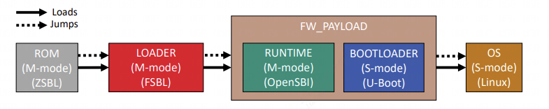

## 开发板启动流程


对华山派开发板启动流程的分析

uboot网络配置：

```sh
setenv ipaddr 192.168.1.3
setenv ethaddr e6:dd:0c:07:db:0d
setenv gatewayip 192.168.1.1
setenv netmask 255.255.255.0
setenv serverip 192.168.1.2
saveenv
```

关于开发板的存储设备emmc，在系统中的文件为`/dev/mmcblk0*`分成不同的分区，一个分区只能有一个文件系统

jffs2根文件系统制作尝试：

- `build/Makefile`中的`jffs2`项用来制作rootfs
- `menuconfig_kernel`中勾选jffs2文件系统支持
- `partition_emmc.xml`修改
- uboot启动参数设置`rootfstype`项

### 一、启动流程框图

参考[riscv-bringup/Readme.md at master · carlosedp/riscv-bringup (github.com)](https://github.com/carlosedp/riscv-bringup/blob/master/unleashed/Readme.md)

```sh

                                    +----------------------------------+      Extlinux.conf                Linux
                                    |                                  |
                                    |         SBL - FW_PAYLOAD         |    +----------------+    +--------------------+
                                    |                                  |    |                |    |                    |
+--------------+   +----------+     |  +-----------+    +-----------+  |    | Unleashed Menu |    | Starting kernel ...|
|              |   |          |     |  |           |    |           |  |    |                |    | [0.00] Linux versio|
|  ROM - ZSBL  |   |  Loader  |     |  |           |    |           |  |    | 1. Kernel 5.5  |    | [0.00] Kernel comma|
|  In the SoC  +-->+  FSBL    +---->+  |  OpenSBI  +--->+   U-Boot  |  +--->+ 2. Kernel 5.6  +--->+ ..                 |
|              |   |          |     |  |           |    |   Payload |  |    |                |    | ...                |
+--------------+   +----------+     |  |           |    |           |  |    |                |    |                    |
                                    |  |           |    |           |  |    |                |    |                    |
                                    |  +-----------+    +-----------+  |    +----------------+    +--------------------+
                                    |                                  |
                                    +----------------------------------+

```

- ZSBL：Soc芯片内部ROM中的一段代码，根据MSEL来选择启动设备加载FSBL；
- FSBL：初始化寄存器，清除BSS段，设置堆栈，设置时钟，初始化DDR，建立C运行环境，加载Uboot到DDR等等；(由源码路径中的`fsbl/`编译生成fip.bin，烧录到固定地址)，此外，还会设置一些opensbi阶段的参数，最后引导sbi。
- OpenSBI：确认启动hart id，代码重定位，清除BSS段，设置临时栈空间，调用c函数读取设备树(上一阶段传递的扁平设备树)，对设备树重定位，最后调用c函数sbi_init，进行设备初始化（平台、串口、Timer等），最后设置相关寄存器切换到S模式。



- 
