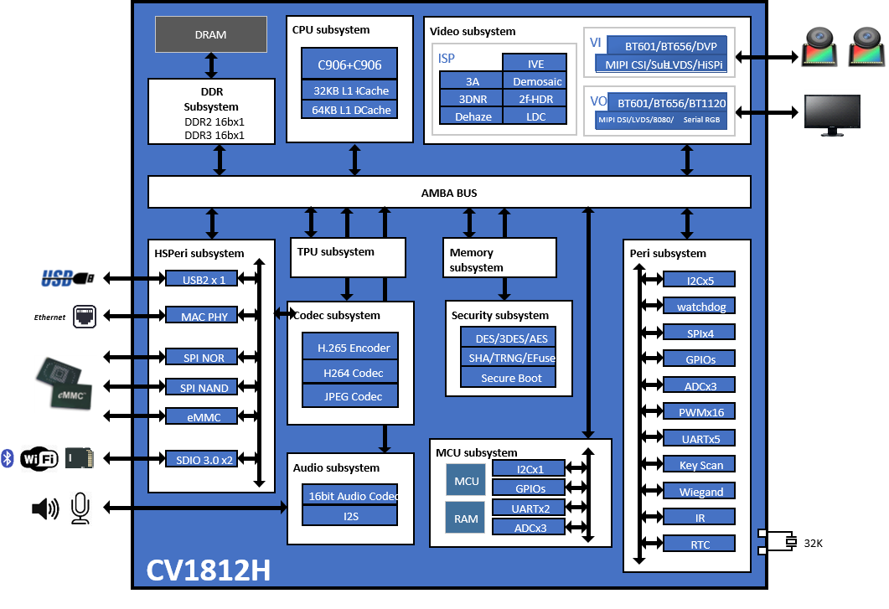
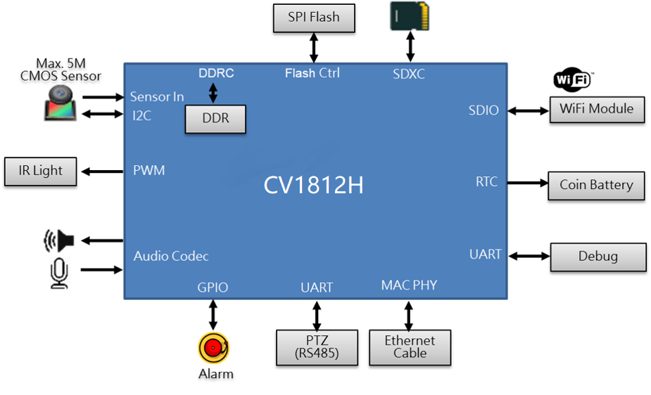
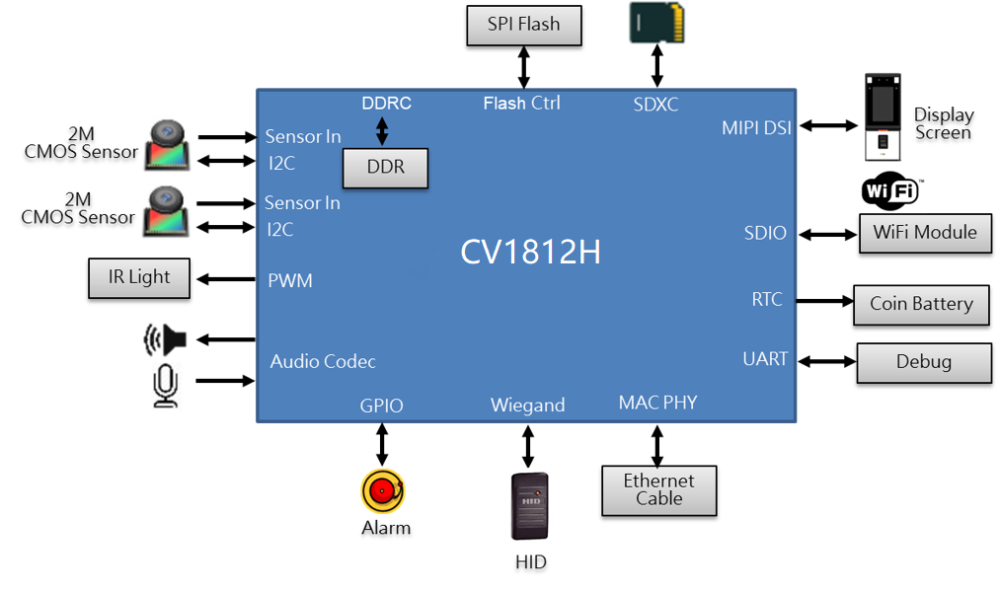

[toc]

---

# CV1812H芯片介绍

## 一、产品概述

CV1812H是面向边缘智能监控IP摄像机、本地端人脸辨识考勤机、智能家居等产品领域而推出的高性能、低功耗芯片，集成了H.264/H.265视频压缩编解码器和ISP；支持HDR宽动态、3D降噪、除雾、镜头畸变校正等多种图像增强和矫正算法，为客户提供专业级的视频图像质量。

芯片更集成自研TPU，在INT8运算下，可提供约0.5TOPS算力。特殊设计的 TPU 调度引擎能有效地为张量处理器核心提供极高的带宽数据流；并为用户提供了强大的深度学习模型编译器和软件SDK开发包。主流的深度学习框架，比如Caffe，Pytorch，ONNX ，MXNet和TensorFlow(Lite) 框架的主流网络可以轻松的移植到平台上。

## 二、主要特性

### *处理器内核*

​	主处理器 RISC-V C906 @1.0GHz

​	协处理器 RISC-V C906 @700MHz

​	Vector加速，集成了浮点运算单元(FPU)

### *自研TPU*

​	≈ 0.5TOPs@INT8

​	支持主流神经网络框架 : Caffe，TensorFlow，TensorFlow Lite，Pytorch，ONNX和MXNet

### *视频编解码性能*

​	H.265 Main Profile

​	H.264 Baseline/Main/High Profile

​	H.264 编解码最大分辨率：2880x1620

​	H.265 编码最大分辨率：2880x1620

​	H.264编解码性能：

​		•2880x1620@30fps+720x576@30fps

​		•2304x1296@30fps 编码 +1920x1080@30fps 解码

​	H.265编码性能：

​		•2880x1620@30fps+720x576@30fps

​	JPEG最大编解码性能：2880x1620@30fps

​	支持 CBR/VBR/FIXQP 等多种码率控制模式

​	支持 感兴趣区域（ROI）编码

### *图像视频处理*

​	图像视频90、180、270度旋转、 Mirror、Flip

​	视频OSD叠加

​	视频1/32～32x缩放功能

​	3A（AE/AWB/AF）算法

​	固定模式噪声消除、坏点校正

​	镜头阴影校正、镜头畸变校正、紫边校正

​	方向自适应demosaic

​	Gamma校正、动态对比度增强、颜色管理和增强

​	区域自适应去雾

​	Bayer降噪、3D降噪、细节增强及锐化增强

​	Local Tone mapping

​	Sensor自带宽动态和2帧宽动态

### *音频解码性能*

​	软件音频编解码协议（G.711、G.726、ADPCM）

​	支持音频3A（AEC、ANR、AGC）功能

### *视频接口*

​	输入

​		•支持三路输入(MIPI x 2 + DVP x 1)

​		•支持8/10/12bit RGB Bayer 视频输入

​		•支持BT.601、BT.656 视频输入

​		•支持MIPI、Sub-LVDS、HiSPi接口

​		•支持主流SONY、OV 、SmartSense 、GC等高清CMOS sensor

​		•兼容多种sensor并行/差分接口电气特性

​		•提供可编程sensor时钟输出

​		•支持输入最大宽度2880，最大分辨率 2880x1620

​	输出

​		•支持1个BT.601/BT.656/BT.1120 输出接口

​		•支持4Lane MIPI-DSI 输出接口

​		•支持8080/LVDS输出接口

​		•支持串口RGB/RGB666/RGB888输出接口

### *音频接口*

​	集成Audio codec，支持16bit语音输入和输出

​	支持I2S/PCM/TDM 接口，支持对接外部Audio codec, 提供MCLK时钟输出

### *安全*

​	支持安全启动及升级

​	AES/DES/SM4 硬件加解密

​	SHA/TRNG/Secure eFuse安全硬件

### *外围接口*

​	集成POR、集成高精度RTC

​	集成6通道ADC

​	6个I2C、4个SPI、7个UART、4 组(16通道) PWM

​	2个SDIO接口，支持SDIO 3.0

​	1个USB 2.0 Host/Device接口

​	若干GPIO接口

​	集成Key scan、Wiegand 、IR

​	集成 MAC PHY，支持RMII模式；10/100 Mbps 全双工或半双工模式

### *内存接口*

​	内置 DRAM 

​		•CV1812H内置DDR3 2Gbit (256MB)

​	SPI Nor Flash 接口(1.8V/3.0V)

​		•支持1、2、4线模式

​		•最大容量支持256MB

​	SPI Nand Flash 接口(1.8V/3.0V)

​		•使用器件本身內建的ECC模塊

​		•支持1KB/2KB/4KB 页大小

​		•对应最大容量支持16G/32G/64G

​	–支持 eMMC4.5 接口(4bit,1.8V)

​		•最大容量支持2TB

### *启动*

​	支持从SPI NOR flash 启动

​	支持从SPI NAND flash 启动

​	支持从eMMC 启动

​	支持快速开机

### *镜像烧录模式*

​	支持通过SD 卡烧写镜像

​	支持通过USB device烧写镜像

​	支持通过以太网烧写镜像

### *物理规格*

​	支持多级省电模式

​	工作电压

​		•内核电压为0.9V

​		•IO电压为1.8V/3.0V

​	封装形式

​		•CV1812H 使用 LFBGA 封装

​		•10mm x 10mm封装大小

​		•管脚间距 : 0.65 mm pitch

## 功能模块图

## CV1812H智能IP摄像机解决方案

  

## CV1812H智能人脸考勤机解决方案

 

