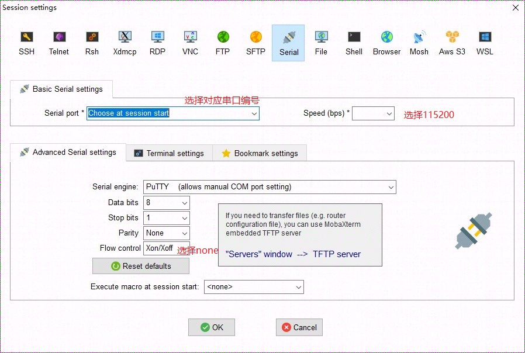
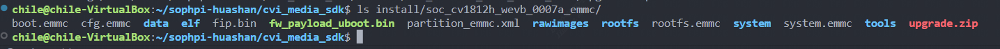

[toc]

---
<div STYLE="page-break-after: always;"></div>

> note：使用前请确保配置好相关环境，未配置见《软件安装编译环境搭建》

# SD卡烧录说明

## 1、使用前准备

    # FAT32格式的Micro SD卡，用以下命令查看sd卡分区格式
    sudo fdisk -l    
    
    # Ubuntu下格式化SD卡为Fat32格式操作，如果sd卡是fat32格式跳过下面操作
    1.df -h 			#查看设备号
    2.umount /dev/sdb1	#取消挂载
    3.sudo mkfs.vfat -F 32 /dev/sdb1  	#格式化成Fat32格式
    4.sudo fdisk -l						#查看格式化结果

## 2、操作过程

> 文件位置


    1.将烧录档案（如下）放到SD卡中。
        .
        ├── fip.bin         
        ├── boot.emmc   (minimal Linux image)
        ├── rootfs.emmc  (rootFS)
        ├── system.emmc (rw 分区)
        ├── cfg.emmc      (config rw)
        └── fw_payload_uboot.bin (bootloader + uboot)
    
    2.将SD卡插入的SD卡槽中。
    3.将平台重开机。


<div STYLE="page-break-after: always;"></div>

## 3、操作实例

### 3.1, 将开发板上通过串口转TTL板与电脑连接

> 注意板端的RX脚接 `usb-ttl` 的TX脚，板端TX脚接 `usb-ttl` 的RX脚


<div STYLE="page-break-after: always;"></div>

### 3.2, 使用mobaxterm配置串口终端




> 终端显示

```
[root@cvitek]~#
```


```shell
1. 插卡上电开机后，会自动进入升级，升级完成后，如下所示会停留在uboot:


Hit any key to stop autoboot:  0
## Resetting to default environment
Start SD downloading...
mmc1 : finished tuning, code:60
465408 bytes read in 11 ms (40.3 MiB/s)
mmc0 : finished tuning, code:27
switch to partitions #1, OK
mmc0(part 1) is current device

MMC write: dev # 0, block # 0, count 2048 ... 2048 blocks written: OK in 17 ms (58.8 MiB/s)

MMC write: dev # 0, block # 2048, count 2048 ... 2048 blocks written: OK in 14 ms (71.4 MiB/s)
Program fip.bin done
mmc0 : finished tuning, code:74
switch to partitions #0, OK
mmc0(part 0) is current device
64 bytes read in 3 ms (20.5 KiB/s)
Header Version:1
2755700 bytes read in 40 ms (65.7 MiB/s)

MMC write: dev # 0, block # 0, count 5383 ... 5383 blocks written: OK in 64 ms (41.1 MiB/s)
64 bytes read in 4 ms (15.6 KiB/s)
Header Version:1
13224 bytes read in 4 ms (3.2 MiB/s)

MMC write: dev # 0, block # 5760, count 26 ... 26 blocks written: OK in 2 ms (6.3 MiB/s)
64 bytes read in 4 ms (15.6 KiB/s)
Header Version:1
11059264 bytes read in 137 ms (77 MiB/s)

MMC write: dev # 0, block # 17664, count 21600 ... 21600 blocks written: OK in 253 ms (41.7 MiB/s)
64 bytes read in 3 ms (20.5 KiB/s)
Header Version:1
4919360 bytes read in 65 ms (72.2 MiB/s)

MMC write: dev # 0, block # 158976, count 9608 ... 9608 blocks written: OK in 110 ms (42.6 MiB/s)
64 bytes read in 4 ms (15.6 KiB/s)
Header Version:1
10203200 bytes read in 128 ms (76 MiB/s)

MMC write: dev # 0, block # 240896, count 19928 ... 19928 blocks written: OK in 228 ms (42.7 MiB/s)
Saving Environment to MMC... Writing to MMC(0)... OK
mars_c906#
```

> 拔掉SD卡，输入re重启进入系统


# USB烧录说明

## 1、使用前准备
### Python环境准备
1. 安装 Python3 (https://www.python.org/) 
2. 使用下列步骤安装 Pip
   · 下载 https://bootstrap.pypa.io/get-pip.py 
   · 使用`python get-pip.py`安装 `pip`

3. 使用 `python -m pip install pyserial”`安装 `pyserial`
### 烧录文件准备
> 文件位置
> 

        准备好烧录档案
        .
        ├── fip.bin         (bootloader + uboot)
        ├── boot.emmc   (minimal Linux image)
        ├── rootfs.emmc  (rootFS)
        ├── system.emmc (rw 分区)
        ├── cfg.emmc      (config rw)
        └── partition_emmc.xml

## 2、操作过程

### a. Windows 

1. 准备好固件目录 (由平台对应 upgrade.zip 解压出来)
2. 将平台的 Uart 连上 Host 并且将平台断电,并在命令提示字符下执行以下命令
3. `cd \install\soc_cv1812h_wevb_0007a_emmc\tools\usb_dl\`
4. `py mars_dl.py --libusb --cpu riscv –image_dir `
5. 执行成功后，将平台上电 
### b. Linux 
1. 准备好固件目录 (由平台对应 upgrade.zip 解压出来) 
2. 将平台的 Uart 连上 Host 并且将平台断电,并在终端机 
3. `cd /install/soc_cv1812h_wevb_0007a_emmc/tools/usb_dl`
4. `py mars_dl.py --libusb --cpu riscv –image_dir `
5. 执行成功后，将平台上电