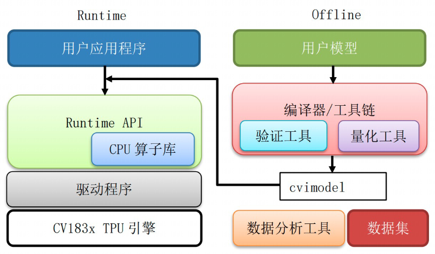
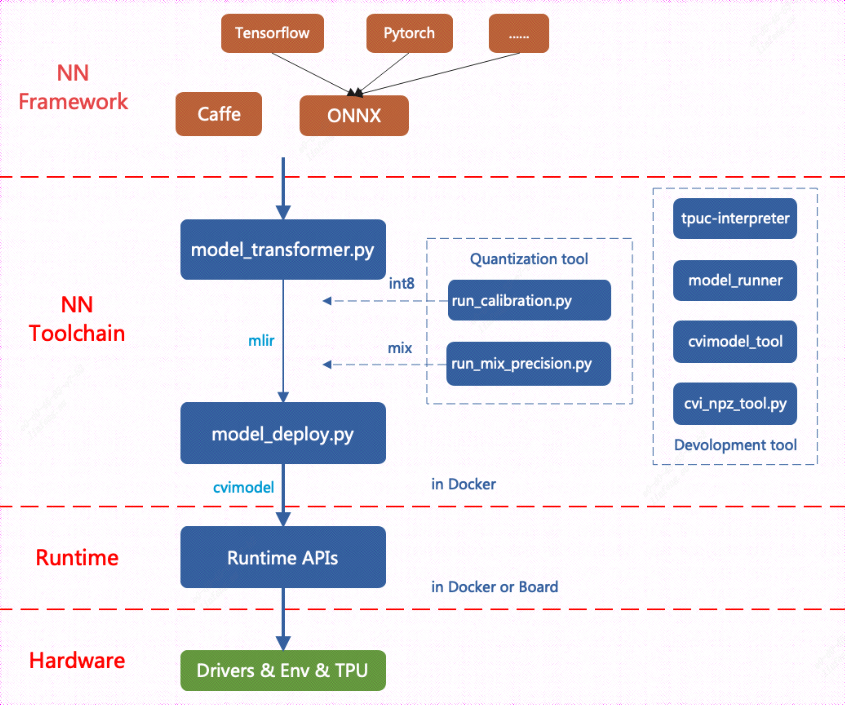
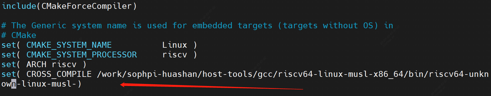

[toc]

---

<div STYLE="page-break-after: always;"></div>


> note：使用前请确保配置好相关环境，未配置见《软件安装编译环境搭建》


# TPU开发指南


## 一、基本介绍

### 1.1 TPU介绍 

CVITEK TPU是晶视智能开发的边缘计算SoC平台CV1812H的异构计算引擎。实现了 对主流神经网络运算的高效硬件加速，兼顾执行效率和可编程灵活性。计算精度方面同时支持高效 的INT8和高动态范围的BF16两种模式，并通过软件平台支持灵活的混合精度配置。

### 1.2 工具链介绍

CVITEK TPU工具链是一个高效，开放，透明，可扩展，模型移植全流程可控的神经网络编译优化 开发工具集。

### 1.3 软件框架




软件框架由Offline工具链和Runtime模型推理库两部分组成。Offline工具链包括模型转换，编译器，量化工具等组件，完成从用户模型导入，变换，量化，优化，到代码生成等步骤，最终组装为cvimodel格式的推理模型文件。Runtime模型推理库加载cvimodel，读取运行时信息进行设置和资源分配，加载权重数据和指令序列，驱动硬件执行其中的指令序列，完成神经网络推理计算任务，输出推理结果数据。Runtime包含完整仿真平台的支持，客户可以先在仿真平台完成模型移植，验证和精度测试，再加载到真实硬件上验证和执行。


### 1.4 神经网络编译器

>  神经网络编译器基于MLIR框架开发。编译器完成从一个**现有框架模型文件到TPU指令集的转换**。具体包括下述几个工具:

- `model_transform.py` ：用于将caffe/onnx框架生成的模型转换为以mlir为前端的fp32模型文件，用于后续的量化，优化和指令生成。

- `model_deploy.py` ：用于将fp32 mlir文件转换成cvimodel文件

- `run_calibration.py` ：对开发者指定的校准数据集执行推理计算，对每个tensor的数据进行统计，形成模型量化所需的参数。使用python进行数据读取，预处理，后处理和统计分析。

- `run_tune.py` ：对量化结果进行微调，提高量化精度

- `run_mix_precision.py `：通过校准数据集，进行混合量化，得到bf16量化表

- `仿真库`：仿真库不同于mlir-interpreter，仿真库模拟真实TPU硬件的指令执行和运算逻辑。对于INT8量化计算，mlir-interpreter的计算结果与仿真库的计算结果bit-accurate一致。对于浮点类型组合计算，mlir-interpreter会和硬件有一定差异，仿真器则仍然保证结果与硬件的bit-accurate一致性。
- `数据分析工具`：一组python工具集，用于对模型移植和编译过程中所产生的数据进行比较，统计，分析和问题定位。支持对转换的各个步骤输出的每层Tensor数据进行多种相似度比对，以确保模型INT8定点以及BF16推理精度达到要求。


### 1.5 模型转储cvimodel文件

> cvimodel文件是离线编译的最终结果，交付给runtime进行解析和在线推理。cvimodel还支持：

- 多batch和多分辨率：对于不同的batch_size和输入分辨率，由于资源和优化选择等差异，需要执行不同的指令序列，但共享权重数据。cvimodel采用相应文件数据格式支持同一模型对多种batch和多种分辨率的推理。

- 模型分段：对于包含TPU不支持算子的模型，支持采用TPU和CPU协同方式进行推理计算。将一个模型分成若干段，每段由特定引擎（TPU或CPU）分别执行。

- 自定义算子：自定义算子目前仅支持采用CPU实现。在cvimodel中，用户自定义算子编译为特定平台的动态链接库并保存在cvimodel模型文件中。

  

> 为华山派平台生成的cvimodel可以运行在CV1812H系列芯片上

### 1.6 Runtime

> Runtime库和应用程序运行在CV1812H SoC的RISC-V处理器Linux系统中。Runtime提供一组API供应用程序运行时调用，实现模型在板端的在线推理。主要功能包括：

- 解析cvimodel文件；
- 加载权重数据、根据配置的batch_size和分辨率信息加载指令序列数据；
- 根据CPU段信息加载CPU函数；
- 加载输入数据；
- 执行推理计算；
- 返回结果数据

<div STYLE="page-break-after: always;"></div>

#### 1.6.1 Python Binding

> Runtime支持Python Binding，方便利用python的数据预处理和后处理代码快速进行模型开发和验证以及离线仿真。


#### 1.6.2 仿真器

> Runtime 除了调用硬件外，还支持同样的API调用仿真器，进行离线测试和调试。


## 二、开发环境配置

安装并配置docker：

```sh
sudo apt install docker.io
systemctl start docker
systemctl enable docker
sudo groupadd docker
sudo usermod -aG docker $USER
newgrp docker (use before reboot)
```

从docker hub获取镜像文件：

```sh
docker pull cvitek/cvitek_dev:1.7-ubuntu-18.04
```

执行下述命令运行docker：

```sh
docker run -itd -v $PWD:/work --name cvitek cvitek/cvitek_dev:1.7-ubuntu-18.04
docker exec -it cvitek bash
```

下载tpu开发所需要的包文件：

```sh
wget --user='cvitek_mlir_2022' --password='Bxc~b6n!Zn' ftp://218.17.249.213/home/tpu_rel_v1.5.0-868-g743c9d53a/cvimodel_samples_cv181x.tar.gz

wget --user='cvitek_mlir_2022' --password='Bxc~b6n!Zn' ftp://218.17.249.213/home/tpu_rel_v1.5.0-868-g743c9d53a/cvitek_tpu_samples.tar.gz

wget --user='cvitek_mlir_2022' --password='Bxc~b6n!Zn' ftp://218.17.249.213/home/tpu_rel_v1.5.0-868-g743c9d53a/cvitek_tpu_sdk_cv181x_musl_riscv64.tar.gz

wget --user='cvitek_mlir_2022' --password='Bxc~b6n!Zn' ftp://218.17.249.213/home/cvitek_mlir_ubuntu-18.04_v1.5.0-872-g4818dc6ef.tar.gz
```

<div STYLE="page-break-after: always;"></div>

## 三、编译移植Pytorch模型


**基本流程**




**cvitek release包内容**

|文件 |描述|
|---|---|
|cvitek_mlir_ubuntu-18.04_v1.5.0-872-g4818dc6ef.tar.gz |cvitek NN工具链软件|
|cvitek_tpu_sdk.tar.gz |cvitek Runtime SDK，包括交叉编译头文件和库文件|
|cvitek_tpu_samples.tar.gz |sample程序源代码|
|cvimodel_samples.tar.gz |sample程序使用的cvimodel模型文件|
|docker_cvitek_dev_1.7-ubuntu-18.04.tar |cvitek Docker镜像文件|

<div STYLE="page-break-after: always;"></div>

以resnet18为例，介绍如何编译迁移一个pytorch模型至CV1812H TPU平台运行

需要以下文件：

- `cvitek_mlir_ubuntu-18.04_v1.5.0-872-g4818dc6ef.tar.gz`

除caffe外的框架，如tensorflow/pytorch均可以参考本章节步骤，先转换成onnx，再转换成cvimodel。如何将模型转换成onnx，可以参考onnx官网：[Tutorials for creating and using ONNX models ](https://github.com/onnx/tutorials)

**步骤1：加载cvitek_milr环境**

```sh
tar zxf cvitek_mlir_ubuntu-18.04_v1.5.0-872-g4818dc6ef.tar.gz
source cvitek_mlir/cvitek_envs.sh
```

**步骤2：获取pytorch模型并转换成onnx**

使用torchvision提供的resnet18模型：https://github.com/pytorch/vision/blob/main/torchvision/models/resnet.py

使用下列python脚本下载pytorch模型，并将pytorch模型输出为onnx格式，保存在`model_resnet18` 目录：

```sh
mkdir model_resnet18
cd model_resnet18
touch modeltrans.py
```

将以下代码放进`modeltrans.py` 文件

```sh
# python
import torch
import  torchvision.models as models
# Use an existing model  from Torchvision, note it
# will download this if  not already on your computer (might take time)
model = models.resnet18(pretrained=True)
# Create some sample  input in the shape this model expects
dummy_input = torch.randn(1, 3, 224, 224)
# Use the exporter from  torch to convert to onnx
torch.onnx.export(model,
    dummy_input,
    'resnet18.onnx',
    export_params=True,
    opset_version=13,
    verbose=True,
    input_names=['input'])
```

执行python脚本：

```sh
python modeltrans.py
```

得到 `resnet18.onnx` 。

<div STYLE="page-break-after: always;"></div>

**步骤3：onnx模型转换为fp32 mlir形式**

创建工作目录workspace，拷贝测试图片 `cat.jpg` ，和数据集100张图片(来自ILSVR2012)：

```sh
# 注意是在上面的model_resnet目录下
mkdir workspace && cd workspace 
cp $MLIR_PATH/tpuc/regression/data/cat.jpg .
cp -rf $MLIR_PATH/tpuc/regression/data/images .
```

推理前，我们需要了解这个模型的预处理参数，resnet18的预处理如链接描述：https://pytorch.org/hub/pytorch_vision_resnet/

>preprocess = transforms.Compose([
> transforms.Resize(256),
> transforms.CenterCrop(224),
> transforms.ToTensor(),
> transforms.Normalize(mean=[0.485, 0.456, 0.406], std=[0.229, 0.224, 0.225])
>])

使用 `model_transform.py` 将onnx模型转换成mlir文件，其中可支持预处理参数如下：

| 参数名 | 说明 |
| ------ | ---- |
|model_type |指定模型类型，caffe或者onnx|
|model_name |指定模型名称|
|image |指定输入文件用于验证，可以是图片或npy或npz；可以不指定，则不会正确性验证|
|net_input_dims |模型输入的大小，比如224,224|
|image_resize_dims| 改变图片高宽的大小，默认与网络输入维度一样|
|keep_aspect_ratio |在Resize时是否保持⻓宽比，默认为false；设置true时会对不足部分补0|
|raw_scale |图像的每个像素与255的比值，默认为255.0|
|mean |图像每个通道的均值，默认为0.0,0.0,0.0|
|std| 图像每个通道的标准值，默认为1.0,1.0,1.0|
|input_scale| 图像的每个像素比值，默认为1.0|
|model_channel_order |模型的通道顺序(bgr/rgb/rgba)，默认为bgr|
|gray |支持灰度格式，默认为false|
|batch_size |指定batch，默认用模型本身的batch|

预处理过程公式表达如下(x代表输入)：


<div STYLE="page-break-after: always;"></div>

由onnx模型转化为mlir，执行以下shell：

```sh
model_transform.py \
  --model_type onnx \
  --model_name resnet18 \
  --model_def ../resnet18.onnx \
  --image ./cat.jpg \
  --image_resize_dims 256,256 \
  --keep_aspect_ratio false \
  --net_input_dims 224,224 \
  --raw_scale 1.0 \
  --mean 0.406,0.456,0.485 \
  --std 0.255,0.244,0.229 \
  --input_scale 1.0 \
  --model_channel_order "rgb" \
  --tolerance 0.99,0.99,0.99 \
  --mlir resnet18_fp32.mlir
```

得到 `resnet18_fp32.mlir` 文件。

> 上述填入的预处理参数仅仅以信息的形式存放在mlir中，后续转换成cvimodel，也仅以信息的方式存放。对图片的预处理过程需要再外部处理，再传给模型运算。

**步骤4：生成全bf16量化cvimodel**

```sh
model_deploy.py \
  --model_name resnet18 \
  --mlir resnet18_fp32.mlir \
  --quantize BF16 \
  --chip mars \
  --image cat.jpg \
  --tolerance 0.99,0.99,0.86 \
  --correctness 0.99,0.99,0.93 \
  --cvimodel resnet18_bf16.cvimodel
```

**步骤5：生成全int8量化cvimodel**

先做Calibration，需要先准备校正图片集,图片的数量根据情况准备100~1000张左右。
这里用100张图片举例，执行calibration,执行如下shell：

```sh
run_calibration.py \
  resnet18_fp32.mlir \
  --dataset=./images \
  --input_num=100 \
  -o resnet18_calibration_table
```

得到 `resnet18_calibration_table` 。这里用 `--dataset` 指定样本目录，也可以用 `--image_list` 指定样本列表。

<div STYLE="page-break-after: always;"></div>

导入`calibration_table`，生成cvimodel：

```sh
model_deploy.py \
  --model_name resnet18 \
  --mlir resnet18_fp32.mlir \
  --calibration_table resnet18_calibration_table \
  --quantize INT8 \
  --chip mars \
  --image cat.jpg \
  --tolerance 0.98,0.98,0.84 \
  --correctness 0.99,0.99,0.99 \
  --cvimodel resnet18_int8.cvimodel
```

以上命令包含以下几步:

- 生成MLIR int8模型, 运行MLIR量化模型的推理, 并与MLIR fp32模型的结果做比较 \

  若对比不过是tolerance参数限制，转模型需要第一个参数(余弦相似度)需要0.8以上，越高说明转

  模型效果越好。

- 生成cvimodel, 并调用仿真器运行推理结果, 将结果与MLIR 量化模型做比较，使用correctness参数作为限制, 一般需要使用默认0.99,0.99,0.99值即可。

`model_deploy.py` 的相关参数说明如下：

|参数名 |说明|
|---|---|
|model_name |模型名称|
|mlir| mlir文件|
|image |用于测试的输入文件，可以是图片、npz、npy；如果有多个输入，用,隔开|
|calibration_table |指定calibration文件路径|
|quantize |指定默认量化方式，BF16/MIX_BF16/INT8|
|chip |支持平台，可以为cv183x/cv182x/mars|
|inputs_type| 指定输入类型(AUTO/FP32/INT8/BF16/SAME)，如果是AUTO，当第一层是INT8时用INT8，BF16时用FP32|
|outputs_type |指定输出类型(AUTO/FP32/INT8/BF16/SAME)，如果是AUTO，当最后层是INT8时用INT8，BF16时用FP32|
|model_version| 支持选择模型的版本，默认为latest|
|tolerance| 表示 MLIR 量化模型与 MLIR fp32模型推理结果相似度的误差容忍度|
|correctnetss| 表示仿真器运行的结果与MLIR int8模型的结果相似度的误差容忍度，默认0.99,0.99,0.99|
|excepts| 指定需要排除比较的层的名称，默认为-|
|debug |调试选项，保存所有的临时文件进行调试|
|cvimodel| 表示输出的cvimodel文件名|

<div STYLE="page-break-after: always;"></div>

**步骤6：开发板中测试模型性能数据**

配置开发板的TPU sdk环境：

```sh
# 若在182x/mars板端环境中出现: taz:invalid option --z的情况
# 先在其他linux环境解压为.tar的格式，再放到板端进行解压
tar zxf cvitek_tpu_sdk_mars_musl_riscv64.tar.gz
export TPU_SDK_PATH=$PWD/cvitek_tpu_sdk
cd cvitek_tpu_sdk && source ./envs_tpu_sdk.sh && cd ..
```

测试仿真环境与真实硬件的输出结果，需要步骤三或步骤四生成的调试文件：

- xxx_quantized_tensors_sim.npz 仿真环境中网络推理过程的tensor文件，作为与真实硬件输出结果参考对比
- xxx_in_fp32.npz 模型的输入tensor文件，测试不同类型的模型，input_npz文件需要不一样
- xxx_[int8/bf16].cvimodel  输出int8或者bf16的cvimodel文件

在开发板中执行以下shell，测试量化为int8模型的仿真环境和真实硬件输出结果进行比较：

```sh
model_runner \
--input resnet18_in_fp32.npz \
--model resnet18_int8.cvimodel \
--output out.npz \
--reference resnet18_quantized_tensors_sim.npz
```

若需打印性能数据, 可在执行model_runner 之前定义如下环境变量：

```sh
export TPU_ENABLE_PMU=1
```

**步骤7：量化模型的选择**

在业务场景部署中, 由于bf16量化的模型相似度高, 优先选择步骤三生成的bf16 cvimodel来搭配
cvitek_tpu_samples的使用。 
在cvitek_tpu_samples中确定代码中的预处理实现与转模型脚本的预处理参数一致, 保证模型推理出来分类或者检测结果正确。
在保证模型推理结果正确下，根据步骤五测试出来模型性能数据和真实场景需求, 选择是否需要使用int8量化模型。

<div STYLE="page-break-after: always;"></div>

## 四、编译并运行runtime samples


### 4.1 开发板运行Sample程序

运行release提供的sample预编译程序，需要如下文件：

`cvitek_tpu_sdk_mars_musl_riscv64.tar.gz`

`cvimodel_samples_cv181x.tar.gz`

将根据chip类型选择所需文件加载至开发板的文件系统，于开发板上的linux console执行，以mars(cv1812h)为例：
解压samples使用的model文件（`cvimodel_samples_cv181x.tar.gz`里以cvimodel格式交付），并解压`cvitek_tpu_sdk_mars_musl_riscv64.tar.gz`，并进入samples目录，执行测试，过程如下：

```sh
# envs
tar zxf cvimodel_samples_cv181x.tar.gz
export MODEL_PATH=$PWD/cvimodel_samples
tar zxf cvitek_tpu_sdk_mars_musl_riscv64.tar.gz
export TPU_ROOT=$PWD/cvitek_tpu_sdk
cd cvitek_tpu_sdk && source ./envs_tpu_sdk.sh
# get cvimodel info
cd samples
./bin/cvi_sample_model_info $MODEL_PATH/mobilenet_v2.cvimodel
####################################
# sample-1 : classifier
###################################
./bin/cvi_sample_classifier \
    $MODEL_PATH/mobilenet_v2.cvimodel \
    ./data/cat.jpg \
    ./data/synset_words.txt
# TOP_K[5]:
#  0.361328, idx 285, n02124075 Egyptian cat
#  0.062500, idx 287, n02127052 lynx, catamount
#  0.045898, idx 331, n02326432 hare
#  0.006012, idx 852, n04409515 tennis ball
#  0.001854, idx 332, n02328150 Angora, Angora rabbit
############################################
# sample-2 : classifier fused preprocess
############################################
./bin/cvi_sample_classifier_fused_preprocess \
    $MODEL_PATH/mobilenet_v2_fused_preprocess.cvimodel \
    ./data/cat.jpg \
    ./data/synset_words.txt
# TOP_K[5]:
#  0.361328, idx 285, n02124075 Egyptian cat
#  0.062500, idx 287, n02127052 lynx, catamount
#  0.045898, idx 331, n02326432 hare
#  0.006012, idx 852, n04409515 tennis ball
#  0.001854, idx 332, n02328150 Angora, Angora rabbit
############################################
# sample-3 : classifier multiple batch
############################################
./bin/cvi_sample_classifier_multi_batch \
    $MODEL_PATH/mobilenet_v2_bs1_bs4.cvimodel \
    ./data/cat.jpg \
    ./data/synset_words.txt
# TOP_K[5]:
#  0.361328, idx 285, n02124075 Egyptian cat
#  0.062500, idx 287, n02127052 lynx, catamount
#  0.045898, idx 331, n02326432 hare
#  0.006012, idx 852, n04409515 tennis ball
#  0.001854, idx 332, n02328150 Angora, Angora rabbit
```

同时提供脚本作为参考，执行效果与直接运行相同，如下：

```sh
./run_classifier.sh
./run_classifier_fused_preprocess.sh
./run_classifier_multi_batch.sh
```

在cvitek_tpu_sdk/samples/samples_extra目录下有更多的samples，可供参考：

```sh
./bin/cvi_sample_classifier_yuv420 \
    $MODEL_PATH/mobilenet_v2_int8_yuv420.cvimodel \
    ./data/cat.jpg \
    ./data/synset_words.txt
    
./bin/cvi_sample_detector_yolo_v3 \
    $MODEL_PATH/yolo_v3_416_with_detection.cvimodel \
    ./data/dog.jpg \
    yolo_v3_out.jpg
    
./bin/cvi_sample_detector_yolox_s \
    $MODEL_PATH/yolox_s.cvimodel \
    ./data/dog.jpg \
    yolox_s_out.jpg
    
./bin/cvi_sample_alphapose \
    $MODEL_PATH/yolo_v3_416_with_detection.cvimodel \
    $MODEL_PATH/alphapose.cvimodel \
    ./data/pose_demo_2.jpg \
    alphapose_out.jpg
    
./bin/cvi_sample_alphapose_fused_preprocess \
    $MODEL_PATH/yolo_v3_416_with_detection.cvimodel \
    $MODEL_PATH/alphapose_fused_preprocess.cvimodel \
    ./data/pose_demo_2.jpg \
    alphapose_out.jpg
    
./bin/cvi_sample_fd_fr \
    $MODEL_PATH/retinaface_mnet25_600_with_detection.cvimodel \
    $MODEL_PATH/arcface_res50.cvimodel \
    ./data/obama1.jpg \
    ./data/obama2.jpg
    
# Similarity: 0.747192
./bin/cvi_sample_fd_fr \
    $MODEL_PATH/retinaface_mnet25_600_with_detection.cvimodel \
    $MODEL_PATH/arcface_res50.cvimodel \
    ./data/obama1.jpg \
    ./data/obama3.jpg
    
# Similarity: 0.800899

./bin/cvi_sample_fd_fr \
    $MODEL_PATH/retinaface_mnet25_600_with_detection.cvimodel \
    $MODEL_PATH/arcface_res50.cvimodel \
    ./data/obama2.jpg \
    ./data/obama3.jpg
    
# Similarity: 0.795205

./bin/cvi_sample_fd_fr \
    $MODEL_PATH/retinaface_mnet25_600_with_detection.cvimodel \
    $MODEL_PATH/arcface_res50.cvimodel \
    ./data/obama1.jpg \
    ./data/trump1.jpg
    
# Similarity: -0.013767

./bin/cvi_sample_fd_fr \
    $MODEL_PATH/retinaface_mnet25_600_with_detection.cvimodel \
    $MODEL_PATH/arcface_res50.cvimodel \
    ./data/obama1.jpg \
    ./data/trump2.jpg
    
# Similarity: -0.060050

./bin/cvi_sample_fd_fr \
    $MODEL_PATH/retinaface_mnet25_600_with_detection.cvimodel \
    $MODEL_PATH/arcface_res50.cvimodel \
    ./data/obama1.jpg \
    ./data/trump3.jpg
    
# Similarity: 0.036089
```

<div STYLE="page-break-after: always;"></div>

### 4.2 交叉编译samples程序

发布包有samples的源代码，按照本节方法在Docker环境下交叉编译samples程序，然后在开发板上运行。

本节需要如下文件：

- `cvitek_tpu_sdk_mars_musl_riscv64.tar.gz`
- `cvitek_tpu_samples.tar.gz`

以华山派平台为例，TPU sdk准备：

```sh
tar zxf cvitek_tpu_sdk_mars_musl_riscv64.tar.gz
export TPU_SDK_PATH=$PWD/cvitek_tpu_sdk
cd cvitek_tpu_sdk && source ./envs_tpu_sdk.sh && cd ..
```

如果docker版本低于1.7，则需要更新32位系统库（只需一次）：

```sh
dpkg --add-architecture i386
apt-get update
apt-get install libc6:i386 libncurses5:i386 libstdc++6:i386
```

在编译demo之前，做以下修改，

> 注意`cvitek_tpu_sdk/cmake/toolchain-riscv64-linux-musl-x86_64.cmake`文件需要做一些修改，将交叉工具链改成全路径



编译samples，安装至install_samples目录：

```sh
tar zxf cvitek_tpu_samples.tar.gz
cd cvitek_tpu_samples
mkdir build_soc
cd build_soc
cmake -G Ninja \
    -DCMAKE_BUILD_TYPE=RELEASE \
    -DCMAKE_C_FLAGS_RELEASE=-O3 -DCMAKE_CXX_FLAGS_RELEASE=-O3 \
    -DCMAKE_TOOLCHAIN_FILE=$TPU_SDK_PATH/cmake/toolchain-riscv64-linux-musl-x86_64.cmake \
    -DTPU_SDK_PATH=$TPU_SDK_PATH \
    -DOPENCV_PATH=$TPU_SDK_PATH/opencv \
    -DCMAKE_INSTALL_PREFIX=../install_samples \
    ..
cmake --build . --target install
```

> 移至开发板，参考4.1章节使用

<div STYLE="page-break-after: always;"></div>

### 4.3 docker环境仿真运行samples程序

需要以下文件：

- `cvitek_mlir_ubuntu-18.04_v1.5.0-872-g4818dc6ef.tar.gz`
- `cvitek_tpu_samples.tar.gz`
- `cvimodel_samples_cv181x.tar.gz`

TPU sdk准备：

```sh
tar zxf cvitek_mlir_ubuntu-18.04_v1.5.0-872-g4818dc6ef.tar.gz
source cvitek_mlir/cvitek_envs.sh
```

编译samples，安装至install_samples目录：

```sh
tar zxf cvitek_tpu_samples.tar.gz
cd cvitek_tpu_samples
mkdir build
cd build
cmake -G Ninja \
    -DCMAKE_BUILD_TYPE=RELEASE \
    -DCMAKE_C_FLAGS_RELEASE=-O3 -DCMAKE_CXX_FLAGS_RELEASE=-O3 \
    -DTPU_SDK_PATH=$MLIR_PATH/tpuc \
    -DCNPY_PATH=$MLIR_PATH/cnpy \
    -DOPENCV_PATH=$MLIR_PATH/opencv \
    -DCMAKE_INSTALL_PREFIX=../install_samples \
    ..
cmake --build . --target install
```

运行samples程序：

```sh
# envs
tar zxf cvimodel_samples_cv181x.tar.gz
export MODEL_PATH=$PWD/cvimodel_samples
source cvitek_mlir/cvitek_envs.sh

# get cvimodel info
cd ../install_samples
./bin/cvi_sample_model_info $MODEL_PATH/mobilenet_v2.cvimodel
```

> 其他samples运行命令参照开发板运行命令

**调试samples程序**

前处理相关问题：

- 模型量化为bf16类型, 则输入类型为是float类型, 在sample中对⻬转模型脚本的预处理参数并且转化为float类型

- 模型量化为int8类型, 则输入类型为int8类型, 在sample中需要对⻬转模型的预处理参数, 并且根据模型的量化参数进行量化

- 模型带预处理参数, 即转模型中带fuse_preprocess参数, 在sample中需要传入int8的图片类型不需预处理, 模型内部会进行预处理


后处理相关问题：

- 通常在sample中后处理一般是客户来实现，但是部分符合条件的后处理我们内部会转化CPU操作来实现，若模型推理的结果不对，保证代码的前处理和转模型预处理参数一致的话, 主要是后处理出现问题。
