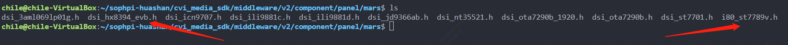

[toc]

---
<div STYLE="page-break-after: always;"></div>
> note：使用前请确保配置好相关环境，未配置见《软件安装编译环境搭建》


# HDMI及双摄显示操作指南

## 1、实验硬件资源准备
    1，HDMI线连接带有HDMI接口的高清屏幕。
    2，FPC线连接开发板J13至双路Sensor模组GC2053+GC2093。
## 2、HDMI显示操作准备如下

模块编译：源码路径分别为
`middleware/v2/sample/display_test/`
`middleware/v2/sample/vio/`

编译成功后会生成可执行文件`lt9611_test`和`sample_vio`

sensor配置文件在`middleware/v2/sample/sensor_cfg`目录下,并将`sensor_cfg.ini.gc2053+gc2093`重命名为`sensor_cfg.ini`
将三个文件拷贝至SD卡后，并在板端进行进行验证。
板子通过HDMI接屏幕，且双路sensor模组GC2053+GC2093连接开发板并上电。

## 3、操作示例   
    在控制台中依次执行下面命令
    挂载SD卡
    mount /dev/mmcblk1p1 /mnt/sd
    
    进入/mnt/sd目录后依次执行下面命令
    cp sensor_cfg.ini /mnt/data
    ./lt9611_test
    ./sample_vio 19 
    1 //切换到GC2093进行显示
    0 //切换到GC2053进行显示
<div STYLE="page-break-after: always;"></div>

## 4、程序解析

> 其中的涉及的一些概念和平台设计架构可以看多媒体开发指南，有具体介绍。


lt9611为mipi转HDMI芯片，初始化芯片之后就可以将图像传输到显示器上，在`sophpi-huashan/cvi_media_sdk/middleware/v2/sample/display_test`中有

相关的初始化程序，其中关于屏幕接口和sensor的配置参数文件可以在`sophpi-huashan/cvi_media_sdk/middleware/v2/component/panel/mars`和`sophpi-huashan/cvi_media_sdk/middleware/v2/component/isp/sensor/mars`目录下看到；




本节例程主要代码在`sophpi-huashan/cvi_media_sdk/middleware/v2/sample/vio`下


通过mian函数跳转到`sample_vio.c`中的`SAMPLE_VIO_VoRotation_Multi`函数，在这个函数中一共分为以下几个部分：

初始化开发板的多媒体软件平台及其相关模块

- **根据图像size为多媒体软件平台分配VB，初始化平台相关；**

  ```c
  	s32Ret = SAMPLE_COMM_VI_GetSizeBySensor(stIniCfg.enSnsType[0], &enPicSize);		// 根据sensor类型获取图像size
  	if (s32Ret != CVI_SUCCESS) {
  		CVI_TRACE_LOG(CVI_DBG_ERR, "SAMPLE_COMM_VI_GetSizeBySensor failed with %#x\n", s32Ret);
  		return s32Ret;
  	}
  
  	s32Ret = SAMPLE_COMM_SYS_GetPicSize(enPicSize, &stSize);					// stSize为图像宽高
  	if (s32Ret != CVI_SUCCESS) {
  		CVI_TRACE_LOG(CVI_DBG_ERR, "SAMPLE_COMM_SYS_GetPicSize failed with %#x\n", s32Ret);
  		return s32Ret;
  	}
  
  	/************************************************
  	 * step3:  Init modules
  	 ************************************************/
  	s32Ret = SAMPLE_PLAT_SYS_INIT(stSize);										// 分配vb内存池
  	if (s32Ret != CVI_SUCCESS) {
  		CVI_TRACE_LOG(CVI_DBG_ERR, "sys init failed. s32Ret: 0x%x !\n", s32Ret);
  		return s32Ret;
  	}
  ```

  

- **解析sensor配置文件ini，并将其填充到VI模块的初始化结构体，然后初始化sensor及VI模块；**

  ```c
  	/************************************************
  	 * step4:  Init VI ISP
  	 ************************************************/
  
  	s32Ret = SAMPLE_PLAT_VI_INIT(&stViConfig);									// 根据结构体初始化VI
  	if (s32Ret != CVI_SUCCESS) {
  		CVI_TRACE_LOG(CVI_DBG_ERR, "vi init failed. s32Ret: 0x%x !\n", s32Ret);
  		return s32Ret;
  	}
  ```

  

- **配置VPSS初始化结构体，然后绑定VI模块通道，初始化并启动；**

  ```c
  	/************************************************
  	 * step5:  Init VPSS
  	 ************************************************/
  	VPSS_GRP	   VpssGrp	  = 0;
  	VPSS_GRP_ATTR_S    stVpssGrpAttr;
  	VPSS_CHN           VpssChn        = VPSS_CHN0;
  	CVI_BOOL           abChnEnable[VPSS_MAX_PHY_CHN_NUM] = {0};
  	VPSS_CHN_ATTR_S    astVpssChnAttr[VPSS_MAX_PHY_CHN_NUM] = {0};
  
  	stVpssGrpAttr.stFrameRate.s32SrcFrameRate    = -1;
  	stVpssGrpAttr.stFrameRate.s32DstFrameRate    = -1;
  	stVpssGrpAttr.enPixelFormat                  = SAMPLE_PIXEL_FORMAT;
  	stVpssGrpAttr.u32MaxW                        = stSize.u32Width;
  	stVpssGrpAttr.u32MaxH                        = stSize.u32Height;
  	stVpssGrpAttr.u8VpssDev                      = 0;
  
  	astVpssChnAttr[VpssChn].u32Width                    = 1920;
  	astVpssChnAttr[VpssChn].u32Height                   = 1080;
  	astVpssChnAttr[VpssChn].enVideoFormat               = VIDEO_FORMAT_LINEAR;
  	astVpssChnAttr[VpssChn].enPixelFormat               = SAMPLE_PIXEL_FORMAT;
  	astVpssChnAttr[VpssChn].stFrameRate.s32SrcFrameRate = 30;
  	astVpssChnAttr[VpssChn].stFrameRate.s32DstFrameRate = 30;
  	astVpssChnAttr[VpssChn].u32Depth                    = 1;
  	astVpssChnAttr[VpssChn].bMirror                     = CVI_FALSE;
  	astVpssChnAttr[VpssChn].bFlip                       = CVI_FALSE;
  	astVpssChnAttr[VpssChn].stAspectRatio.enMode        = ASPECT_RATIO_NONE;
  	astVpssChnAttr[VpssChn].stNormalize.bEnable         = CVI_FALSE;
  
  	/*start vpss*/
  	abChnEnable[0] = CVI_TRUE;
  	s32Ret = SAMPLE_COMM_VPSS_Init(VpssGrp, abChnEnable, &stVpssGrpAttr, astVpssChnAttr);
  	if (s32Ret != CVI_SUCCESS) {
  		SAMPLE_PRT("init vpss group failed. s32Ret: 0x%x !\n", s32Ret);
  		return s32Ret;
  	}
  
  	s32Ret = SAMPLE_COMM_VPSS_Start(VpssGrp, abChnEnable, &stVpssGrpAttr, astVpssChnAttr);
  	if (s32Ret != CVI_SUCCESS) {
  		SAMPLE_PRT("start vpss group failed. s32Ret: 0x%x !\n", s32Ret);
  		return s32Ret;
  	}
  
  	ViPipe = 0;
  	ViChn = 0;
  	s32Ret = SAMPLE_COMM_VI_Bind_VPSS(ViPipe, ViChn, VpssGrp);
  	if (s32Ret != CVI_SUCCESS) {
  		SAMPLE_PRT("vi bind vpss failed. s32Ret: 0x%x !\n", s32Ret);
  		return s32Ret;
  	}
  ```

  

- **配置VO模块初始化结构体，初始化VO模块并绑定VPSS；**

  ```c
  	SAMPLE_VO_CONFIG_S stVoConfig;
  	RECT_S stDefDispRect  = {0, 0, 1920, 1080};
  	SIZE_S stDefImageSize = {1920, 1080};
  	VO_CHN VoChn = 0;
  	CVI_U32 j = 0;
  
  	s32Ret = SAMPLE_COMM_VO_GetDefConfig(&stVoConfig);
  	if (s32Ret != CVI_SUCCESS) {
  		CVI_TRACE_LOG(CVI_DBG_ERR, "SAMPLE_COMM_VO_GetDefConfig failed with %#x\n", s32Ret);
  		return s32Ret;
  	}
  
  	stVoConfig.VoDev	 = 0;
  	stVoConfig.stVoPubAttr.enIntfType  = VO_INTF_MIPI;
  	stVoConfig.stVoPubAttr.enIntfSync  = VO_OUTPUT_1080P60;
  	stVoConfig.stDispRect	 = stDefDispRect;
  	stVoConfig.stImageSize	 = stDefImageSize;
  	stVoConfig.enPixFormat	 = SAMPLE_PIXEL_FORMAT;
  	stVoConfig.enVoMode	 = VO_MODE_1MUX;
  
  	s32Ret = SAMPLE_COMM_VO_StartVO(&stVoConfig);
  	if (s32Ret != CVI_SUCCESS) {
  		SAMPLE_PRT("SAMPLE_COMM_VO_StartVO failed with %#x\n", s32Ret);
  		return s32Ret;
  	}
  
  	VpssGrp = 0;
  	VpssChn = 0;
  //	CVI_VO_SetChnRotation(stVoConfig.VoDev, VoChn, ROTATION_90);
  	SAMPLE_COMM_VPSS_Bind_VO(VpssGrp, VpssChn, stVoConfig.VoDev, VoChn);
  ```

  


## 5、实验效果

    HDMI屏幕上能切换显示GC2053及GC2093图像

> 终端输出


> 屏幕输出

