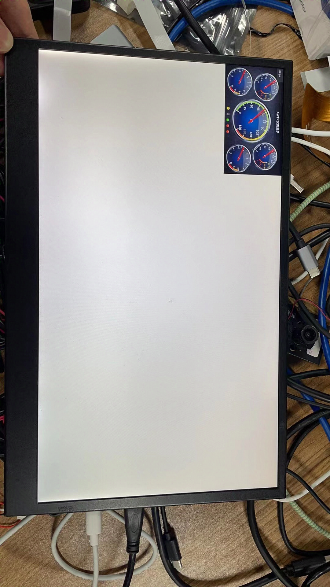

[toc]

---
<div STYLE="page-break-after: always;"></div>

> note：使用前请确保配置好相关环境，未配置见《软件安装编译环境搭建》

# 显示屏，GUI图形界面

## 1、编译APP

    1.cd cvi_media_sdk/
    2.source build/cvisetup.sh 				# 配置编译环境
    3.defconfig cv1812h_wevb_0007a_emmc		# 配置编译环境
    4.build_all								#编译
    5.cd ../product-sample/awtk_app/
    6.make clean&&make &&make install		#编译GUI应用app

> 编译输出

```sh
...

make[2]: Leaving directory '/home/chile/sophpi-huashan/product-sample/awtk_app/ui/sample'
make[1]: Leaving directory '/home/chile/sophpi-huashan/product-sample/awtk_app/ui'
tar -cf install.tar install/
chile@chile-VirtualBox:~/sophpi-huashan/product-sample/awtk_app$
```


## 2、配置板端资源以及环境

    1.通过NFS或者sd卡把cvi_media_sdk/middleware/v2/sample/mipi_tx/sample_dsi（如使用LCD接口）
      或 middleware/v2/sample/display_test/lt9611_test（如使用HDMI接口）
      拷贝到板端的/mnt/data目录下面。
    2.把install.tar 压缩包拷贝到板端/mnt/data后解压(编译完app后，install.tar在product-sample/awtk_app/路径下)：
      tar -xf install.tar
      注意：目前资源路径是在awtk_app_conf.h这个文件设定，现在配置是：
      #define APP_RES_ROOT "/mnt/data/install/bin/res"
      所以install 必须放到/mnt/data/ 应用才能正常运行。
    3.配置环境变量:
        export LD_LIBRARY_PATH=$LD_LIBRARY_PATH:/mnt/data/install/lib
    4.运行sample_dsi 或 启动屏幕驱动：
        cd /mnt/data/
        ./sample_dsi # 如使用LCD接口
        或 
        ./lt9611_test # 如使用HDMI接口
        devmem 0x0a088000 32 0xC0
    5.加载fb对应的ko:
        insmod /mnt/system/ko/cfbcopyarea.ko 
        insmod /mnt/system/ko/cfbfillrect.ko 
        insmod /mnt/system/ko/cfbimgblt.ko 
        insmod /mnt/system/ko/cvi_fb.ko
    6.运行gui程序：
        cd /mnt/data/install/bin
        ./sample_awtk

<div STYLE="page-break-after: always;"></div>

## 3、GUI结果展示（HDMI）

