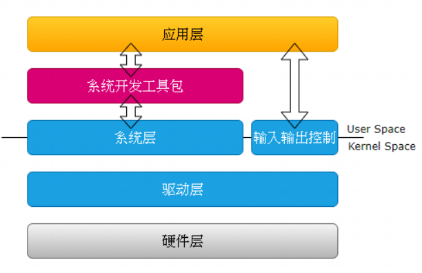
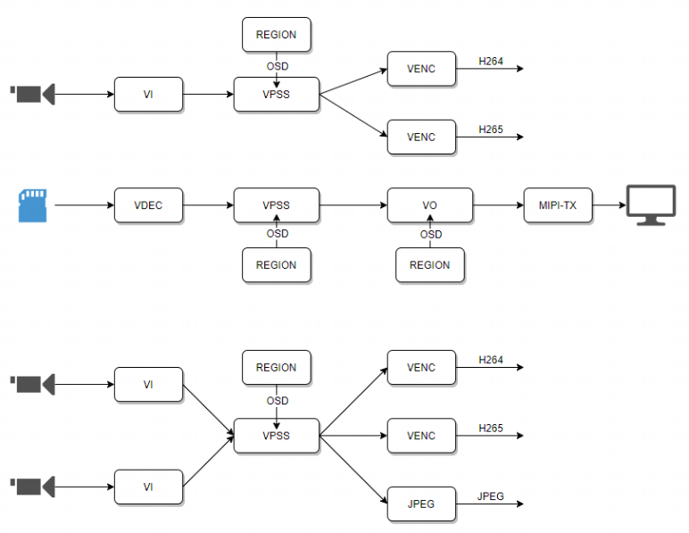
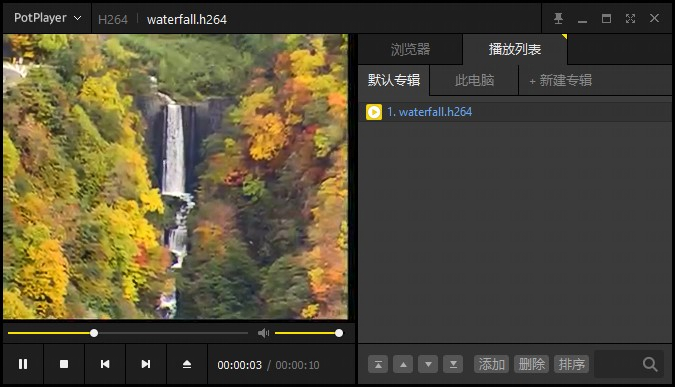

[toc]

---

<div STYLE="page-break-after: always;"></div>
> note：使用前请确保配置好相关环境，未配置见《软件安装编译环境搭建》


# 多媒体软件开发指南

CVITEK所提供的多媒体软件架构(Multimedia Framework, 简称MMF)，用以缩短应用开发的时间周期，该架构屏蔽了底层硬件的复杂设计和差异，提供了统一便捷的API接口，MMF包含了以下功能：ISP图像前处理、图像输入及输出、H265/H264/JPEG编解码、音频输入和输出、音频编解码等等

## 一、基本介绍

### 1.1 术语
MMF	 (Multimedia Framework 多媒体软件架构)

ISP		(Image Signal Processor 图像信号处理)

VI		  (Video Input 视频输入)

VPSS	  (Video Process Sub System 视频处理子系统)

VO		  (Video Output 视频输出)

VDEC      (Video Decoder 视频解码)

VENC	  (Video Encoder 视频编码)

AI		     (Audio Input 音频输入)

AO		   (Audio Output 音频输出)

ADEC      (Audio Dencoder 音频解码)

AENC      (Audio Encoder 音频编码)

REGION  (区域管理)

VB			(Video Buffer 图像内存区块)

MIPI		(Mobile Industry Processor Interface 移动通信行业处理器接口)


### 1.2 软件架构

- 硬件层 HW 

  由 CVITEK SoC 加上外围元件组成。外围元件包含 Flash, DDR, 视频 Sensor, ...等等 

- 驱动层 Driver 

  控制 HW 的驱动程序 

- 系统层 OS 

  基于 Linux 的 OS 系统

- 输入输出控制 Ioctl 

  用以控制 SDK 涵盖范围以外的元件, 例如 MIPI_RX, MIPI_TX。 

- 系统开发工具包 SDK 

  屏蔽了硬件细节和差异，提供统一API 以供开发 

- 应用层 Application 

  基于 SDK 和 ioctl，由用户开发的应用程序





<div STYLE="page-break-after: always;"></div>

### 1.3 多媒体软件平台处理流程

1、VI捕获视频图像，可对其做剪切、缩放等处理后，再将图像数据传给VPSS处理；

​      或者VDEC将编码后的码流解码，再将图像数据传给VPSS处理；

2、VPSS接收到VI或者VDEC的图像数据进行处理，并且可以同时输出多个不同分辨率的图像，以供预览、编码；

3、REGION可以将用户所指定的位图(Bitmap)、时间等元素作为OSD叠加在图像数据上；

4、VO接收VPSS处理后的图像，并且根据设定的时序将图像输出到显示设备；

​	  或者VENC接收VPSS处理后的图像，并将其编码压缩





**视频输入VI**

通过sensor将图像数据传入内存区域的模块，可以对图像进行缩放、裁剪、旋转等处理，输出多路不同分辨率的图像

**视频解码VDEC**

对编码后的视频流进行解码，并将解码后的图像数据作为VPSS或者VO的输入

**视频处理子系统VPSS**

接收解码后的输出或者VI的输出视频流，对图像进行去噪、增强、锐化等处理，并输出多路图像数据

**视频编码VENC**

接收VPSS处理过的图像数据，叠加OSD根据不同协议进行编码输出码流

**视频输出VO**

接收VPSS输出的图像数据，进行播放控制等处理，根据不同协议输出给显示设备

**视频内存区块VB**

分配给VI、VDEC、VPSS，经VO、VENC等使用后释放会区块池


## 二、例程解析

我们可以在`sophpi-huashan/cvi_media_sdk/middleware/v2/sample`目录下看到相关例程

```shell
chile@chile-VirtualBox:~/temp/turck/sophpi-huashan/cvi_media_sdk/middleware/v2/sample$ ls
audio   cvg           gyro     ive       osdc     rtk_hciattach  sensor_cfg   vdec    vio
cipher  display_test  ipcam    Makefile  overlay  sample.mk      sensor_test  vdecvo
common  fisheye       ir_auto  mipi_tx   region   scene_auto     tp           venc
```

在编译sdk时也会编译这些例程，在各自文件夹下生成相应的可执行文件，也可以在声明编译环境后单独编译

```shell
chile@chile-VirtualBox:~/temp/turck/sophpi-huashan/cvi_media_sdk/middleware/v2/sample$ make
```

<div STYLE="page-break-after: always;"></div>

### 2.1 vio例程解析

**main函数**

>  根据执行时附带的参数运行不同功能函数

```c
int main(int argc, char *argv[])
{
	CVI_S32 s32Ret = CVI_FAILURE;
	CVI_S32 s32Index;

    // 判断传入参数个数
	if (argc < 2) {	
		SAMPLE_VIO_Usage(argv[0]);
		return CVI_FAILURE;
	}

	if (!strncmp(argv[1], "-h", 2)) {
		SAMPLE_VIO_Usage(argv[0]);
		return CVI_SUCCESS;
	}

	signal(SIGINT, SAMPLE_VIO_HandleSig);		// 信号处理函数，SIGINT为中断信号，一般由Ctrl+C触发
	signal(SIGTERM, SAMPLE_VIO_HandleSig);
	
    // 根据参数实现不同功能
	s32Index = atoi(argv[1]);
	switch (s32Index) {
	case 0:
	
	...
	
	case 19:										// 以19为例
		s32Ret = SAMPLE_VIO_VoRotation_Multi();
		break;
	default:
		SAMPLE_PRT("the index %d is invaild!\n", s32Index);
		SAMPLE_VIO_Usage(argv[0]);
		return CVI_FAILURE;
	}

	if (s32Ret == CVI_SUCCESS)
		SAMPLE_PRT("sample_vio exit success!\n");
	else
		SAMPLE_PRT("sample_vio exit abnormally!\n");

	return s32Ret;
}
```


VI--VPSS--VO整体流程，先初始化mmf系统平台相关，包括视频内存管理等，然后初始化vi开启通道，初始化vpss，创建组和通道，与vi通道绑定，再初始化vo开启通道绑定vpss

<div STYLE="page-break-after: always;"></div>

**SAMPLE_VIO_VoRotation_Multi函数**

> 初始化参数配置

```c
	SAMPLE_SNS_TYPE_E  enSnsType	    = SENSOR0_TYPE;				// sensor型号
	WDR_MODE_E	   enWDRMode	    = WDR_MODE_NONE;				// WDR 工作模式，分为帧模式、行模式、非WDR
	DYNAMIC_RANGE_E    enDynamicRange   = DYNAMIC_RANGE_SDR8;		// 动态范围
	PIXEL_FORMAT_E     enPixFormat	    = SAMPLE_PIXEL_FORMAT;		// 像素格式
	VIDEO_FORMAT_E     enVideoFormat    = VIDEO_FORMAT_LINEAR;		// 视频格式
	COMPRESS_MODE_E    enCompressMode   = COMPRESS_MODE_NONE;		// 视频压缩模式
	VI_VPSS_MODE_E	   enMastPipeMode   = VI_OFFLINE_VPSS_OFFLINE;	// VI和VPSS工作模式
	VB_CONFIG_S        stVbConf;									// 视频缓存池结构体
	PIC_SIZE_E         enPicSize;									// 图像尺寸类型枚举
	CVI_U32            u32BlkSize, u32BlkRotSize;					
	SIZE_S stSize;													// 图像尺寸
	CVI_S32 s32Ret = CVI_SUCCESS;
	VI_DEV ViDev = 0;												// VI设备号
	VI_PIPE ViPipe = 0;												// VI管道号
	VI_CHN ViChn = 0;												// 通道号
	CVI_S32 s32WorkSnsId = 0;										// 运行sensor id
	SAMPLE_VI_CONFIG_S stViConfig;									
	VI_PIPE_ATTR_S     stPipeAttr;									// VI管道属性
	SAMPLE_INI_CFG_S	   stIniCfg = {0};
	//SAMPLE_VI_CONFIG_S stViConfig;

	stIniCfg = (SAMPLE_INI_CFG_S) {									// 初始化配置参数
		.enSource  = VI_PIPE_FRAME_SOURCE_DEV,						
		.devNum    = 2,
		.enSnsType[0] = SONY_IMX327_MIPI_2M_30FPS_12BIT,
		.enWDRMode[0] = WDR_MODE_NONE,
		.s32BusId[0]  = 3,
		.MipiDev[0]   = 0xff,
		.enSnsType[1] = SONY_IMX327_MIPI_2M_30FPS_12BIT,
		.enWDRMode[1] = WDR_MODE_NONE,
		.s32BusId[1] = 0,
		.MipiDev[1]  = 0xff,
		.u8UseMultiSns = 1,
	};

	// Get config from ini if found.
	if (SAMPLE_COMM_VI_ParseIni(&stIniCfg)) {						// 从ini文件解析配置参数
		SAMPLE_PRT("Parse complete\n");
	}

	//Set sensor number
	CVI_VI_SetDevNum(stIniCfg.devNum);								// 设置sensor数目
```
<div STYLE="page-break-after: always;"></div>
> 1.配置VI参数

```c
s32Ret = SAMPLE_COMM_VI_IniToViCfg(&stIniCfg, &stViConfig);
	if (s32Ret != CVI_SUCCESS)
		return s32Ret;
```

> 2.获取输入图像尺寸

```c
s32Ret = SAMPLE_COMM_VI_GetSizeBySensor(stIniCfg.enSnsType[0], &enPicSize);	// 形参为sensor型号和不同分辨率的枚举类型
	if (s32Ret != CVI_SUCCESS) {
		CVI_TRACE_LOG(CVI_DBG_ERR, "SAMPLE_COMM_VI_GetSizeBySensor failed with %#x\n", s32Ret);
		return s32Ret;
	}

	s32Ret = SAMPLE_COMM_SYS_GetPicSize(enPicSize, &stSize);		
	if (s32Ret != CVI_SUCCESS) {
		CVI_TRACE_LOG(CVI_DBG_ERR, "SAMPLE_COMM_SYS_GetPicSize failed with %#x\n", s32Ret);
		return s32Ret;
	}
```

> 3.初始化软件平台相关

```c
s32Ret = SAMPLE_PLAT_SYS_INIT(stSize);  // 配置并初始化vb以及mmf系统
	if (s32Ret != CVI_SUCCESS) {
		CVI_TRACE_LOG(CVI_DBG_ERR, "sys init failed. s32Ret: 0x%x !\n", s32Ret);
		return s32Ret;
	}
```

> 4.初始化并启动VI及其相关模块，使能设备、MIPI接口、创建pipe、isp、channels

```c
s32Ret = SAMPLE_PLAT_VI_INIT(&stViConfig);
	if (s32Ret != CVI_SUCCESS) {
		CVI_TRACE_LOG(CVI_DBG_ERR, "vi init failed. s32Ret: 0x%x !\n", s32Ret);
		return s32Ret;
	}
```

> 5.配置group初始化

```c
	VPSS_GRP	   	   VpssGrp	  = 0;														// group号
	VPSS_GRP_ATTR_S    stVpssGrpAttr;														// group属性
	VPSS_CHN           VpssChn        = VPSS_CHN0;											// 通道号
	CVI_BOOL           abChnEnable[VPSS_MAX_PHY_CHN_NUM] = {0};								// channel使能控制
	VPSS_CHN_ATTR_S    astVpssChnAttr[VPSS_MAX_PHY_CHN_NUM] = {0};							// channel属性

	stVpssGrpAttr.stFrameRate.s32SrcFrameRate    = -1;
	stVpssGrpAttr.stFrameRate.s32DstFrameRate    = -1;
	stVpssGrpAttr.enPixelFormat                  = SAMPLE_PIXEL_FORMAT;
	stVpssGrpAttr.u32MaxW                        = stSize.u32Width;
	stVpssGrpAttr.u32MaxH                        = stSize.u32Height;
	stVpssGrpAttr.u8VpssDev                      = 0;

	astVpssChnAttr[VpssChn].u32Width                    = 1920;
	astVpssChnAttr[VpssChn].u32Height                   = 1080;
	astVpssChnAttr[VpssChn].enVideoFormat               = VIDEO_FORMAT_LINEAR;
	astVpssChnAttr[VpssChn].enPixelFormat               = SAMPLE_PIXEL_FORMAT;
	astVpssChnAttr[VpssChn].stFrameRate.s32SrcFrameRate = 30;
	astVpssChnAttr[VpssChn].stFrameRate.s32DstFrameRate = 30;
	astVpssChnAttr[VpssChn].u32Depth                    = 1;
	astVpssChnAttr[VpssChn].bMirror                     = CVI_FALSE;
	astVpssChnAttr[VpssChn].bFlip                       = CVI_FALSE;
	astVpssChnAttr[VpssChn].stAspectRatio.enMode        = ASPECT_RATIO_NONE;
	astVpssChnAttr[VpssChn].stNormalize.bEnable         = CVI_FALSE;

	/*start vpss*/
	abChnEnable[0] = CVI_TRUE;																	//	group0 
	s32Ret = SAMPLE_COMM_VPSS_Init(VpssGrp, abChnEnable, &stVpssGrpAttr, astVpssChnAttr);		//	创建group并开启channel
	if (s32Ret != CVI_SUCCESS) {																//	
		SAMPLE_PRT("init vpss group failed. s32Ret: 0x%x !\n", s32Ret);							//	
		return s32Ret;																			//	
	}																							//

	s32Ret = SAMPLE_COMM_VPSS_Start(VpssGrp, abChnEnable, &stVpssGrpAttr, astVpssChnAttr);		// 启用group
	if (s32Ret != CVI_SUCCESS) {																//
		SAMPLE_PRT("start vpss group failed. s32Ret: 0x%x !\n", s32Ret);						//	
		return s32Ret;																			//
	}																							//

	ViPipe = 0;																					//		
	ViChn = 0;																					//
	s32Ret = SAMPLE_COMM_VI_Bind_VPSS(ViPipe, ViChn, VpssGrp);									// VPSS绑定VI
	if (s32Ret != CVI_SUCCESS) {																//		
		SAMPLE_PRT("vi bind vpss failed. s32Ret: 0x%x !\n", s32Ret);							//
		return s32Ret;																			//		
	}																							//

	VpssGrp	  = 1;
	stVpssGrpAttr.enPixelFormat                  = SAMPLE_PIXEL_FORMAT;
	stVpssGrpAttr.u32MaxW                        = 1920;
	stVpssGrpAttr.u32MaxH                        = 1080;
	/*start vpss*/
	abChnEnable[0] = CVI_TRUE;																	// group1
	s32Ret = SAMPLE_COMM_VPSS_Init(VpssGrp, abChnEnable, &stVpssGrpAttr, astVpssChnAttr);		//
	if (s32Ret != CVI_SUCCESS) {																//		
		SAMPLE_PRT("init vpss group failed. s32Ret: 0x%x !\n", s32Ret);							//
		return s32Ret;																			//
	}																							//	

	s32Ret = SAMPLE_COMM_VPSS_Start(VpssGrp, abChnEnable, &stVpssGrpAttr, astVpssChnAttr);		//
	if (s32Ret != CVI_SUCCESS) {																//
		SAMPLE_PRT("start vpss group failed. s32Ret: 0x%x !\n", s32Ret);						//		
		return s32Ret;																			//
	}																							//

	ViPipe = 0;																					//
	ViChn = 1;																					//
	s32Ret = SAMPLE_COMM_VI_Bind_VPSS(ViPipe, ViChn, VpssGrp);									//
	if (s32Ret != CVI_SUCCESS) {																//
		SAMPLE_PRT("vi bind vpss failed. s32Ret: 0x%x !\n", s32Ret);							//
		return s32Ret;																			//
	}																							//
```
<div STYLE="page-break-after: always;"></div>
> 6. 初始化VO模块，VO绑定VPSS

```c
SAMPLE_VO_CONFIG_S stVoConfig;
	RECT_S stDefDispRect  = {0, 0, 1920, 1080};
	SIZE_S stDefImageSize = {1920, 1080};
	VO_CHN VoChn = 0;
	CVI_U32 j = 0;

	s32Ret = SAMPLE_COMM_VO_GetDefConfig(&stVoConfig);		// 设置相关属性、参数
	if (s32Ret != CVI_SUCCESS) {
		CVI_TRACE_LOG(CVI_DBG_ERR, "SAMPLE_COMM_VO_GetDefConfig failed with %#x\n", s32Ret);
		return s32Ret;
	}
	stVoConfig.VoDev	 = 0;
	stVoConfig.stVoPubAttr.enIntfType  = VO_INTF_MIPI;
	stVoConfig.stVoPubAttr.enIntfSync  = VO_OUTPUT_1080P60;
	stVoConfig.stDispRect	 = stDefDispRect;
	stVoConfig.stImageSize	 = stDefImageSize;
	stVoConfig.enPixFormat	 = SAMPLE_PIXEL_FORMAT;
	stVoConfig.enVoMode	 = VO_MODE_1MUX;
		
	s32Ret = SAMPLE_COMM_VO_StartVO(&stVoConfig);			// 设置并启用显示设备、设置视频层相关、启用VO
	if (s32Ret != CVI_SUCCESS) {
		SAMPLE_PRT("SAMPLE_COMM_VO_StartVO failed with %#x\n", s32Ret);
		return s32Ret;
	}
	
	VpssGrp = 0;
	VpssChn = 0;
//	CVI_VO_SetChnRotation(stVoConfig.VoDev, VoChn, ROTATION_90);
	SAMPLE_COMM_VPSS_Bind_VO(VpssGrp, VpssChn, stVoConfig.VoDev, VoChn);		// 绑定channel输出
	do {
		SAMPLE_PRT(GREEN "\nselect sensor: 0-GC2053/1-GC2093, or 255 exit!\n" NONE);

		scanf("%d", &j);
		if (j == 255) {
			break;
		}
		VpssGrp = (j == 0) ? 0 : 1;
		SAMPLE_COMM_VPSS_UnBind_VO((VpssGrp ^ 1), VpssChn, stVoConfig.VoDev, VoChn);	// 切换不同sensor
		SAMPLE_COMM_VPSS_Bind_VO(VpssGrp, VpssChn, stVoConfig.VoDev, VoChn);
	} while (1);
```
<div STYLE="page-break-after: always;"></div>
> 7. 取消绑定，关闭模块，释放资源

```c
	SAMPLE_COMM_VPSS_UnBind_VO(VpssGrp, VpssChn, stVoConfig.VoDev, VoChn); // 取消vo与vpss绑定关系

	SAMPLE_COMM_VO_StopVO(&stVoConfig);					// 关闭VO

	ViPipe = 0;
	ViChn = 0;
	VpssGrp = 0;
	SAMPLE_COMM_VI_UnBind_VPSS(ViPipe, ViChn, VpssGrp);	// 取消VI channel0绑定
	SAMPLE_COMM_VPSS_Stop(VpssGrp, abChnEnable);

	ViPipe = 0;
	ViChn = 1;
	VpssGrp = 1;
	SAMPLE_COMM_VI_UnBind_VPSS(ViPipe, ViChn, VpssGrp); // 取消VI channel1绑定
	SAMPLE_COMM_VPSS_Stop(VpssGrp, abChnEnable);

	SAMPLE_COMM_VI_DestroyIsp(&stViConfig);    // 释放资源
	SAMPLE_COMM_VI_DestroyVi(&stViConfig);
	SAMPLE_COMM_VI_CLOSE();
	SAMPLE_COMM_SYS_Exit();
```

> 效果：屏幕显示sensor采集到的图像


<div STYLE="page-break-after: always;"></div>

### 2.2 venc例程解析

在main函数中运行函数

**venc_main**

解析输入参数

```c
s32Ret = SAMPLE_VENC_INIT_CFG(psv, argc, argv);
	if (s32Ret < 0) {
		CVI_VENC_ERR("SAMPLE_VENC_INIT_CFG\n");
		return s32Ret;
	}
```


else if分支，根据参数项中的"testMode"项决定分支，即编码模式

```c
if (pcic->testMode == JPEG_CONTI_ENCODE_MODE) {
		int num_testcase = getNumTestcase(JPEG_CONTI_ENCODE_MODE);

		for (int idx = 0; idx < num_testcase; idx++) {
			chnInputCfg *pTestIc = getInputCfgTestcase(JPEG_CONTI_ENCODE_MODE);
			CVI_S32 bCreateChn = psv->chnCtx[0].chnIc.bCreateChn;
			char yuvFilename[MAX_FILENAME_LEN];
	
    ......
        
			
	} else {
		if (pcic->testMode == BIND_VI_VPSS_VENC) { 		// VI--VPSS--VENC
			s32Ret = _SAMPLE_VENC_initViVpss(psv);		// 初始化平台、VI、VPSS
			if (s32Ret != CVI_SUCCESS) {
				CVI_VENC_ERR("_initVPSSSetting failure(%d)\n", s32Ret);
				return s32Ret;
			}
		}

		s32Ret = SAMPLE_VENC_START(psv);	// 配置并初始化VENC、编码通道，开启编码，输出码流
		if (s32Ret < 0) {
			CVI_VENC_ERR("SAMPLE_VENC_START\n");
			return s32Ret;
		}

		s32Ret = SAMPLE_VENC_STOP(psv);		// 关闭，释放资源
		if (s32Ret < 0) {
			CVI_VENC_ERR("SAMPLE_VENC_STOP\n");
			return s32Ret;
		}
	}
```

<div STYLE="page-break-after: always;"></div>

将`sophpi-huashan/cvi_media_sdk/middleware/v2/sample/venc`下的`sample_venc`可执行文件放到开发板上，并从网络上找一份yuv格式的原始视频数据，也放到开发板上

[瀑布视频352x288下载地址](http://trace.eas.asu.edu/yuv/waterfall/waterfall_cif.7z)

```c
[root@cvitek]/mnt/data/mmf_sample# ./sample_venc h  		# 帮助信息
// ------------------------------------------------
// ./sample_venc -c codec -w width -h height -i src.yuv -o enc
EX.
sample_venc -c 265 -w 1920 -h 1080 -i ReadySteadyGo_1920x1080_600.yuv -o enc
// ------------------------------------------------
--codec
    265 = h.265, jpg = jpeg, mjp = motion jpeg
--width
    width
--height
    height
--input
    source yuv file
--output
    output bitstream

......
    

--sensorEn
    sensorEn [0, 1], default = 0
[ERR] checkInputCfg = 2491, codec =
[ERR] SAMPLE_VENC_INIT_CFG = 739, checkInput (chn 0) failure
[ERR] venc_main = 613, SAMPLE_VENC_INIT_CFG
[root@cvitek]/mnt/data/mmf_sample#

    
# -c 编码格式，-w 图像宽，-h 图像高，-i 输入文件，-o 输出文件
[root@cvitek]/mnt/data/mmf_sample# sample_venc -c 264 -w 352 -h 288 -i data/waterfall_cif.yuv -o waterfall
[initSysAndVb]-2711: [Pool 0] u32BlkSize: 178176, u32BlkCnt: 1
[root@cvitek]/mnt/data/mmf_sample# ls
data            sample_vcodec   sample_venc     waterfall.h264
[root@cvitek]/mnt/data/mmf_sample#

```

<div STYLE="page-break-after: always;"></div>

生成waterfall.h265文件，用potplayer(其他支持h265播放器也行)打开，显示瀑布画面




解码使用

```c
[root@cvitek]/mnt/data/mmf_sample# ./sample_vcodec sample_vdec -c 264 -i waterfall.h264 -o decoded
 ---------------------------------------------------------------------------------------------------
 chn:0, Type:0, bStart:0, DecodeFrames:0, LeftPics:0,LeftBytes:0, LeftFrames:0, RecvFrames:0
 FormatErr:0,   s32PicSizeErrSet:0,  s32StreamUnsprt:0,s32PackErr:0,  u32PrtclNumErrSet:0,  s32RefErrSet:0,  s32PicBufSizeErrSet:0
 ---------------------------------------------------------------------------------------------------
[root@cvitek]/mnt/data/mmf_sample# ls
chn0_decoded.yuv        data                  sample_vcodec         sample_venc           waterfall.h264
[root@cvitek]/mnt/data/mmf_sample#
```

生成`chn0_decoded.yuv`原始图像数据，大小有36MB，而`waterfall.h264`只有235kB

<div STYLE="page-break-after: always;"></div>

### 2.4 调试信息

在运行相关程序时，可以在开发板上查看vi、vpss等相关模块的信息

```shell
[root@cvitek]~# ls /proc/cvitek
codec    h264e    isp      log      power    rgn      vb       venc     vi_dbg   vo_disp
gdc      h265e    jpege    mipi_tx  rc       sys      vdec     vi       vo       vpss

# 以vpss为例
[root@cvitek]~# cat /proc/cvitek/vpss

Module: [VPSS], Build Time[#1 PREEMPT Mon Oct 17 09:46:12 CST 2022]

-------------------------------MODULE PARAM-------------------------------
           vpss_vb_source      vpss_split_node_num
                 0                        1

-------------------------------VPSS MODE----------------------------------
                vpss_mode           dev0           dev1
                   single              N      input_mem

-------------------------------VPSS GRP ATTR------------------------------
     GrpID      MaxW      MaxH              PixFmt  SrcFRate  DstFRate  dev
       # 0      1920      1080                NV21        -1        -1    0
       # 1      1920      1080                NV21        -1        -1    0

-------------------------------VPSS CHN ATTR------------------------------
     GrpID  PhyChnID    Enable  MirrorEn    FlipEn  SrcFRate  DstFRate
     Depth    Aspect    videoX    videoY    videoW    videoH   BgColor
       # 0       # 0         Y         N         N        30        30
         1      NONE         0         0         0         0       0x0
       # 0       # 1         N         N         N         0         0
         0      NONE         0         0         0         0       0x0
       # 0       # 2         N         N         N         0         0
         0      NONE         0         0         0         0       0x0
       # 0       # 3         N         N         N         0         0
         0      NONE         0         0         0         0       0x0
       # 1       # 0         Y         N         N        30        30
         1      NONE         0         0         0         0       0x0
       # 1       # 1         N         N         N         0         0
         0      NONE         0         0         0         0       0x0
       # 1       # 2         N         N         N         0         0
         0      NONE         0         0         0         0       0x0
       # 1       # 3         N         N         N         0         0
         0      NONE         0         0         0         0       0x0

-------------------------------VPSS GRP CROP INFO-------------------------
     GrpID    CropEn  CoorType     CoorX     CoorY     Width    Height
       # 0         N       RAT         0         0         0         0
       # 1         N       RAT         0         0         0         0

-------------------------------VPSS CHN CROP INFO-------------------------
     GrpID     ChnID    CropEn  CoorType     CoorX     CoorY     Width    Height
       # 0       # 0         N       RAT         0         0         0         0
       # 0       # 1         N       RAT         0         0         0         0
       # 0       # 2         N       RAT         0         0         0         0
       # 0       # 3         N       RAT         0         0         0         0
       # 1       # 0         N       RAT         0         0         0         0
       # 1       # 1         N       RAT         0         0         0         0
       # 1       # 2         N       RAT         0         0         0         0
       # 1       # 3         N       RAT         0         0         0         0

-------------------------------VPSS GRP WORK STATUS-----------------------
     GrpID   RecvCnt   LostCnt        StartFailCnt    bStart        CostTime(us)     MaxCostTime(us)      HwCostTime(us)   HwMaxCostTime(us)
       # 0      8020         0                   0         Y                8206                8253                7920                7955
       # 1      8033         0                   0         Y                7623                8299                7395                7937

-------------------------------VPSS CHN OUTPUT RESOLUTION-----------------
     GrpID     ChnID    Enable     Width    Height              Pixfmt  Videofmt    SendOK FrameRate
       # 0       # 0         Y      1920      1080                NV21    LINEAR      8020        26
       # 0       # 1         N         0         0             RGB_888    LINEAR         0         0
       # 0       # 2         N         0         0             RGB_888    LINEAR         0         0
       # 0       # 3         N         0         0             RGB_888    LINEAR         0         0
       # 1       # 0         Y      1920      1080                NV21    LINEAR      8032        25
       # 1       # 1         N         0         0             RGB_888    LINEAR         0         0
       # 1       # 2         N         0         0             RGB_888    LINEAR         0         0
       # 1       # 3         N         0         0             RGB_888    LINEAR         0         0

-------------------------------VPSS CHN ROTATE INFO-----------------------
     GrpID     ChnID    Rotate
       # 0       # 0         0
       # 0       # 1         0
       # 0       # 2         0
       # 0       # 3         0
       # 1       # 0         0
       # 1       # 1         0
       # 1       # 2         0
       # 1       # 3         0

-------------------------------VPSS CHN LDC INFO-----------------------
     GrpID     ChnID    Enable    Aspect    XRatio    YRatio
   XYRatio   XOffset   YOffset     DistortionRatio
       # 0       # 0         N         N         0         0
         0         0         0                   0
       # 0       # 1         N         N         0         0
         0         0         0                   0
       # 0       # 2         N         N         0         0
         0         0         0                   0
       # 0       # 3         N         N         0         0
         0         0         0                   0
       # 1       # 0         N         N         0         0
         0         0         0                   0
       # 1       # 1         N         N         0         0
         0         0         0                   0
       # 1       # 2         N         N         0         0
         0         0         0                   0
       # 1       # 3         N         N         0         0
         0         0         0                   0

------------------------------DRV WORK STATUS------------------------------
           dev         IspTrigCnt0         IspTrigCnt1     IspTrigFailCnt0     IspTrigFailCnt1
   UserTrigCnt     UserTrigFailCnt             IrqCnt0             IrqCnt1
           # 0                   0                   0                   0                   0
             0                   0                   0                   0
           # 1                   0                   0                   0                   0
         16053                   0               16052                   0

-------------------------------VPSS CHN BUF WRAP ATTR---------------------
     GrpID     ChnID    Enable   BufLineWrapBufSize
       # 0       # 0         N         0         0
       # 0       # 1         N         0         0
       # 0       # 2         N         0         0
       # 0       # 3         N         0         0
       # 1       # 0         N         0         0
       # 1       # 1         N         0         0
       # 1       # 2         N         0         0
       # 1       # 3         N         0         0
[root@cvitek]~#

```

可以看到group、channel等相关信息


