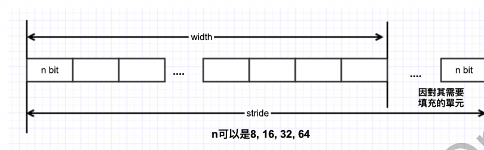

[toc]

---

<div STYLE="page-break-after: always;"></div>
> note：使用前请确保配置好相关环境，未配置见《软件安装编译环境搭建》

# IVE软件开发指南

 晶视智能Intelligent Video Engine (IVE)是一种使用硬件去加速电脑视觉算法的模块，用户利用IVE开发智能分析方案可以**加速智能分析的运算，降低CPU占用**。


## 一、基本介绍


### 1.1重要概念

**句柄（handle）**

用户在调用算子创建任务时，系统会为每个任务分配一个handle，用于标识不同的任务的执行状态。

**返回值：**

标志（blnstant）

```
Ture 表示 Busy waiting mode 

False 表示Interrupt mode
```


**查询(query)**

 用户根据系统返回的 handle，调用 HI_MPI_IVE_Query 可以查询对应算子任务是否完成。

```c
CVI_S32 CVI_IVE_QUERY（IVE_HANDLE pIVHandle，CVI_BOOL*pbFinish，CVI _ BOOL bBlock）

查询现有任务的完成状态。


参数:

pIveHandle–Ive实例处理程序。

pbFinidh–指向任务完成状态的输出指针。它不能为空。

bBlock–指示任务是否被阻止的输入标志。


返回:

CVI_S32如果成功，则返回CVI_SUCCESS
```

<div STYLE="page-break-after: always;"></div>

**跨度（stride）**

与图像或二维数据的width度量一致的量。



IVE_IMAGE_S 图像数据跨度，表示图像一行以“像素” 计算的单元个数，“像素”位宽可以是 8bit，16bit等。


IVE_DATA_S 二维数据跨度，表示二维数据一行的字节数。即是图中的 n = 8情况。


**对齐**

硬件为了快速访问内存首地址或跨行访问数据，要求内存地址或内存跨度必须为对齐系数的倍数。


```
数据内存首地址对齐
当前IVE算子对其输入输出要求16对齐
跨度对齐
对二维广义图像，二维单分量数据以及一维数组数据的跨度均必须满足16像素对齐
```


<div STYLE="page-break-after: always;"></div>

### 1.2.API参考

**Create Handle**

创建IVE句柄

语法：

```C
头文件：
 #include "cvi_comm_ive.h cvi_ive.h"
IVE_HANDLE CVI_IVE_CreateHandle();
参数：无
返回值：返回一个IVE_HANDLE类型的handle
```


**Destroy Handle**

释放IVE句柄

语法：

```c
头文件：

 #include "cvi_comm_ive.h cvi_ive.h"

CVI_S32 CVI_IVE_CreateHandle(IVE_HANDLE plveHandle);

参数：handle指针 不能为空

返回值：成功返回0    
```


**DMA**

创建直接内存访问任务。可以实现数据从一块内存快速拷贝到另一块内存

语法：

```
头文件：
 #include "cvi_comm_ive.h cvi_ive.h"
CVI_S32 CVI_IVE_DMA(IVE_HANDLE plveHandle,IVE_DST_DATA_S *pstSrc,IVE_DST_DATA_S *pstDst,IVE_DMA_CTRL_S *pstCtrl,CVI_BOOL blnstant);

参数：plveHandle ： handle指针，不能为空
	 pstSrc ： 源数据指针，不能为空
	 pstDst ： 输出数据指针。Copy模式下不能为空
	 pstCtrl : DMA控制参数指针，不能为空
	 blnstant ： 返回结果标志，True为busy waiting mode，False为Interrupt mode
返回值：成功返回0  	 
```


<div STYLE="page-break-after: always;"></div>

**Add**

创建两灰度图像的加权加计算任务

语法：

```c
CVI_S32 CVI_IVE_Add（IVE_HANDLE pIVHandle、IVE_SRC_IMAGE_S*pstSrc1、IVE_SRC_Imag1_S*pstSrc2、IVE_DST_IMAGE_S*pstDst、IVE_Add_CTRL_S*pstCtrl、CVI_BOOL bInstant）

将两幅图像相加并输出结果。


参数:

pIveHandle–Ive实例处理程序。

pstSrc1–输入图像1。

pstSrc2–输入图像2。

pstDst–输出结果。

pstCtrl–添加控制参数。

bInstant–虚拟变量。
```


**16BitTo8Bit**

```c
CVI_S32 CVI_IVE_16BitTo8Bit（IVE_HANDLE pIVHandle、IVE_SRC_IMAGE_S*pstSrc、IVE-DST_IMAGE_S*pstDst、IVE_16BIT_TO_8BIT_CTRL_S*pstCtrl、CVI_BOOL bInstant）

16BitTo8Bit输入一个图像并输出结果。

参数:

pIveHandle–Ive实例处理程序。

pstSrc–输入图像。

pstDst–输出结果。

pstCtrl–16BitTo8Bit参数

bInstant–虚拟变量。

返回:

CVI_S32 CVI_S33如果成功，则返回CVI_SUCCESS
```

<div STYLE="page-break-after: always;"></div>

**And**

```c
CVI_S32 CVI_IVE_And（IVE_HANDLE pIVHandle，IVE_SRC_IMAGE_S*pstSrc1，IVE_SRC_Imag1_S*pstSrc2，IVE_DST_IMAGE_S*pstDst，CVI_BOOL bInstant）

AND两个图像并输出结果。


参数:

pIveHandle–Ive实例处理程序。

pstSrc1–输入图像1。

pstSrc2–输入图像2。

pstDst–输出结果。

bInstant–虚拟变量。


返回:

CVI_S32 CVI_S33如果成功，则返回CVI_SUCCESS。
```

**Bernsen**

``` c
CVI_S32 CVI_IVE_Bernsen（IVE_HANDLE pIVHandle，IVE_SRC_IMAGE_S*pstSrc，IVE-DST_IMAGE_S*pstDst，IVE_Bernsen_CTRL_S*pstCtrl，CVI_BOOL bInstant）

Bernsen输入一幅图像并输出结果。


参数:

pIveHandle–Ive实例处理程序。

pstSrc–输入图像。

pstDst–输出腐蚀结果。

pstCtrl–Bernsen参数

bInstant–虚拟变量。


返回:

CVI_S32 CVI_S33如果成功，则返回CVI_SUCCESS。
```

<div STYLE="page-break-after: always;"></div>

### 1.3.数据类型和结构

**相关数据类型及接口：**

```c
IVE_IMAGE_TYPED_E:定义二维广义图像支持的图像类型
IVE_IMAGE_S:定义二维广义图像信息
IVE_SRC_IMAGE_S:定义源图像
IVE_DST_IMAGE_S:定义输出图像
IVE_DATA_S:定义以byte为单位的二维图像信息
IVE_DATA_S:定义以byte为单位的二维图像信息

IVE_STC_DATA_S:定义以byte为单位的二维源数据信息

IVE_DST_DATA_S:定义byte为单位的二维输出数据信息

IVE _SRC_MEM_INFO_S:定义一维源数据。

IVE_DST_MEM_INFO_S:定义一维输出数据。

IVE _8BIT_U:定义8bit数据共用体。

IVE_DMA_MODE E:定义DMA运算模式。

IVE_DMA_CTRL_S:定义DMA控制信息。

IVE_FILTER_CTRL_S:定义模板滤波控制信息。

IVE_CSC_MODE E:定义色彩空间转换模式。

IVE_CSC_CTRLS:定义色彩空间转换控制信息。

IVE_SOBELOUTCTRL_E:定义sobel输出控制信息。

 IVE_SOBEL_CTRL_S:定义sobel边缘提取控制信息。

IVE_MAG_AND_ANG_OUT_CTRL_E:定义幅值与角度计算的输出格式。

IVE_MAG_AND_ANG_CTRL_S:定义幅值和幅角计算的控制信息。

IVE _MAG_DIST_E:定义梯度幅值距離計算方式。

IVE_DILATE_CTRL_S:定义膨胀控制信息。

IVE_ERODE_CTRL_S:定义腐蚀控制信息。

IVE_BLOCK_CTRL_S:定义IVE BLOCK控制信息。

IVE_SUB_MODE_E:定义两图像相减输出格式。

IVE_SUB_CTRL_S:定义两图像相减控制参数。

IVE_INTEG_OUT_CTRL_E:定义积分图输出控制参数。

IVE_INTEG_CTRL_S定义积分图计算控制参数。

IVE_THRESH_MODE E定义图化、工值化输出格式

IVE_THRESH_CTRL_S:定义图像二值化控制信息。

IVE_THRESH_S16_MODE_E定义16bit有符号图像的阈值化模式。

IVE_THRESH_S16_CTRL_S定义16it有符号图像的阈值化控制参数。

IVE_THRESH_U16_MODE_E定义16bti无符号图像的阈值化模式。

IVE_THRESH_U16_CTRL_5定义16bit无符号图像的阈值化控制参数。

IVE_16BIT_TO_8BIT_MODE_E:定义16bit图像到8bit图像的转化模式。

IVE_16BIT_TO_8BIT_CTRL_S定义6bit图像到8bit 图像的转化控制参数。

IVE_ORD_STAT_FILTER_MODE_E定义顺序统计量滤波模式。

IWE_ORD_STAT_FILTER_CTRL_S:定义顺序统计量滤波控制参数。

IVE_EQUALIZE_HIST_CTRL_S定义直方图均衡化控制参数。

IVE_ADD_CTRL_S:定义两图像的加权加控制参数。

IVE_NCC_DST_MEM S定义NCC的输出内存信息。

IVE LBP CMP MODE E:定义LBP纹理计算控制参数。

IVE_LBP_CTRL_S定义LBP纹理计算控制参数。

IVE_NORM_GRAD_OUT_CTRL_E:定义归一化梯度信息计算任务输出控制收举类型。

IVE_NORM_GRAD_CTRL_S定义归化梯度信息计算控制参数

IVE_SAD_MODE_E定义SAD计算模式。

IVE_SAD_OUT_CTRL_E定义SAD输出控制模式。

IVE_SAD_CTRL_S:定义SAD控制参数。

IVE_RESIZE_MODE_E定义Resize 的模式。

IVE_RESIZE_CTRL_S定义Resize 控利参数。

IVE_HOG_CTRL_S定义计算HOGHistogram gforented Gradient)特征控制参数。    
    
```

<div STYLE="page-break-after: always;"></div>

**定义数据类型：**

[说明]

定义定点化的数据类型

[定义]

```
与middleware共用，详细见cvi_type.h
```

**定义结构类型：**

IVE_IMAGE_TYPE_E_NUM

[说明]：

定义二维广义图像支持的图像类型

[定义]:

```c
typedef enum IVE_IMAGE _TYPE{

IVE_IMAGE_TYPE_U8C1 = 0x0,
IVE_IMAGE_TYPE_S8C1 = 0x1,
IVE_IMAGE_TYPE_YUV420SP =0x2,
IVE_IMAGE_TYPE_YUV422SP = 0x3,
IVE_IMAGE_TYPE_YUV420P = 0x4,
IVE_IMAGE_TYPE_YUV422P = 0x5,
IVE_IMAGE_TYPE_S8C2_PACKAGE = 0x6,
IVE_IMAGE_TYPE_S8C2_PLANAR = 0x7,
IVE_IMAGE_TYPE_S16C1 = 0x8,
IVE_IMAGE_TYPE_U16C1 = 0x9,
IVE_IMAGE_TYPE_U8C3_PACKAGE = 0xa,
IVE_IMAGE_TYPE_U8C3_PLANAR = 0xb,
IVE_IMAGE_TYPE_S32C1 = 0xc,
IVE_MAGE_TYPE_U32C1 = 0xd,
IVE_IMAGE_TYPE_S64C1E = 0xe,
IVE_IMAGE_TYPE_U64C1 = 0xf,
IVE_IMAGE_TYPE_BF16C1 = 0x10,
IVE_IMAGE_TYPE_FP32C1 = 0x11,

IVE_MAGE_TYPE_BUTT
}IVE_MAGE_TYPE_E;
```


### 1.4.调试信息

**概述：**

调试信息采用linux下的proc文件系统，可反应IVE的运行顺序，算法耗时，输入输出的影响结构内容，提供问题定义与分析时使用。

<div STYLE="page-break-after: always;"></div>

文件目录：

```
/proc/ive/hw_profiling
```


信息查看方法：

```
使用cat echo 查询
```


**时间信息：**

调试信息：

```shell
[root@cvitek]~# cat /proc/ive/hw_profiling
[IVE] ive time profiling
op name        |   start(s)|  ioctl(us)|  tile0(us)|  tile1(us)|  tile2(us)|  tile3(us)|  tile4(us)|  tile5(us)| tileSum(us)
Add            |       6973|        724|        346|          0|          0|          0|          0|          0|        346
```


参数说明：

| 参数        | 描述                                       |
| ----------- | ------------------------------------------ |
| op name     | 演算法                                     |
| start(s)    | 记录最后一次使用的时间                     |
| ioctl(us)   | Driver 运行时间，包含软体与硬体的耗时      |
| tile0~5(us) | 大图被切割后，各小图所使用的硬件的耗时记录 |
| tileSum(us) | 总硬体耗时记录                             |

<div STYLE="page-break-after: always;"></div>

**输出入图像信息**

```shell
[root@cvitek]~# cat /proc/ive/hw_profiling
[IVE] ive time profiling
op name        |   start(s)|  ioctl(us)|  tile0(us)|  tile1(us)|  tile2(us)|  tile3(us)|  tile4(us)|  tile5(us)| tileSum(us)
Add            |       6973|        724|        346|          0|          0|          0|          0|          0|        346
[root@cvitek]~# cat /proc/ive/hw_profiling; dmesg | tail -n 50
[IVE] ive time profiling
op name        |   start(s)|  ioctl(us)|  tile0(us)|  tile1(us)|  tile2(us)|  tile3(us)|  tile4(us)|  tile5(us)| tileSum(us)
Add            |       6973|        724|        346|          0|          0|          0|          0|          0|        346
[ 6246.222215]  Width: 352
[ 6246.222221]  Height: 288
[ 6246.222228]  Phy 0 Addr: 0x85761000
[ 6246.222398]  Stride 0: 384
[ 6283.430909]
[ 6283.430909] [IVE] Time profiling is started
[ 6412.105409]
[ 6412.105409] [IVE] input parameter incorrect
[ 6448.083330]
[ 6448.083330] [IVE] Time profiling is started
[ 6810.719582] Image pstSrc1
[ 6810.719596]  Type: 0x0
[ 6810.719603]  Width: 352
[ 6810.719609]  Height: 288
[ 6810.719779]  Phy 0 Addr: 0x8572b000
[ 6810.719787]  Stride 0: 384
[ 6810.719793] Image pstSrc2
[ 6810.719799]  Type: 0x0
[ 6810.719806]  Width: 352
[ 6810.719812]  Height: 288
[ 6810.719818]  Phy 0 Addr: 0x85746000
[ 6810.719825]  Stride 0: 384
[ 6810.719831] Image pstDst
[ 6810.719836]  Type: 0x0
[ 6810.719843]  Width: 352
[ 6810.719849]  Height: 288
[ 6810.719855]  Phy 0 Addr: 0x85761000
[ 6810.719862]  Stride 0: 384
[ 6906.784897]
[ 6906.784897] [IVE] Time profiling is started
[ 6973.993698] Image pstSrc1
[ 6973.993712]  Type: 0x0
[ 6973.993718]  Width: 352
[ 6973.993725]  Height: 288
[ 6973.993732]  Phy 0 Addr: 0x8577c000
[ 6973.993739]  Stride 0: 384
[ 6973.993745] Image pstSrc2
[ 6973.993751]  Type: 0x0
[ 6973.993757]  Width: 352
[ 6973.993763]  Height: 288
[ 6973.993770]  Phy 0 Addr: 0x85797000
[ 6973.993776]  Stride 0: 384
[ 6973.993782] Image pstDst
[ 6973.993788]  Type: 0x0
[ 6973.993794]  Width: 352
[ 6973.993964]  Height: 288
[ 6973.993975]  Phy 0 Addr: 0x857b2000
[ 6973.993982]  Stride 0: 384
[ 6996.486822]
[ 6996.486822] [IVE] Enable dump IVE_IMAGE_S, IVE_DATA_S, IVE_MEM_INFO_S
```


参数说明：

| 参数                 | 描述                           |
| -------------------- | ------------------------------ |
| Image pstSrc /pstDst | 输入/输出的图片                |
| Type                 | 略                             |
| Width                | 图片宽度                       |
| Height               | 图片高度                       |
| Phy 0 Addr           | 各通道在实体记忆体上的起始位置 |
| Stride 0             | 各通道的Stride长度             |

<div STYLE="page-break-after: always;"></div>

### 1.5.常见问题

**Cache内存的使用**

```
内存使用cache时机，由算法软件对着内存的使用方式来判断。由于IVE是直接读取DDR内存数据，此时使用的内存若带有cache，则必须一直刷cache来保证数据的一致性。

若无频繁CPU超做，建议不带cache
```


**blnstant参数的设定**

```
IVE 各算法函式最后一个参数的介绍，设定True为使用Busy waiting方式等待中断回应；设定False 则会将程序移出CPU，等到中断讯号通知才运行IVE中断
```

<div STYLE="page-break-after: always;"></div>

## 二.代码例子


我们可以在`sophpi-huashan/cvi_media_sdksdk/middleware/v2/sample`目录下看到相关例程，`ive`文件夹下就是例程源码和可执行文件

```shell
chile@chile-VirtualBox:~/temp/turck/sophpi-huashan/cvi_media_sdksdk/middleware/v2/sample$ ls
audio   cvg           gyro     ive       osdc     rtk_hciattach  sensor_cfg   vdec    vio
cipher  display_test  ipcam    Makefile  overlay  sample.mk      sensor_test  vdecvo
common  fisheye       ir_auto  mipi_tx   region   scene_auto     tp           venc
```

在编译sdk时也会编译这些例程，在各自文件夹下生成相应的可执行文件，也可以在声明编译环境后单独编译

```shell
chile@chile-VirtualBox:~/temp/turck/sophpi-huashan/cvi_media_sdksdk/middleware/v2/sample$ make
```


```c
#include "cvi_ive.h"

#include <stdio.h>
#include <stdlib.h>
#include <string.h>
#include <sys/time.h>

int main(int argc, char **argv)
{
	if (argc != 4) {
		printf("Incorrect loop value. Usage: %s <w> <h> <file_name>\n",
		       argv[0]);
		printf("Example: %s 352 288 data/00_352x288_y.yuv\n", argv[0]);
		return CVI_FAILURE;
	}
	// 00_352x288_y.yuv
	const char *filename = argv[3];//filename 接收 传入图片路径参数
	int ret = CVI_SUCCESS;
	int input_w, input_h;
	struct timeval t0, t1;
	unsigned long elapsed_cpu;
	
    //宽高参数赋值
	input_w = atoi(argv[1]);
	input_h = atoi(argv[2]);
	gettimeofday(&t0, NULL);

	IVE_HANDLE handle = CVI_IVE_CreateHandle();//创建IVE句柄

	// Create src1 image.
	IVE_IMAGE_S src1, src2;//定义图像类型

	CVI_IVE_ReadRawImage(handle, &src1, filename, IVE_IMAGE_TYPE_U8C1, input_w,
			  input_h);//从文件filename读取文件存放到src1图像结构体

	// Create src2 image.
	CVI_IVE_CreateImage(handle, &src2, IVE_IMAGE_TYPE_U8C1, input_w,
			    input_h);//创建宽w 高h 的图像
	memset((void *)(uintptr_t)src2.u64VirAddr[0], 255,
	       src1.u32Stride[0] * input_h);
	for (int j = input_h / 10; j < input_h * 9 / 10; j++) {
		for (int i = input_w / 10; i < input_w * 9 / 10; i++) {
			((char *)(uintptr_t)src2
				 .u64VirAddr[0])[i + j * src1.u32Stride[0]] = 0;
		}
	}

	// Create dst image.
	IVE_DST_IMAGE_S dst;

	CVI_IVE_CraeteImage(handle, &dst, IVE_IMAGE_TYPE_U8C1, input_w,
			    input_h);

	// Config Setting.
	IVE_ADD_CTRL_S iveAddCtrl;

	iveAddCtrl.u0q16X = 65535;
	iveAddCtrl.u0q16Y = 65535;

	// Run IVE
	printf("Run HW IVE ADD.\n");
	gettimeofday(&t0, NULL);
	ret = CVI_IVE_Add(handle, &src1, &src2, &dst, &iveAddCtrl, 1);//添加两张图像并且输出结果
	//CVI_BOOL bFinish = false;
	//CVI_IVE_QUERY(handle, &bFinish, true);
	gettimeofday(&t1, NULL);
	elapsed_cpu =
		((t1.tv_sec - t0.tv_sec) * 1000000 + t1.tv_usec - t0.tv_usec);
	printf("%s CPU time %lu\n", __func__, elapsed_cpu);

	CVI_IVE_WriteImg(handle, "sample_Add.yuv", &dst);//写入原始数据

	CVI_SYS_FreeI(handle, &src1);//释放内存
	CVI_SYS_FreeI(handle, &src2);
	CVI_SYS_FreeI(handle, &dst);
	CVI_IVE_DestroyHandle(handle);//销毁句柄

	return ret;
}

```

<div STYLE="page-break-after: always;"></div>

输出：

```
生成一个sample_Add.yuv文件
```


