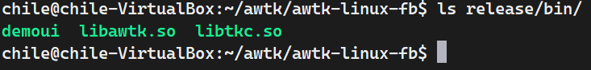

[toc]

# AWTK移植应用

在ubuntu上声明开发板sdk环境并创建一个文件夹，

```sh
chile@chile-VirtualBox:~$ cd sophpi-huashan/cvi_media_sdk/
chile@chile-VirtualBox:~/sophpi-huashan/cvi_media_sdk$ source build/cvisetup.sh
chile@chile-VirtualBox:~/sophpi-huashan/cvi_media_sdk$ defconfig cv1812h_wevb_0007a_emmc
chile@chile-VirtualBox:~/sophpi-huashan/cvi_media_sdk$ build_all
chile@chile-VirtualBox:~/sophpi-huashan/cvi_media_sdk$ cd ~/ && mkdir awtk && cd awtk
```

## pre： tslib移植

awtk得触摸功能依赖tslib库，所以我们先移植tslib，

源码：[https://github.com/libts/tslib](https://github.com/libts/tslib)，下载1.22版本即可，

```sh

tar zxf tslib-1.22.tar.gz
cd tslib-1.22/
mkdir build
./autogen.sh
./configure --host=riscv64-unknown-linux-musl --prefix=/home/chile/awtk/tslib-1.22/build/ CFLAGS='-Wl,-dynamic-linker,/lib/ld-musl-riscv64v_xthead.so.1'
make 
make install
```


拷贝到开发板，

```sh
scp -r build/* root@192.168.1.3:/mnt/data/tslib
scp sophpi-huashan/cvi_media_sdk/middleware/v2/sample/display_test/lt9611_test root@192.168.1.3:/mnt/data/hdmi #根据自己路径来
```

用hdmi连接好显示器，接好触摸屏（需要重启），在开发板上运行，

```sh
# 启动屏幕
../hdmi/lt9611_test		#注意使用自己的路径就好，
devmem 0x0a088000 32 0xC0

# 加载framebuffer对应的ko:
    insmod /mnt/system/ko/cfbcopyarea.ko 
    insmod /mnt/system/ko/cfbfillrect.ko 
    insmod /mnt/system/ko/cfbimgblt.ko 
    insmod /mnt/system/ko/cvi_fb.ko
# 加载触摸驱动
	insmod /mnt/system/ko/3rd/gt9xx.ko
```

检查tslib文件，

```sh
[root@cvitek]/mnt/data/tslib# ls
bin    etc      include  lib      share
[root@cvitek]/mnt/data/tslib# vim conf.sh
```

创建一个脚本添加以下内容：

```sh
export TSLIB_ROOT=/mnt/data/tslib
export TSLIB_TSDEVICE=/dev/input/event0
export TSLIB_CONFFILE=$TSLIB_ROOT/etc/ts.conf
export TSLIB_PLUGINDIR=$TSLIB_ROOT/lib/ts
export TSLIB_CALIBFILE=$TSLIB_ROOT/etc/pointercal
export TSLIB_CONSOLEDEVICE=none
export TSLIB_FBDEVICE=/dev/fb0
export LD_LIBRARY_PATH=$LD_LIBRARY_PATH:$TSLIB_ROOT/lib
```

声明环境变量，

```sh
[root@cvitek]/mnt/data/tslib# source ./conf.sh
```

校准触摸，

```sh
[root@cvitek]/mnt/data/tslib# ./bin/ts_calibrate
```

依次点击校准点即可。


## 1、获取源码

> awtk-examples停止维护，不需要

```sh
git clone https://github.com/zlgopen/awtk.git
git clone https://github.com/zlgopen/awtk-examples.git
git clone https://github.com/zlgopen/awtk-linux-fb.git
cd awtk-linux-fb
```

## 2、修改配置文件

> 编辑 awtk_config.py 设置工具链的路径
``` 
# 最后一步配置路径及参数
-Wl,-dynamic-linker,/lib/ld-musl-riscv64v_xthead.so.1
TSLIB_LIB_DIR='/home/chile/awtk/tslib-1.22/build/lib'
TSLIB_INC_DIR='/home/chile/awtk/tslib-1.22/build/include'
TOOLS_PREFIX='/home/chile/sophpi-huashan/cvi_media_sdk/host-tools/gcc/riscv64-linux-musl-x86_64/bin/riscv64-unknown-linux-musl-'
```


> 编辑 awtk-port/main_loop_linux.c 修改输入设备的文件名（根据实际情况，本次默认）
```
#define FB_DEVICE_FILENAME "/dev/fb0"
#define TS_DEVICE_FILENAME "/dev/input/event0"
#define KB_DEVICE_FILENAME "/dev/input/event1"
#define MICE_DEVICE_FILENAME "/dev/input/mouse0"
```

## 3、编译并生成发布包

> 对于内置的 demoui 例子
```
scons
sh ./release.sh
```
生成`release/`文件夹以及其的压缩包`release.tar.gz`，生成内置 demoui 例子，生成结果在 release/bin 文件夹下的 demoui 文件，如下图：




## 5、传输文件到板端

>  使用scp指令传输或者sd卡

```sh
scp -r release/* root@192.168.1.3:/mnt/data/awtk		# 根据自己的路径来
```

## 6、板端使用
```
cd /mnt/data/awtk/

# 启动屏幕
../hdmi/lt9611_test		#如使用HDMI接口,注意使用自己的路径就好
devmem 0x0a088000 32 0xC0
##

# 加载framebuffer对应的ko:
    insmod /mnt/system/ko/cfbcopyarea.ko 
    insmod /mnt/system/ko/cfbfillrect.ko 
    insmod /mnt/system/ko/cfbimgblt.ko 
    insmod /mnt/system/ko/cvi_fb.ko
# 加载触摸驱动
	insmod /mnt/system/ko/3rd/gt9xx.ko

#运行GUI程序demo
./bin/demoui
##
```


## 7、运行效果

> 终端输出


> 屏幕显示


## 8、自定义自己的GUI界面

> 参考awtk官网GUI开发教程
