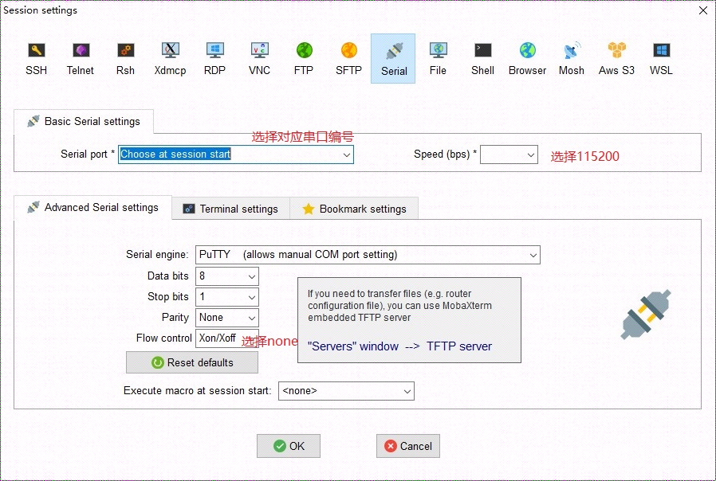
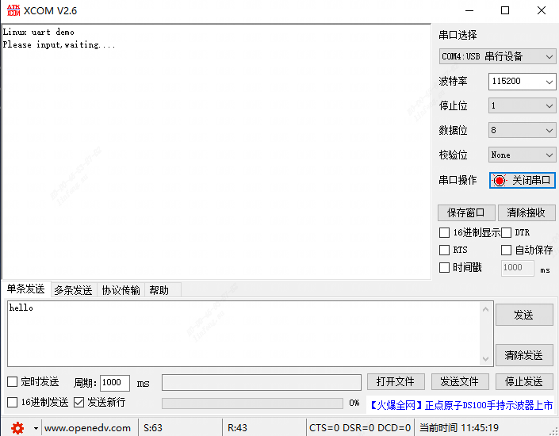
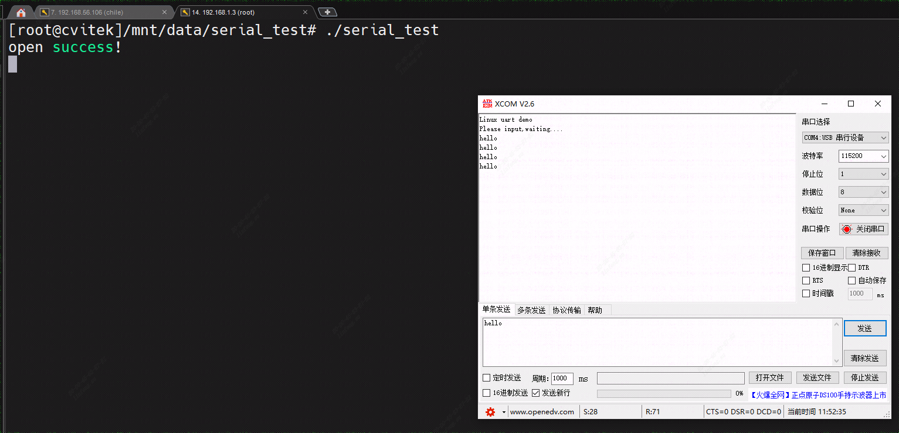

[toc]

---
<div STYLE="page-break-after: always;"></div>

> note：使用前请确保配置好相关环境，未配置见《软件安装编译环境搭建》


# UART连接调试

## 1、UART的操作准备如下：
    使用SDK发布的kernel，已经包含串口驱动。
## 2、操作过程

### 2.1 串口检查
#### 2.1.1 软件编译

    加载内核。默认UART相关模块已全部编入内核，不需要再执行加载命令。

#### 2.1.2 将开发板上通过串口转TTL板与电脑连接

> 注意板端的RX脚接 `usb-ttl` 的TX脚，板端TX脚接 `usb-ttl` 的RX脚


#### 2.1.3 使用mobaxterm配置串口终端




> 一切顺利的话终端显示

```
[root@cvitek]~#
```

#### 2.1.4 串口设备

> 串口波特率设置为115200，停止位1，校验位0，关闭流控制
>
> 终端窗口有输出即为正常，输入指令的串口为ttyS0


### 2.2 串口编程

在`sophpi-huashan/cvi_media_sdk/middleware/v2/sample`目录下新建一个文件夹`serial_test`(其他地方都可以)

```sh
mkdir serial_test && cd serial_test
```

新建`serial_test.c`并编写代码如下

```c
#include <stdio.h>
#include <string.h>
#include <unistd.h>
#include <sys/types.h>
#include <sys/stat.h>
#include <fcntl.h>
#include <termios.h>
#include <errno.h>
 
int set_opt(int,int,int,char,int);
void main()
{
	int fd,nByte,flag=1;
	char *uart1 = "/dev/ttyS1";//改为要打开的串口
	char buffer[512];
	char *uart_out = "Please input,waiting....\r\n";
    char *uart_demo = "Linux uart demo\r\n";
	memset(buffer, 0, sizeof(buffer));
	//if((fd = open(uart3, O_RDWR|O_NOCTTY))<0)//默认为阻塞读方式
    if((fd = open(uart1, O_RDWR|O_NONBLOCK))<0)//非阻塞读方式
 		printf("open %s is failed",uart1);
	else{
		set_opt(fd, 115200, 8, 'N', 1);
		write(fd,uart_demo, strlen(uart_demo));
        write(fd,uart_out, strlen(uart_out));
        printf("open success!\n");
		while(1){
			while((nByte = read(fd, buffer, 512))>0){
				buffer[nByte+1] = '\0';			
				write(fd,buffer,strlen(buffer));
				memset(buffer, 0, strlen(buffer));
				nByte = 0;
		}
	}
}
 
int set_opt(int fd,int nSpeed, int nBits, char nEvent, int nStop)
{
	struct termios newtio,oldtio;
	if  ( tcgetattr( fd,&oldtio)  !=  0) { 
		perror("SetupSerial 1");
		return -1;
	}
	bzero( &newtio, sizeof( newtio ) );
	newtio.c_cflag  |=  CLOCAL | CREAD;
	newtio.c_cflag &= ~CSIZE;
 
	switch( nBits )
	{
		case 7:
			newtio.c_cflag |= CS7;
			break;
		case 8:
			newtio.c_cflag |= CS8;
			break;
	}
 
	switch( nEvent )
	{
	case 'O':
		newtio.c_cflag |= PARENB;
		newtio.c_cflag |= PARODD;
		newtio.c_iflag |= (INPCK | ISTRIP);
		break;
	case 'E': 
		newtio.c_iflag |= (INPCK | ISTRIP);
		newtio.c_cflag |= PARENB;
		newtio.c_cflag &= ~PARODD;
		break;
	case 'N':  
		newtio.c_cflag &= ~PARENB;
		break;
	}
 
	switch( nSpeed )
	{
		case 2400:
			cfsetispeed(&newtio, B2400);
			cfsetospeed(&newtio, B2400);
			break;
		case 4800:
			cfsetispeed(&newtio, B4800);
			cfsetospeed(&newtio, B4800);
			break;
		case 9600:
			cfsetispeed(&newtio, B9600);
			cfsetospeed(&newtio, B9600);
			break;
		case 115200:
			cfsetispeed(&newtio, B115200);
			cfsetospeed(&newtio, B115200);
			break;
		case 460800:
			cfsetispeed(&newtio, B460800);
			cfsetospeed(&newtio, B460800);
			break;
		default:
			cfsetispeed(&newtio, B9600);
			cfsetospeed(&newtio, B9600);
			break;
	}
	if( nStop == 1 )
		newtio.c_cflag &=  ~CSTOPB;
	else if ( nStop == 2 )
		newtio.c_cflag |=  CSTOPB;
		newtio.c_cc[VTIME]  = 100;///* 设置超时10 seconds*/
		newtio.c_cc[VMIN] = 0;
		tcflush(fd,TCIFLUSH);
	if((tcsetattr(fd,TCSANOW,&newtio))!=0)
	{
		perror("com set error");
		return -1;
	}
	
	//	printf("set done!\n\r");
	return 0;
}
 
```

编译前声明环境，在`sophpi-huashan/cvi_media_sdk`下执行：

```sh
source build/cvisetup.sh
defconfig cv1812h_wevb_0007a_emmc
```

编译命令，在`sophpi-huashan/cvi_media_sdk/middleware/v2/sample/serial_test`下执行，生成可执行文件`serial_test`：

```sh
riscv64-unknown-linux-musl-gcc serial_test.c -o serial_test -march=rv64imafdcvxthead -mcmodel=medany -mabi=lp64d
```

ssh登录开发板，以便传输文件

```sh
# 设置开发板ip地址
ifconfig eth0 192.168.1.3
```

用mobaxterm添加新的ssh连接，登录开发板。

在把可执行文件下载到开发板之前，我们先还要确定`uart1_tx`和`uart1_rx`的引脚，这里我们为了方便，把`uart0`引脚复用为`uart1`的，

```sh
# 将cvi_pinmux添加到文件系统
cp ./cvi_media_sdk/ramdisk/rootfs/public/pinmux/musl_riscv64/usr/sbin/cvi_pinmux ./cvi_media_sdk/ramdisk/rootfs/overlay/mars_musl_riscv64/usr/local/bin/

# 重新编译源码，在sophpi-huashan/cvi_media_sdk目录下执行
build_all
# 烧录操作见烧录章节
```

烧录好固件之后，可以在相关目录先看到刚才添加的可执行文件`cvi_pinmux`

```sh
[root@cvitek]~# ls /usr/local/bin/
autologin   cvi_pinmux
[root@cvitek]~# cvi_pinmux
cvi_pinmux for Mars
./cvi_pinmux -p          <== List all pins
./cvi_pinmux -l          <== List all pins and its func
./cvi_pinmux -r pin      <== Get func from pin
./cvi_pinmux -w pin/func <== Set func to pin

# 将uart0复用到uart1
[root@cvitek]~# cvi_pinmux -w JTAG_CPU_TCK/UART1_RX
pin JTAG_CPU_TCK
func UART1_RX
register: 3001068
value: 6
[root@cvitek]~# cvi_pinmux -w JTAG_CPU_TMS/UART1_TX
pin JTAG_CPU_TMS
func UART1_TX
register: 3001064
value: 6
[root@cvitek]~#
```

然后把可执行文件`app_gpio_test`（在目录`sophpi-huashan/cvi_media_sdk/middleware/v2/sample/serial_test`下）拷贝到开发板，

mobaxterm的串口不太适合观察，我们可以用其他的串口助手；

在开发板上运行：

```sh
[root@cvitek]/mnt/data# ./serial_test
```

我们可以在串口终端看到以下：



然后我们输入内容，会打印回显




