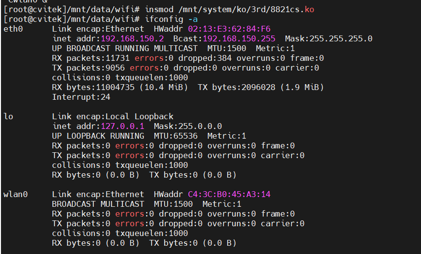

# 无线模块调试及应用-wifi


## 1.获取源码

> 创建个文件夹 下载源码并解压

```sh
mkdir wifi1
cd wifi1
wget http://w1.fi/releases/wpa_supplicant-2.7.tar.gz
wget https://www.openssl.org/source/old/1.1.1/openssl-1.1.1q.tar.gz
wget https://www.infradead.org/~tgr/libnl/files/libnl-3.2.23.tar.gz
tar -xvf libnl-3.2.23.tar.gz
tar -xvf openssl-1.1.1q.tar.gz
tar -xvf wpa_supplicant-2.7.tar.gz
```


## 2.移植libopenssl

> [wpa_supplicant](https://so.csdn.net/so/search?q=wpa_supplicant&spm=1001.2101.3001.7020) 依赖于 libopenssl，因此需要先移植 libopenssl
>
> prefix=/home/ljh/mydemo/wifi1/tool/libopenssl/ 这里的路径是自己定义配置输出的库文件的路径 根据自己路径创建即可


**1.配置生成 Makefile**

```sh
cd wifi1
mkdir tool
cd tool
mkdir libopenssl
cd ../openssl-1.1.1q/
./config shared no-asm --prefix=/home/ljh/mydemo/wifi1/tool/libopenssl/
```


**2.声明编译器路径并修改Makefile**

> /home/ljh/mydemo/sophpi-huashan/host-tools/gcc/riscv64-linux-musl-x86_64/bin根据源码路径修改

```
 export PATH=$PATH:/home/ljh/mydemo/sophpi-huashan/host-tools/gcc/riscv64-linux-musl-x86_64/bin
vi Makefile
```


找到所有包含“-m64”的内容，一共两处分别为变量 `CNF_CFLAGS 和 CNF_CXXFLAGS，将这两个变量中的“-m64”删除掉`


**3.编译**

```sh
make CROSS_COMPILE=riscv64-unknown-linux-musl- -j4
make install
```

> 编译成功如下图所示 


**4.生成文件压缩并传输到开发板**

> 注意：需要提前在开发板的mnt/data/创建wifi文件夹 并且在wifi文件下创建lib文件夹

```sh
cd ../tool/libopenssl/lib/

tar -czvf lib.tar.gz *
scp lib.tar.gz root@192.168.150.2:/mnt/data/wifi/lib
```


## 3.移植libnl库

> wpa_supplicant 也依赖于 libnl，因此还需要移植一下 libnl 库


**1.配置生成Makefile**

```sh
cd wifi1/tool
mkdir libnl
cd ../libnl-3.2.23/
export PATH=$PATH:/home/ljh/mydemo/sophpi-huashan/host-tools/gcc/riscv64-linux-musl-x86_64/bin    
./configure --host=riscv64-unknown-linux-musl --prefix=/home/ljh/mydemo/wifi1/tool/libnl/
```


**2.编译**

```sh
make -j6
make install
```

>  编译安装完成后的libnl目录下如图 所示：


**3.生成文件压缩并传输到开发板**

`需要用到libnl文件下的lib库文件`，文件传输拷贝lib下的库文件到开发板的mnt/data/wifi/lib目录下。

> 注意：需要提前在开发板的mnt/data/创建wifi文件夹 并且在wifi文件下创建lib文件夹

```sh
cd ../tool/libnl/lib

tar -czvf libnl.tar.gz *
scp libnl.tar.gz root@192.168.150.2:/mnt/data/wifi/lib
```


## **4.移植wpa_supplicant**

> 接下来移植wpa_supplicant


**1.配置.config 指定交叉编译器**

```
cd wpa_supplicant-2.7/wpa_supplicant/
cp defconfig .config
```

>  完成以后打开.config 文件，在里面指定交叉编译器、openssl、libnl 库和头文件路径，设置如下
>
> /home/ljh/mydemo/wifi1/tool 这里的路径是前面创建存放lib库文件的文件夹 根据自己设置而改


```c
CC = riscv64-unknown-linux-musl-gcc -Wl,-dynamic-linker,/lib/ld-musl-riscv64v_xthead.so.1
 # /* openssl 库文件和头文件路径*/
CFLAGS += -I/home/ljh/mydemo/wifi1/tool/libopenssl/include
LIBS += -L/home/ljh/mydemo/wifi1/tool/libopenssl/lib -lssl -lcrypto
  # /*libnl库文件和头文件路径*/
CFLAGS += -I/home/ljh/mydemo/wifi1/tool/libnl/include/libnl3
LIBS += -L/home/ljh/mydemo/wifi1/tool/libnl/lib
```


**2.编译wap_supplicant**

> /home/ljh/mydemo/wifi1/tool 这里的路径是前面创建存放lib库文件的文件夹 根据自己设置而改
>
> `编译 wpa_supplicant 的时候是需要指定 libnl 的 pkgconfig 路径`，否则会提示“libnl-3.0”或者“libnl-3.0.pc”找不到等错误。

```sh
export PKG_CONFIG_PATH=/home/ljh/mydemo/wifi1/tool/libnl/lib/pkgconfig:$PKG_CONFIG_PATH
make
```

编译完成以后就会在本目录下生成 wpa_supplicant 和 wpa_cli


**3.生成文件压缩并传输到开发板**

编译好的wpa_cli 和 wpa_supplicant 这两个文件拷贝到开发板的mnt/data/wifi

> 注意：需要提前在开发板的mnt/data/创建wifi文件夹

```sh
scp -r wpa_cli wpa_supplicant root@192.168.150.2:/mnt/data/wifi 
```


在开发板测试使用：

```sh
cd /mnt/data/wifi/lib
gzip -d *.gz
tar xvf lib.tar
tar xvf libnl.tar
#声明库文件路径
export LD_LIBRARY_PATH=$LD_LIBRARY_PATH:/mnt/data/wifi/lib/
```


> 正常输出一下内容表示移植成功！


## 5.WIFI联网测试

**1.在开发板解压库文件压缩包并声明库文件路径**

> 注意：上面操作过这步骤可忽略

```sh
cd /mnt/data/wifi/lib
gzip -d *.gz
tar xvf *.tar
export LD_LIBRARY_PATH=$LD_LIBRARY_PATH:/mnt/data/wifi/lib/
export PATH=$PATH:/mnt/data/wifi/
```


**2.联网使用**


加载wifi驱动：

```shell
insmod /mnt/system/ko/3rd/8821cs.ko
ifconfig -a
```



在开发板的mnt/data/wifi中

```sh
mkdir wpa
vi wpa_supplicant.conf
```

编写以下内容保存退出

> ctrl_interface= 这里指的是上边的wpa路径
>
> ssid是wifi的名称 psk是密码 这里我使用是手机热点

```c
ctrl_interface=./wpa
ap_scan=1
network={
 ssid="Axiong123" 
 psk="11111111"
}

```

输入命令使用：

```sh
wpa_supplicant -D nl80211 -c ./wpa_supplicant.conf -i wlan0 &
```

成功输出：


观察手机：


获取ip地址：

```
udhcpc -i wlan0
```


可以ping 通百度 联网成功！

