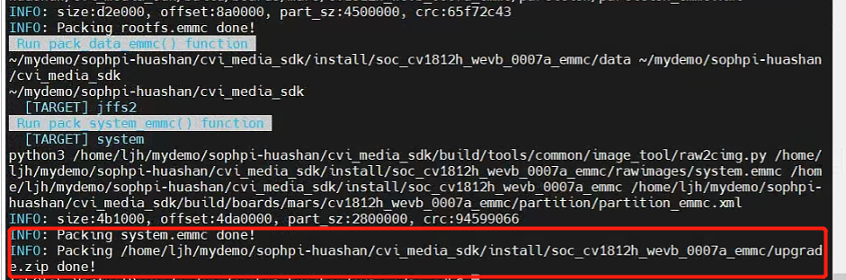
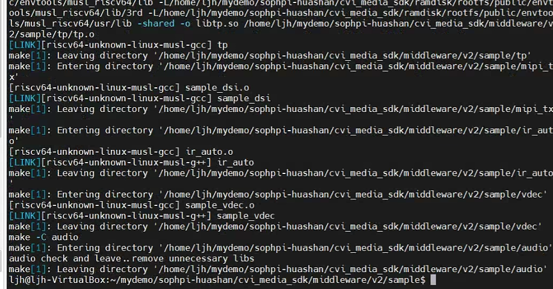
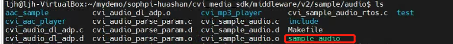
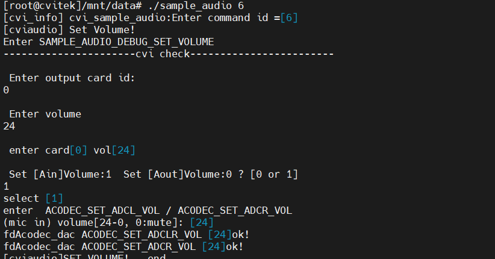
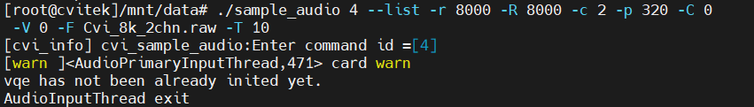
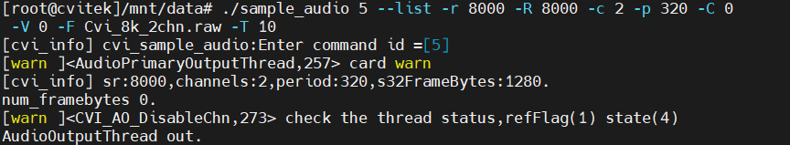

#  AUDIO：录音与播放操作指南


## 1.获取源码

```
git clone https://github.com/sophgo/sophpi-huashan.git
```


## 2.编译源码

> 下载好源码进入源码路径文件夹 cd sophpi-huashan

```
1.cd cvi_media_sdk/
2.source build/cvisetup.sh 				# 配置编译环境
3.defconfig cv1812h_wevb_0007a_emmc	
4.build_all								# 编译SDK
```

编译成功如以下截图：




接下来到sample文件夹编译：

```sh
cd middleware/v2/sample
make
```

编译成功如以下截图：



## 3.传输文件

> 传输编译生成的audio播放文件到开发板进行测试使用


```
cd sophpi-huashan/cvi_media_sdk/middleware/v2/sample/audio
ls
```

可以看到有以下文件：




传输sample_audio文件到开发板/mnt/data

```shell
scp sample_audio root@192.168.150.2:/mnt/data/
```


在开发板/mnt/data/创建lib文件夹

```
cd /mnt/data
mkdir lib
```


传输运行所需要的库文件：

```shell
cd sophpi-huashan/cvi_media_sdk/middleware/v2/lib/

scp libaaccomm2.so libcvi_vqe.so libaacdec2.so libcvi_RES1.so libsys.so libaacenc2.so libcvi_VoiceEngine.so libtinyalsa.so libaacsbrdec2.so libcvi_audio.so libaacsbrenc2.so libcvi_ssp.so root@192.168.150.2:/mnt/data/lib

cd sophpi-huashan/cvi_media_sdk/middleware/v2/lib/3rd/
scp libcli.so root@192.168.150.2:/mnt/data/lib
```


## 4.运行播放程序


### **硬件操作：**

板子上电进行验证 **实验硬件连线**    硬件板子连接J12至MIC，J11至喇叭


### **开发板操作：**

声明运行所需的库文件路径

```
export LD_LIBRARY_PATH=$LD_LIBRARY_PATH:/mnt/data/lib
```


#### 1.设置音频音量：

```
 cd /mnt/data
 ./sample_audio 6
    0                       # card id
    24                      # volume 
    1                       # Select Ain
```

> 终端打印输出




#### 2.使能speak

**确认是否使能speak** 开发板默认关闭speak，若想开启，需拉高相关gpio(具体详情请询问FAE人员) 例：此专案cv1812h 的SPK_EN为495，则通过输入以下命令

```
echo 495 > /sys/class/gpio/export
echo out > /sys/class/gpio/gpio495/direction
echo 1 > /sys/class/gpio/gpio495/value
```


#### 3.录音测试：

```
./sample_audio 4 --list -r 8000 -R 8000 -c 2 -p 320 -C 0 -V 0 -F Cvi_8k_2chn.raw -T 10
# 预设录音秒数:10，然后对着mic朗读一段文字或播放一段音乐。
# 产出Cvi_8k_2chn.raw 档案.
```

> 终端打印输出



#### 4.播放测试：

```
./sample_audio 5 --list -r 8000 -R 8000 -c 2 -p 320 -C 0 -V 0 -F Cvi_8k_2chn.raw -T 10
```


**实验效果**    播音时确认喇叭有出声且大小合适没有爆音，杂音，明显失真等

> 终端打印输出





#### 5.代码演示：

> sophpi-huashan/cvi_media_sdk/middleware/v2/sample/audio/cvi_sample_audio.c


main函数：

```c
CVI_S32 main(int argc, char *argv[])
{
	CVI_S32 s32Ret = CVI_SUCCESS;
	CVI_U32 u32Index = 0;//定义index句柄
	ST_AudioUnitTestCfg  stAudTestCfg;
	stAudPara stAudioparam;//定义音频信息结构体

	if (argc  <  2) {
		printf_sample_usage(); //如果程序输入参数小于2个 终端打印使用说明
		printf_parse_usage();
		return CVI_FAILURE;//退出程序
	}

	u32Index = atoi(argv[1]); //输入第一个参数为句柄

	if (u32Index > 10) {
		printf_sample_usage();//如果程序输入参数大于10个 终端打印使用说明
		return CVI_FAILURE;//退出程序
	}

	if (u32Index < 6 || u32Index == 10) {
		if (argc != 19) {
			printf_parse_usage();
			return CVI_FAILURE;
		}
		memset(&stAudioparam, 0, sizeof(stAudPara));
		get_audio_parse(argc, argv, &stAudioparam);
	} else {
		stAudTestCfg.bOptCfg = CVI_FALSE;
		stAudTestCfg.unit_test = 0;
		strcpy(stAudTestCfg.filename, "NULL");
	}

	printf("[cvi_info] cvi_sample_audio:Enter command id =[%d]\n", u32Index);

    //根据u32Index句柄参数 选择不同的执行函数
	switch (u32Index) {
	case 0: {
		SAMPLE_AUDIO_AI_BIND_AENC(&stAudioparam);
		break;
	}
	case 1: {
		SAMPLE_AUDIO_AI_UNBIND_AENC(&stAudioparam);
		break;
	}
	case 2: {
		SAMPLE_AUDIO_ADEC_BIND_AO(&stAudioparam);
		break;
	}
	case 3: {
		SAMPLE_AUDIO_ADEC_UNBIND_AO(&stAudioparam);
		break;
	}
	case 4: {
		SAMPLE_AUDIO_RECORD_PCM_FORMAT_FILE(&stAudioparam);//录制输出音频文件
		break;
	}
	case 5: {
		SAMPLE_AUDIO_PLAY_PCM_FORMAT_FILE(&stAudioparam);//播放音频文件
		break;
	}
	case 6: {
		printf("[cviaudio] Set Volume!\n");
		SAMPLE_AUDIO_DEBUG_SET_VOLUME(&stAudTestCfg);//设置音频音量
		printf("[cviaudio]SET VOLUME!...end\n");
		break;

	}
	case 7: {
		printf("[sample code]Cviaudio Version\n");
		SAMPLE_AUDIO_VERSION();
		break;
	}
	case 8: {
		printf("[cviaudio] Get Volume!\n");
		SAMPLE_AUDIO_DEBUG_GET_VOLUME(&stAudTestCfg);
		printf("[cviaudio]GET VOLUME!...end\n");
		break;
	}
	case 9: {
		printf("[cviaudio] ioctl_test!\n");
		SAMPLE_AUDIO_DEBUG_IOCTL_TEST();
		printf("[cviaudio] ioctl_test!...end\n");
		break;
	}
	case 10: {
		printf("[sample code]AEC self loop test\n");
		SAMPLE_AUDIO_AEC_LOOP_TEST(&stAudioparam);
		break;
	}
	default: {
		break;
	}
	}

	return s32Ret;
}
```

