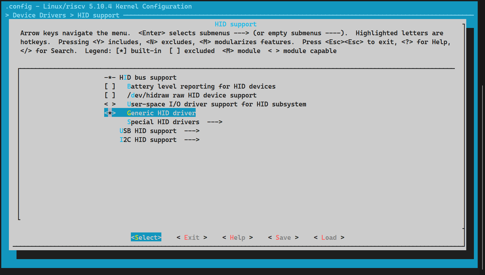
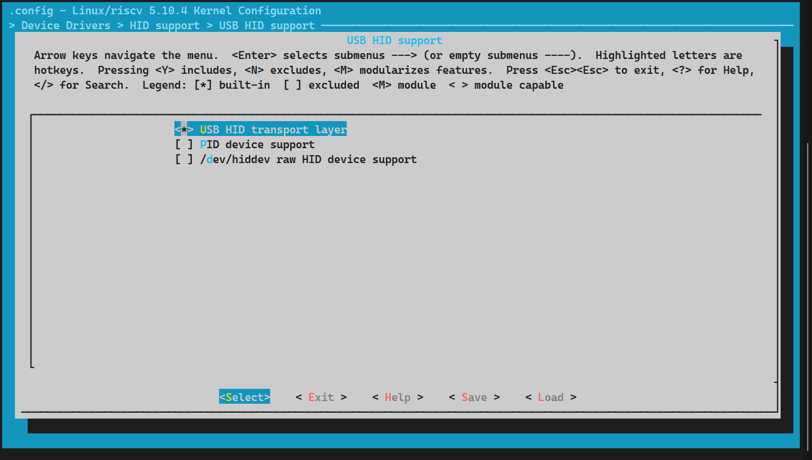
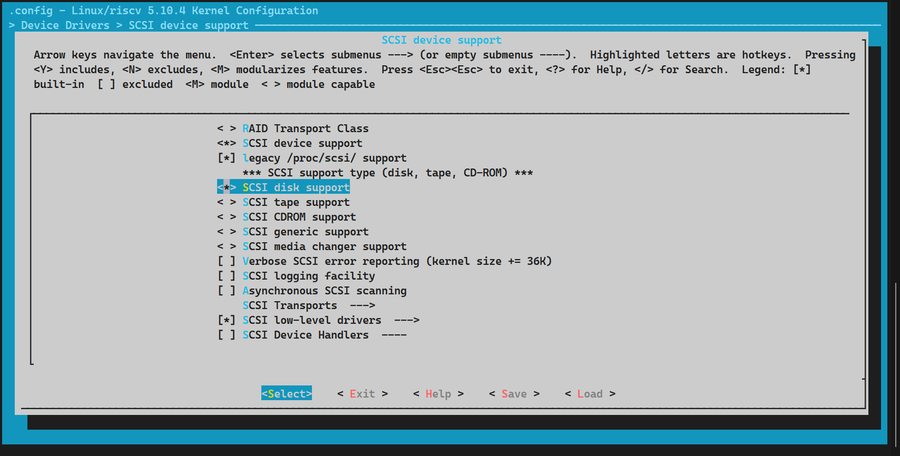
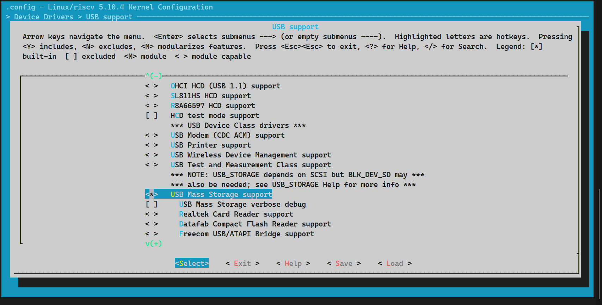
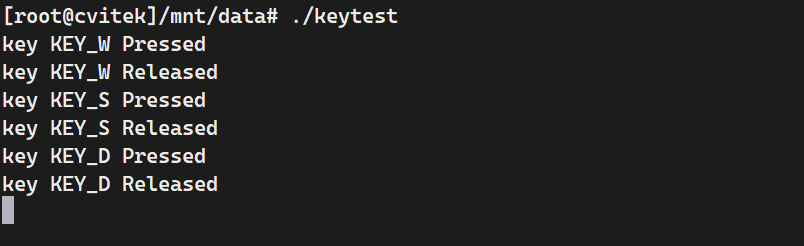
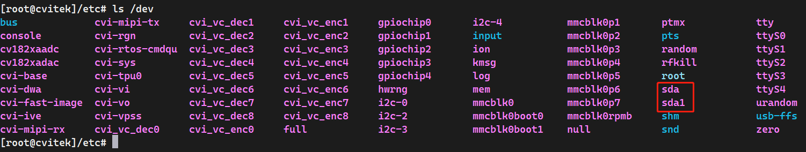
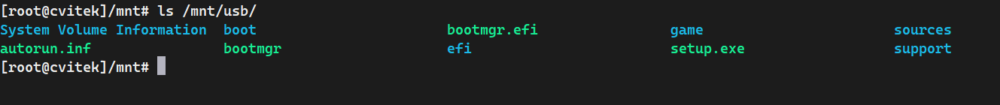

## USB-HUB调试及使用


### 一、USB-HUB驱动


### 二、编译源码并使能内核驱动

声明环境，

```sh
cd sophpi-huashan/cvi_media_sdk
source build/cvisetup.sh
defconfig cv1812h_wevb_0007a_emmc
```

**使能键盘和鼠标驱动**，属于HID设备，（内核已经集成），直接使用`menuconfig`图形化配置，

```sh
menuconfig_kernel
```

> **HID Drivers**
```sh
-> Device Drivers
	-> HID support
		-> HID bus support 
			-> <*> Generic HID driver 	//使能通用 HID 驱动
```



> **USB鼠标键盘**

```sh
-> Device Drivers
	-> HID support
		-> USB HID support
			-> <*> USB HID transport layer 	//USB 键盘鼠标等 HID 设备驱动
```



**使能U盘设备**，使用SCSI协议，（内核集成）

```sh
-> Device Drivers
	-> SCSI device support
		-> <*> SCSI disk support 	//选中此选项

```



```sh
-> Device Drivers
	-> USB support (USB_SUPPORT [=y])
		-> Support for Host-side USB
			-> <*> USB Mass Storage support //USB 大容量存储设备
```



编译源码，（单独编译内核`build_kernel`）

```sh
build_all
```

烧录编译的固件，见`<烧录固件>`章节。

### 三、开发板HOST验证

进入开发板shell，

```sh
[root@cvitek]~# cd /etc
[root@cvitek]/etc# ./uhubon.sh host		(host开发板作为主设备，device开发板作为otg从设备)
turn on usb hub

# 如果提示内核驱动已存在可以先卸载，再执行
[root@cvitek]/etc# rmmod /mnt/system/ko/dwc2.ko

[root@cvitek]/etc# lsusb
Bus 001 Device 001: ID 1d6b:0002
Bus 001 Device 002: ID 058f:6254
```

插入U盘和键盘，

```sh
[root@cvitek]/etc# lsusb
Bus 001 Device 001: ID 1d6b:0002
Bus 001 Device 002: ID 058f:6254
Bus 001 Device 004: ID 0951:1666				# U盘		
Bus 001 Device 003: ID 05ac:0256				# 键盘
[root@cvitek]/etc#
```

并且在`/dev`生成了对应的设备文件，

```sh
[root@cvitek]/dev/input# ls
event0  event1  event2  event3  event4  event5		# event0就是键盘
```

#### 3.1 测试键盘输入

在ubuntu主机上编写键盘测试demo，`keyboard.c`

```sh
#include <stdio.h>  
#include <linux/input.h>  
#include <stdlib.h>  
#include <sys/types.h>  
#include <sys/stat.h>  
#include <fcntl.h>  

#define VNAME(value) (#value)
#define DEV_PATH "/dev/input/event0"  

static char map[256][50] = {
	"KEY_RESERVED","KEY_ESC","KEY_1","KEY_2","KEY_3","KEY_4","KEY_5","KEY_6","KEY_7","KEY_8",
	"KEY_9","KEY_0","KEY_MINUS","KEY_EQUAL","KEY_BACKSPACE","KEY_TAB","KEY_Q","KEY_W","KEY_E",
	"KEY_R","KEY_T","KEY_Y","KEY_U","KEY_I","KEY_O","KEY_P","KEY_LEFTBRACE","KEY_RIGHTBRACE",
	"KEY_ENTER","KEY_LEFTCTRL","KEY_A","KEY_S","KEY_D","KEY_F","KEY_G","KEY_H","KEY_J","KEY_K",
	"KEY_L","KEY_SEMICOLON","KEY_APOSTROPHE","KEY_GRAVE","KEY_LEFTSHIFT","KEY_BACKSLASH","KEY_Z",
	"KEY_X","KEY_C","KEY_V","KEY_B","KEY_N","KEY_M","KEY_COMMA","KEY_DOT","KEY_SLASH","KEY_RIGHTSHIFT",
	"KEY_KPASTERISK","KEY_LEFTALT","KEY_SPACE","KEY_CAPSLOCK","KEY_F1","KEY_F2","KEY_F3","KEY_F4","KEY_F5",
	"KEY_F6","KEY_F7","KEY_F8","KEY_F9","KEY_F10","KEY_NUMLOCK","KEY_SCROLLLOCK","KEY_KP7","KEY_KP8",
	"KEY_KP9","KEY_KPMINUS","KEY_KP4","KEY_KP5","KEY_KP6","KEY_KPPLUS","KEY_KP1","KEY_KP2","KEY_KP3","KEY_KP0",
	"KEY_KPDOT","KEY_ZENKAKUHANKAKU","KEY_102ND","KEY_F11","KEY_F12","KEY_RO","KEY_KATAKANA","KEY_HIRAGANA",
	"KEY_HENKAN","KEY_KATAKANAHIRAGANA","KEY_MUHENKAN","KEY_KPJPCOMMA","KEY_KPENTER","KEY_RIGHTCTRL",
	"KEY_KPSLASH","KEY_SYSRQ","KEY_RIGHTALT","KEY_LINEFEED","KEY_HOME","KEY_UP","KEY_PAGEUP","KEY_LEFT",
	"KEY_RIGHT","KEY_END","KEY_DOWN","KEY_PAGEDOWN","KEY_INSERT","KEY_DELETE","KEY_MACRO","KEY_MUTE",
	"KEY_VOLUMEDOWN","KEY_VOLUMEUP","KEY_POWER","KEY_KPEQUAL","KEY_KPPLUSMINUS","KEY_PAUSE","KEY_SCALE",
	"KEY_KPCOMMA","KEY_HANGEUL/KEY_HANGUEL","KEY_HANJA","KEY_YEN","KEY_LEFTMETA","KEY_RIGHTMETA","KEY_COMPOSE",
	"KEY_STOP","KEY_AGAIN","KEY_PROPS","KEY_UNDO","KEY_FRONT","KEY_COPY","KEY_OPEN","KEY_PASTE","KEY_FIND",
	"KEY_CUT","KEY_HELP","KEY_MENU","KEY_CALC","KEY_SETUP","KEY_SLEEP","KEY_WAKEUP","KEY_FILE","KEY_SENDFILE",
	"KEY_DELETEFILE","KEY_XFER","KEY_PROG1","KEY_PROG2","KEY_WWW","KEY_MSDOS","KEY_COFFEE/KEY_SCREENLOCK",
	"KEY_DIRECTION","KEY_CYCLEWINDOWS","KEY_MAIL","KEY_BOOKMARKS","KEY_COMPUTER","KEY_BACK","KEY_FORWARD",
	"KEY_CLOSECD","KEY_EJECTCD","KEY_EJECTCLOSECD","KEY_NEXTSONG","KEY_PLAYPAUSE","KEY_PREVIOUSSONG","KEY_STOPCD",
	"KEY_RECORD","KEY_REWIND","KEY_PHONE","KEY_ISO","KEY_CONFIG","KEY_HOMEPAGE","KEY_REFRESH","KEY_EXIT",
	"KEY_MOVE","KEY_EDIT","KEY_SCROLLUP","KEY_SCROLLDOWN","KEY_KPLEFTPAREN","KEY_KPRIGHTPAREN","KEY_NEW",
	"KEY_REDO","KEY_F13","KEY_F14","KEY_F15","KEY_F16","KEY_F17","KEY_F18","KEY_F19","KEY_F20","KEY_F21",
	"KEY_F22","KEY_F23","KEY_F24","KEY_PLAYCD","KEY_PAUSECD","KEY_PROG3","KEY_PROG4","KEY_DASHBOARD","KEY_SUSPEND",
	"KEY_CLOSE","KEY_PLAY","KEY_FASTFORWARD","KEY_BASSBOOST","KEY_PRINT","KEY_HP","KEY_CAMERA","KEY_SOUND",
	"KEY_QUESTION","KEY_EMAIL","KEY_CHAT","KEY_SEARCH","KEY_CONNECT","KEY_FINANCE","KEY_SPORT","KEY_SHOP",
	"KEY_ALTERASE","KEY_CANCEL","KEY_BRIGHTNESSDOWN","KEY_BRIGHTNESSUP","KEY_MEDIA","KEY_SWITCHVIDEOMODE",
	"outputs","KEY_KBDILLUMTOGGLE","KEY_KBDILLUMDOWN","KEY_KBDILLUMUP","KEY_SEND","KEY_REPLY","KEY_FORWARDMAIL",
	"KEY_SAVE","KEY_DOCUMENTS","KEY_BATTERY","KEY_BLUETOOTH","KEY_WLAN","KEY_UWB","KEY_UNKNOWN","KEY_VIDEO_NEXT",
	"KEY_VIDEO_PREV","KEY_BRIGHTNESS_CYCLE","KEY_BRIGHTNESS_ZERO","KEY_DISPLAY_OFF","KEY_WIMAX","KEY_RFKILL","KEY_MICMUTE"
};

int main()  
{  
    int keys_fd;  
    char ret[2];  
    struct input_event t;  
    keys_fd=open(DEV_PATH, O_RDONLY);  
    if(keys_fd <= 0)  
    {  
        printf("open /dev/input/event0 device error!\n");  
        return -1;  
    }  
    while(1)  
    {  
        if(read(keys_fd, &t, sizeof(t)) == sizeof(t))  
        {  
            if(t.type==EV_KEY)  
                if(t.value==0 || t.value==1)  
                {  
                    printf("key %s %s\n", map[t.code], (t.value) ? "Pressed" : "Released");  
                    if(t.code == KEY_ESC)  
                        break;  
                }  
        }  
    }  
    close(keys_fd);  
    return 0;  
}  
```

编译demo，

```sh
riscv64-unknown-linux-musl-gcc keytest.c -o keytest -march=rv64imafdcvxthead -mcmodel=medany -mabi=lp64d
# 将生成的可执行文件传到开发板（根据自己的文件目录来）
scp keytest root@192.168.50.80:/mnt/data
```

运行，`./keytest`，



#### 3.2 测试U盘

```sh
ls /dev
```



```sh
mkdir /mnt/usb_disk
mount /dev/sda1 /mnt/usb
ls /mnt/data/usb
```



可以看到U盘中的文件。

