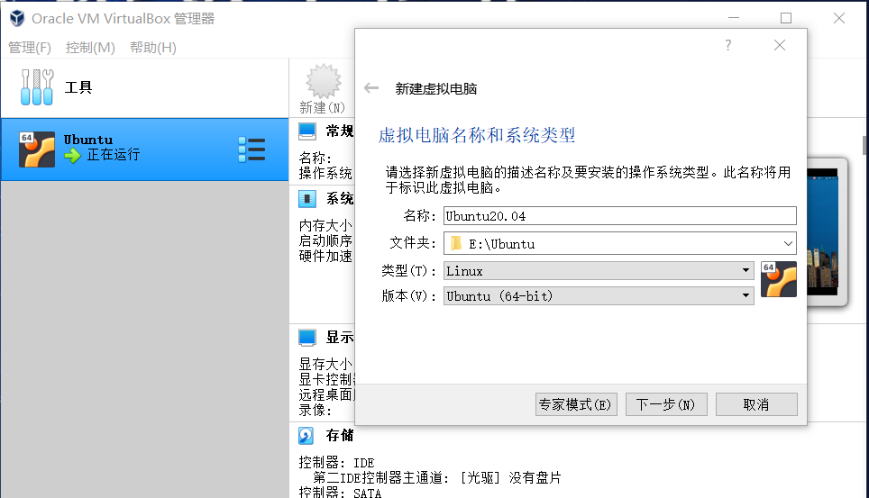
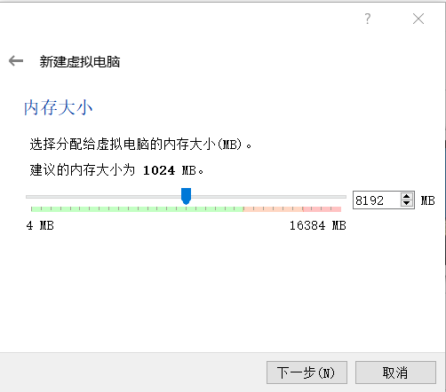
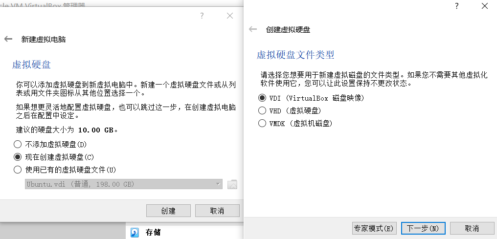
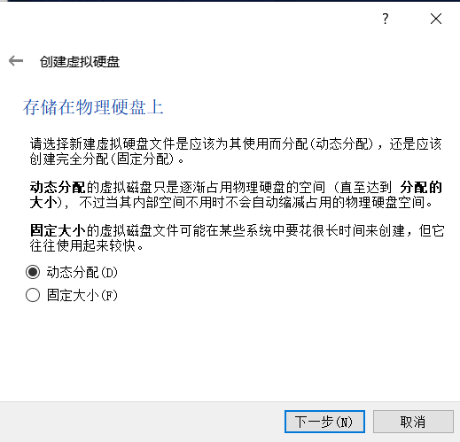
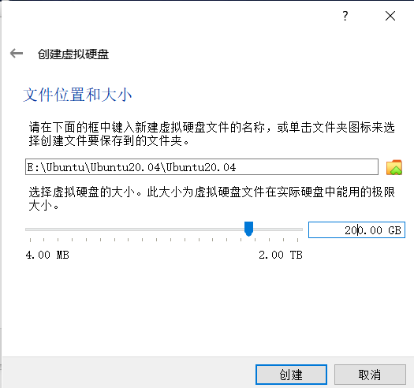
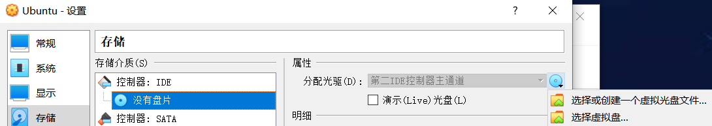
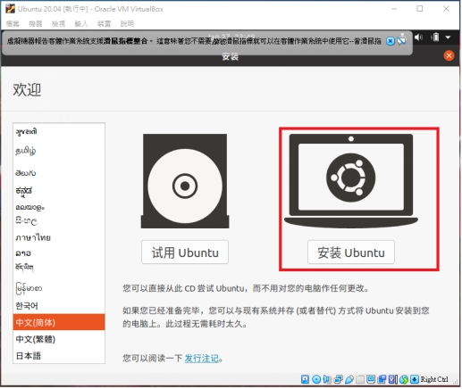
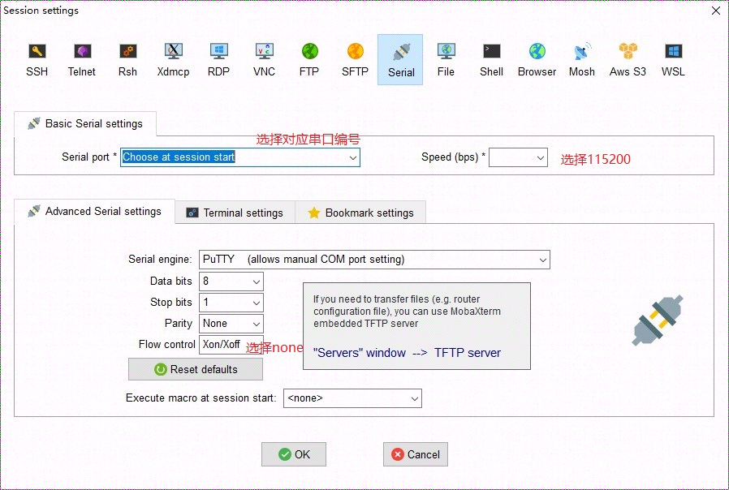
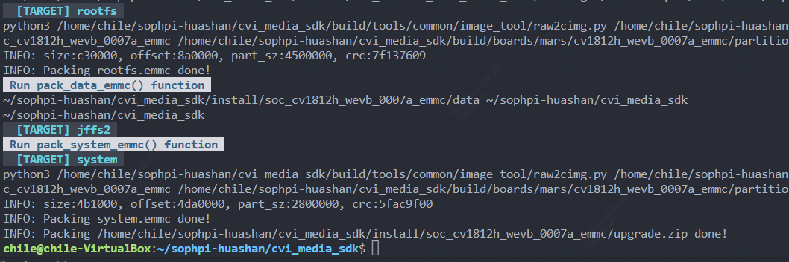

[toc]

---

<div STYLE="page-break-after: always;"></div>

# 软件安装及编译环境搭建

点击下载 [Virtualbox VM](https://www.virtualbox.org/wiki/Downloads) 和 [Ubuntu 20.04 LTS](https://releases.ubuntu.com/focal/ubuntu-20.04.5-desktop-amd64.iso)

## 1、于VirtualBoxVM安装Ubuntu
建立新的VM，并加以命名



规划8GB内存供VM使用。



创建硬盘





<div STYLE="page-break-after: always;"></div>

预留200GB硬盘空间，供后续存放SDK用。



## 2、Ubuntu开机设定

第一次开机需要挂载安装光盘ISO挡案




<div STYLE="page-break-after: always;"></div>

开始安装



（如需在虚拟机上使用共享剪贴板和共享文件夹等提升使用体验，请自行搜索方法，此处不再赘述）


<div STYLE="page-break-after: always;"></div>

## 3、MobaXterm安装及开发板连接

官网地址：
```
https://mobaxterm.mobatek.net/
```
将开发板上通过串口转TTL板与电脑连接

> 注意板端的RX脚接 `usb-ttl` 的TX脚，板端TX脚接 `usb-ttl` 的RX脚


<div STYLE="page-break-after: always;"></div>

使用mobaxterm配置串口终端




> 终端显示

```
[root@cvitek]~#
```


<div STYLE="page-break-after: always;"></div>

## 4、套件安装以及SDK编译

在编译SDK之前，Ubuntu需要安装以下套件：


```sh
sudo apt-get update
sudo apt-get install -y build-essential
sudo apt-get install -y ninja-build 
sudo apt-get install -y automake 
sudo apt-get install -y autoconf 
sudo apt-get install -y libtool
sudo apt-get install -y wget
sudo apt-get install -y curl
sudo apt-get install -y git
sudo apt-get install -y gcc
sudo apt-get install -y libssl-dev
sudo apt-get install -y bc
sudo apt-get install -y slib
sudo apt-get install -y squashfs-tools
sudo apt-get install -y android-sdk-libsparse-utils 
sudo apt-get install -y android-sdk-ext4-utils
sudo apt-get install -y jq
sudo apt-get install -y cmake
sudo apt-get install -y python3-distutils
sudo apt-get install -y tclsh
sudo apt-get install -y scons
sudo apt-get install -y parallel
sudo apt-get install -y ssh-client 
sudo apt-get install -y tree 
sudo apt-get install -y python3-dev
sudo apt-get install -y python3-pip 
sudo apt-get install -y device-tree-compiler
sudo apt-get install -y libssl-dev
sudo apt-get install -y ssh
sudo apt-get install -y cpio
sudo apt-get install -y squashfs-tools
sudo apt-get install -y fakeroot
sudo apt-get install -y libncurses5
sudo apt-get install -y flex 
sudo apt-get install -y bison
```
检查cmake版本

```sh
cmake --version
```


<div STYLE="page-break-after: always;"></div>

如果小于版本号3.16则需要更新cmake，以3.16.5为例

```sh
# 注意先删除低版本cmake
sudo apt autoremove cmake

wget https://cmake.org/files/v3.16/cmake-3.16.5.tar.gz
tar zxvf cmake-3.16.5.tar.gz
cd cmake-3.16.5/
./configure
make
sudo make install
```
**获取SDK源码**

```
git clone https://github.com/sophgo/sophpi-huashan.git
```

**编译**

```
1.cd cvi_media_sdk/
2.source build/cvisetup.sh 				# 配置编译环境
3.defconfig cv1812h_wevb_0007a_emmc	
4.build_all								# 编译SDK
```

> 编译成功



生成的镜像在`install/soc_cv1812h_wevb_0007a_emmc`下


