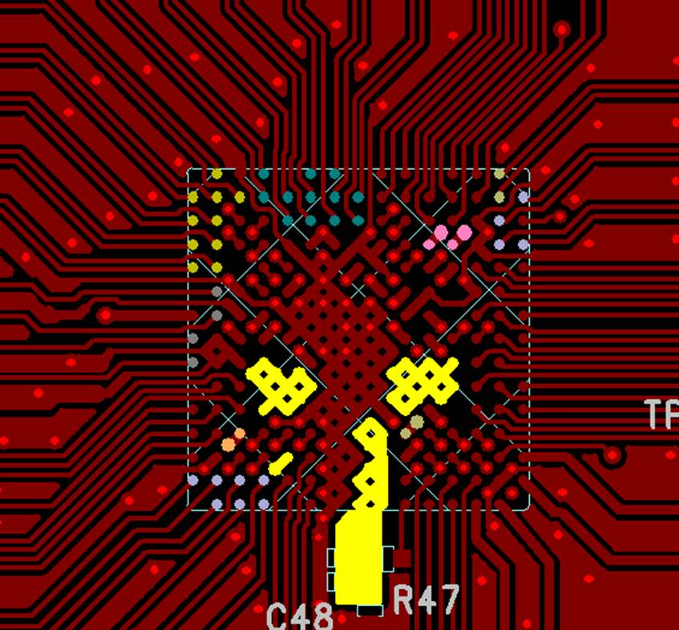
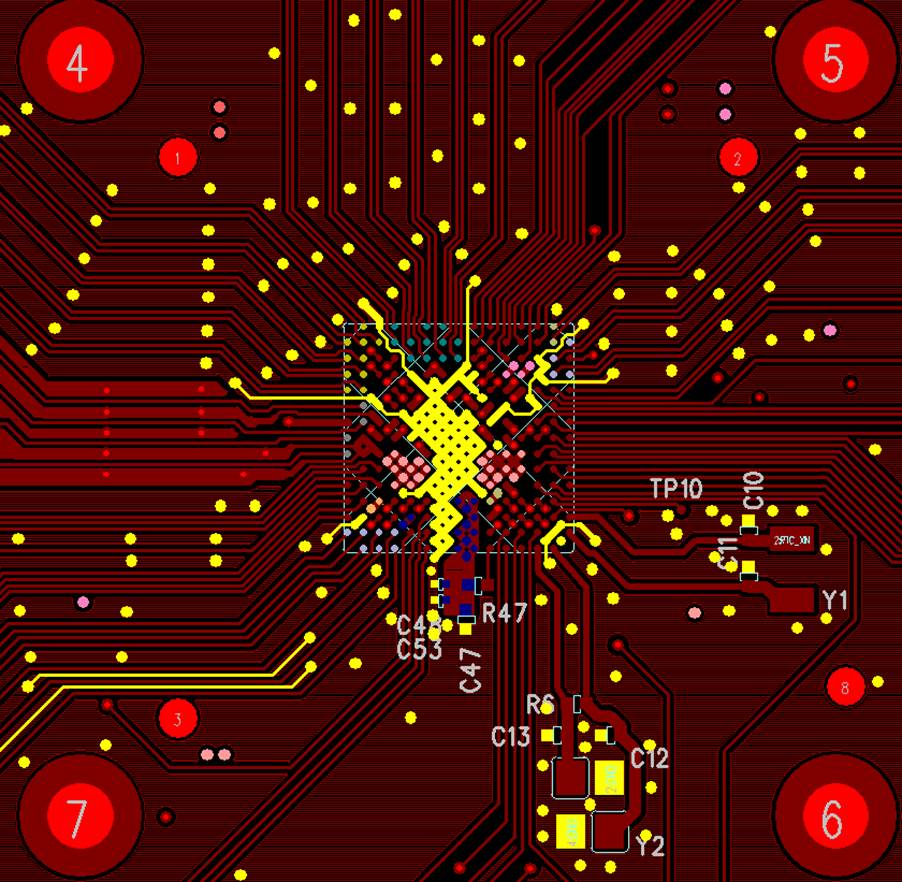
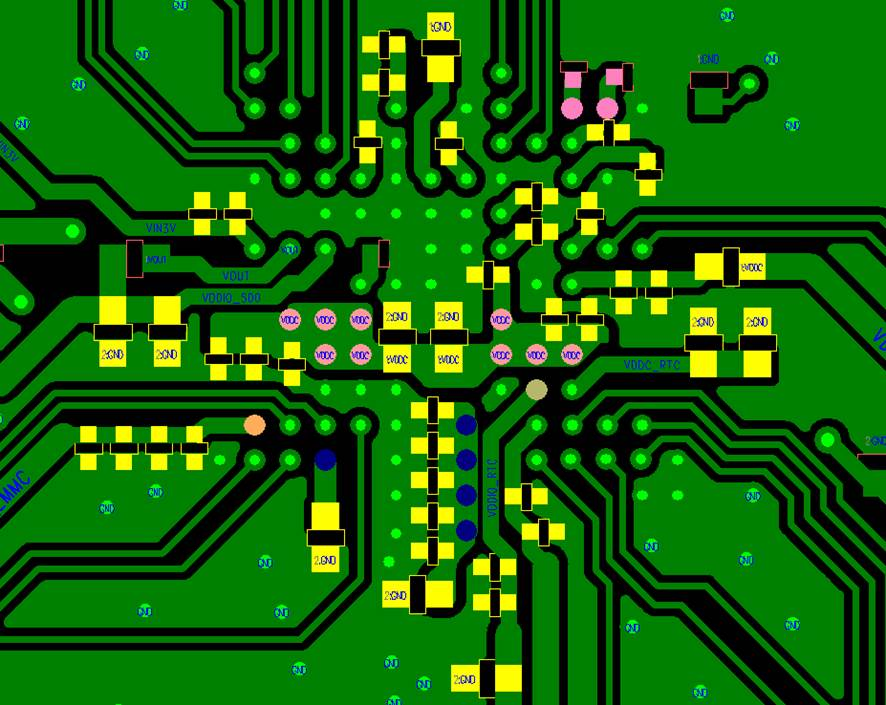
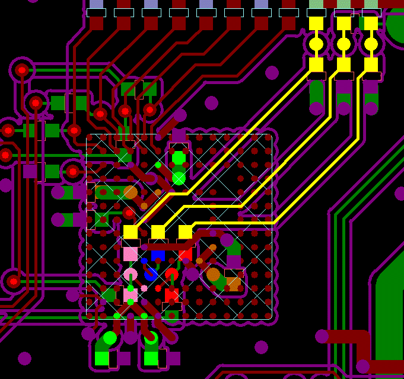
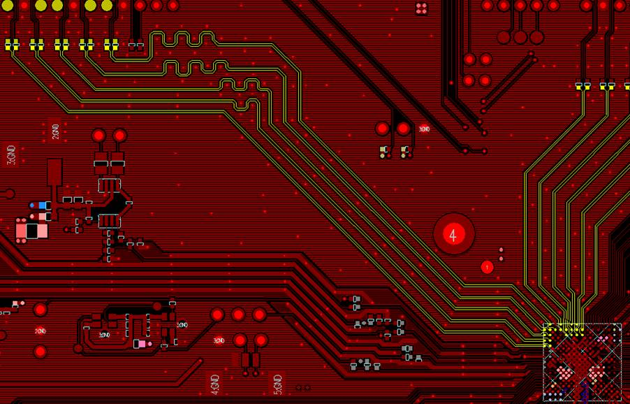
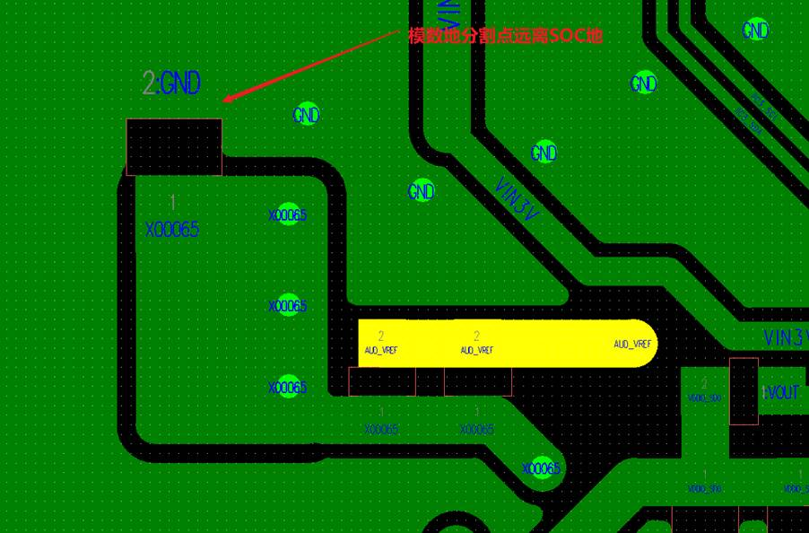
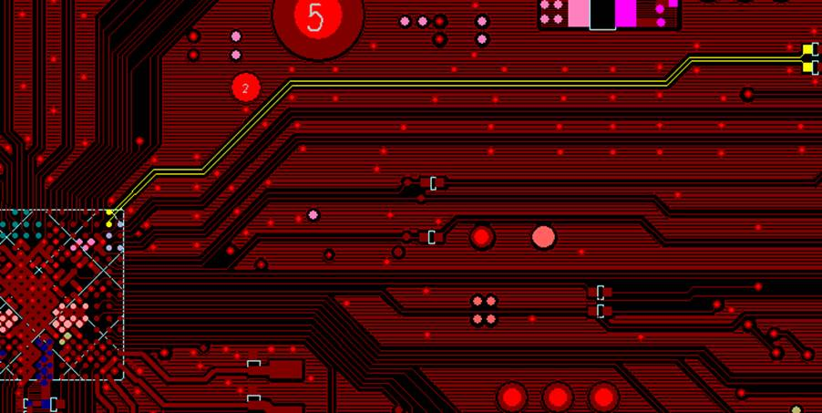
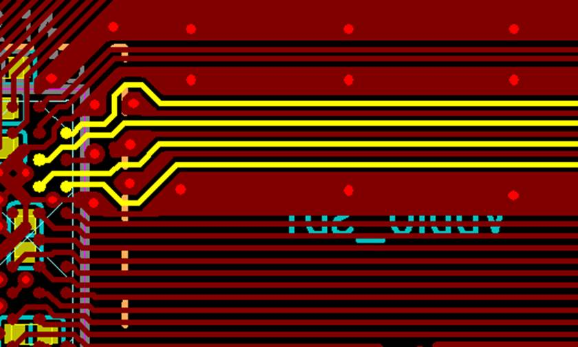
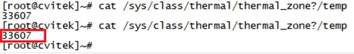

[toc]

---

# 1     产品概述

## 1.1    概述

本文档主要介绍CV1812H芯片方案的PCB设计及散热设计。

 

 

# 2       PCB 设计

## 2.1    PCB设计总体原则

### 2.1.1  确认板层与叠层结构

1）根据接口布局与走线难度确认是否需要增加板层

如果板子较大，走线没有严重交叉，建议维持最小板层降低成本；如果要增加板层请务必确认叠层结构符合要求。

 

2）最后再评估为散热或者EMI考虑，是否需要增加板层

为EMI考虑，MCLK、eMMC_CLK、SDIO_CLK等务必走内层；

### 2.1.2  重大原则不让步

DDR和SOC 封装下Bottom层确保完全copy，包括元器件的封装不要调整，确保核心区域电容的数量不删减、GND与Power过孔的数量不删减、GND的通道尽可能完整并向四周发散等；

信号线尽可能都走在信号层，Power Net尽可能走在Power层；

 

## 2.2    电源、地、滤波电容

### 2.2.1  Power Net线宽与过孔数量

按照常用四层板FR－4，1盎司铜厚时，线宽至少需要满足40mil/A。要注意Bottom层、电源层采用铺铜时有些地方可能会很窄，要确保宽度满足40mil/A。

一般1盎司铜厚时，10mil的孔内径与20mil的孔盘再对应20mil的线可过0.5A电流。电源走线如有换层，在连接处放置足够数量过孔，至少2个，如果是换到内层，加多一倍过孔数量，确保连接性良好。 

### 2.2.2  主要电源走线

要确保VDDC、DDR等关键电源的走线线宽足够,过孔数量够。

图 3-16 主要电源走线PCB图

### 2.2.3  地

1）电源与地线层的完整性规则：对于导通孔密集的区域，要注意避免孔在电源和地层的挖空区域相互连接，形成对平面层的分割，从而破坏平面层的完整性，并进而导致信号线在地层的回路面积增大。

2）重叠电源与地线层规则：同电源层在空间上要避免重叠。主要是为了减少不同电源之间的干扰，特别是一些电压相差很大的电源之间，电源平面的重叠问题一定要设法避免，难以避免时可考虑中间隔地层。

 

要确保TOP层、BOTTOM层的GND是向四方发散的并有完整的地回路，而且差分信号等需要包地的走线有足够的包地。

图 3-17 地线PCB图

### 2.2.4  滤波电容

器件去耦一般规则：

1）必要的去耦电容可以滤除电源上的干扰信号，使电源信号稳定。去耦电容的布局及电源的布线方式将直接影响到整个系统的稳定性；

2）IC去偶电容的布局要尽量靠近IC的电源管脚，并使之与电源和地之间形成的回路最短；

3）电源输入：先经输入电容，再接内部电路；

4）电源输出：先经过输出容，再到输出端；

5）电源至IC：先经旁路电容，再到IC。

 

要求主芯片底下与周围的电容大小与位置布局要完全参考公板PCB，确保电容既能支持Power所需的电能又能滤波。

图 3-18 主芯片去耦电容PCB图

### 2.2.5  DCDC与LDO

一般的基本原则： 

1）多个DCDC模块间距离不要太近，太近DCDC模块间散热会较差导致DCDC thermal增大输出能力下降，太近模块间相邻开关频率时EMI强度会更大；

2）给主芯片专供的DCDC模块距离SOC端要尽量近，这样power走线衰减小，并且引入的干扰也少，从而Power更干净，同时能确保SOC瞬时电流响应更加及时有效；但不能太近，太近SOC的散热会导致DC thermal增大；

3）DCDC 模块要稍微远离audio、video、功放（包括模拟功放和数字功放）等模拟信号，避免对模拟信号产生干扰；

4）DCDC 模块本身尽可能地把所有外围器件都紧密地放在DC IC的旁边，减少走线的长度会是最理想的布局方式；

5）散热，LDO需要加背面散热铜皮，插入功耗>1W时要考虑更换散热更好的封装（如：TO252，TO263）；DCDC本层不要走线，而用大面积铜皮并开阻焊窗口，对应的底层也并开阻焊窗口，加强散热；

6）反馈环路，需要远端反馈的一定要远端采用点，并且要包地；

 

DCDC 模块的具体位置无强制要求，但大体方位参考公板PCB，不同DCDC 模块按Power Net 方向需求放到对应的方向上，确保相互无干扰以及走线无交叉。

 

## 2.3    晶体走线

晶体的XTAL_XIN_XI、XTAL_XIN_XOUT、RTC_XIN、RTC_XOUT、CLK25M等晶振信号走线全程做包地处理，并保证这些信号有完整的参考平面。晶体电路下方不能有高速信号穿过 。

## 2.4    DRAM(VDDQ)

无特殊情况，为确保系统稳定性与软体参数稳定性，不建议自行设计DDR走线，要求完全copy公板参考设计，包括但不限于位号、元器件位置、走线方式、线宽线距、供电网络、铺地规则等等。

## 2.5    Flash

### 2.5.1  SPI Flash

布局与走线无特殊要求，SPI_CLK信号线要单独包地。

### 2.5.2  eMMC FLASH

eMMC Power供电走线最少20mil，背面电容尽量靠近eMMC Power Pad，GND要完整。

eMMC 一般不用绕等长，确保eMMC CLK有完整包地并且尽可能优先考虑走内层。

由于eMMC是0.65mm的pitch，要特别注意贴片良率的问题，如发现PCBA短路较多，要针对工艺问题改善。

图 3-19 eMMC PCB图

 

## 2.6    视频信号

### 2.6.1  MIPI TX/MIPI RX

设计要求如下：

* 线宽线距按差分100欧姆布线，尽量不打过孔，之前有现成OK的走线方式请参考之前的layout，没有的请参考公板 Layout；
*  以GND为参考平面，尽量保持参考平面的完整性；
* 差分对内P/N等长控制在 20 mil以内，差分对间数据信号的线长均以时钟信号的线长为基准，偏差控制在±300mil以内；控制差分阻抗100ohm+/ 10%；
* 经过连接器时，相邻差分信号对之间必须使用GND管脚进行隔离；
* 总长建议4inch以内，等长约束与总线长度，要考虑封装、PCB、外接线材等联合控制。

 

图 3-20 MIPI信号 PCB图

### 2.6.2  VI_DATA与VO_DATA

设计要求如下：

相邻信号走线间距保持“3W原则”；

* DATA线长以CLK线长为基准，偏差控制在±500mil以内，CLK包地；
* 等长约束与总线长度，要考虑封装、PCB、外接线材等联合控制；
* 由于CMOS与TTL接口驱动能力有限，因此整体线长不能太长。

### 2.6.3  LT9611 Layout注意事项

* MIPI TX输入信号走线参考2.6.1设计要求；

* HDMI输出差分信号：差分对内P/N等长控制在 5 mil以内，差分对间数据信号的线长均以时钟信号的线长为基准，偏差控制在10mil以内，总长控制在300mil以内，差分阻抗100ohm+/ 10%，尽量少打过孔；
* 去耦电容靠近芯片电源引脚
* BandGap External Resistor（2K_1%）靠近Pin 20脚接地

 

## 2.7    音频信号

### 2.7.1  模拟音频

设计要求如下：

* AUD_AVREF(Pad_G1)管脚的下地电容与电阻的位置要完全Copy 公板设计；
* Audio_GND与系统GND的分割点电阻，要远离SOC核心区域GND；
* 模拟音频输入输出信号的耦合电容要尽量靠近主芯片端，全程包地。

图 3-21 模拟音频信号 PCB图

### 2.7.2  数字音频

I2S每根信号尽量单独包地，至少MCLK要单独包地，其他整组包地。

## 2.8    SDIO与SD Card

设计要求如下：

* 相邻信号走线间距保持“3W原则”；
* DATA线长以CLK为基准，偏差控制在±500mil内，CLK尽量内层再包地；
* 尽量确保SDIO信号的参考GND平面完整；
* 等长约束与总线长度，要考虑封装、PCB、外接线材等联合控制；
* SD卡背面不要放置大功率的器件，以防止SD卡高温下失效；
* ESD器件要靠近SD卡座。

## 2.9    USB2.0

设计要求如下：

* 串联电阻靠近外设端，信号线长度偏差控制在10mil 以内，差分阻抗控制在90 Ω±10% ，信号线包地并以GND 为参考，保持参考平面完整；
* 信号线长度不大于 5 inch ，过孔数量不超过2个，外挂线缆长度控制在1.5 米以内，当做板级级联时，信号线长度不大于 10 inch ，过孔数量不超过 2 个。

图 3-22 USB2.0信号 PCB图

## 2.10  RJ45与RMII/RGMII走线

当需要RMII/RGMII模块走线时参考公板，也可以PHY芯片厂家的要求为准。

RJ45设计要求如下：

* RX0和RX1，TX0和TX1需单端走线，单根信号独立包地
* 信号线串联电阻要靠近网络变压器端，其靠近网络接口处放置，要在网络变压器次级侧引脚与网络接口前边整个区域画隔离带确保抗网络浪涌能力。网络变压器底下不能走线。

图 3-23 RJ45网口走线 PCB图

## 2.11  PCB散热设计

PCB本身的散热主要靠表层大面积的铺铜，确定好合适的板层与叠层结构之后根据情况尽量减少表层走线，板子小就要考虑增加板层。

SOC的GND VIA要尽可能多，同时核心区域的GND尽可能大并且向四周发散才能将SOC本身的热导向整个PCB。

 

## 2.12  铺铜规则设计

设计要求如下：

* DDR区域：此区域的铺铜设计要参考公板设置，包括内层；

* 其他区域：可自行设置，确保PCB与PCBA生产工艺满足要求即可。

# 3       散热相关

## 3.1    主芯片散热

确认产品要求的整机工作环境温度范围，CViTEK要求芯片表面温度不超过100度，芯片结温不超过125度。

首先务必确保高温老化条件，以正常出货的条件为标准，完整的整机与各项功能，补光灯、算法等相关应用都有正常运行，CViTKE SOC内置温度Sensor，等高温箱与整机工作3小时之后状态基本稳定，可通过如下命令获取芯片结温，并不断检测芯片结温。

cat /sys/class/thermal/thermal_zone0/temp

 

如下log代表芯片当前结温=33.6°。

 

## 3.2    关键元器件散热

确保各关键元器件包括但不限于DCDC/LDO、Flash、DDR等的温升满足其SPEC要求。

确保各关键元器件的散热焊盘设计满足其SPEC要求，如有必要可加散热片。

 

 

 