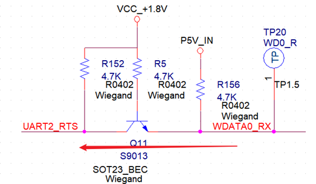

[toc]

---

# 1       产品概述

## 1.1    概述

本文档主要介绍CV1812H芯片方案的原理图设计及常见问题Debug方法。

 

 

# 2       原理图设计

## 2.1    芯片IO引脚耐压说明

主芯片 VDDIO_VIVO，VDDIO_SD1，VDDIO_EMMC，VDDIO_SD0 Domain 的IO Support 1.8V/3.3V 耐压。

其他IO接口都是1.8V耐压和level，电路设计时要特别注意其他元器件所支持的level以及耐压，防止level不匹配导致信号异常以及主芯片被损坏。

注意：

**IO的电压要注意和相应的Power Domain一致！**

 

## 2.2    电源设计要求

### 2.2.1  CORE/TPU电源设计

CORE与TPU电源为VDDC；

典型电压为0.9V，其正常开机初始化之后可由PWM0_BUCK动态调压电路控制，其电压值在0.9V±0.0XV（X的范围还在完善，目前X=0）；

 

**DCDC选型：**

更换其他型号时务必注意其DCDC的FB电压必须为0.6V！则调压电阻取值：串联电阻R3=FB下分压电阻R2的2倍；如果DCDC的FB不是0.6V，则调压电阻要重新计算请咨询CVITEK HW工程师；要求其DCDC输出能力不小于1.5A，选择开关频率1.0MHz以上、支持快速动态响应的DCDC。

图 2-1  VDDC/VDDC_TPU电源电路图

注意：R9,R10,C26要上件，预留后续VDDC动态调压范围能力; 

 

### 2.2.2  DDR电源设计

* CV1810H内置DDR2L*1，典型电压1.5V。*
* *CV1811H/CV1812H/CV1813H内置DDR3L*1，典型电压1.35V。
*  DDR采用独立的DCDC供电。
* 供电原理图如下，DCDC推荐选择1.0MHz以上开关频偏，1.0A输出能力。

图 2-3 DDR电源电路图

 

 

### 2.2.3  IO Power Domain设计

* VDDIO_RTC：是PTEST、PWR_VBAT_DET、PWR_ON、PWR_SEQ、PWR_WAKEUP、PWR_BUTTON、PWR_GPIO等的Power Domain。
*  VDD18A_AUDIO：是AUDIO的Power Domain。
* VDDIO18_1：是USB_ID、USB_VBUS_DET、USB_VBUS_EN、ADC、PWM0_BUCK等的Power Domain。
* VDDIO_VIVO：是VIVO的Power Domain。
* VDDIO_SD1：是SD1的Power Domain。
* VDDIO_EMMC：是IIC0、JTAG、UART0、EMMC等的Power Domain。
* VDDIO_SD0：是SD0的Power Domain。
* VDD18A_MIPI：是MIPI TX、MIPI RX等的Power Domain。

 

各IO电源的分支连接关系请参考公板原理图。各电源的电流需求参考下文中“电流参考表”节的内如，务必确保DCDC、LDO、电感、电容等的选型既要满足有效值（MAX）也要满足峰值（OCP）要求。

 

注意：

VDDIO_VIVO、VDDIO_EMMC、VDDIO_SD1、VDDIO_SD0可以选择接1.8V或3.3V，相应PowerDomain PIN也变成对应的电平level。

 

### 2.2.4  eMMC与SDIO0 Power Domain设计

* VDDIO_EMMC：是eMMC 的Power Domain，VDDIO_EMMC (Pad M3)电源的选择如下。

表 2-1 eMMC Domain设定

| **VDDIO_EMMC** | **eMMC**版本  |
| -------------- | ------------- |
| 3.3V           | 4.4版本及以下 |
| 1.8V           | 4.5版本及以上 |

 

* VDDIO_SD0：是SDIO0的Power Domain，主芯片SDIO0内置3.3V level与1.8V level的切换（根据SD CARD的握手协议动态切换level），电源为VIN3V（PAD_H3），输出VOUT（PAD_G4）。

所以在有SD CARD情况下，需将VDDIO_SD0接到VOUT上。

 

图 2-4 SDIO0 Power domian电路图

   

**注意：**

如果不需要SD CARD功能，SDIO0用做其它功能，则VIN3V（PAD_H3）与VOUT（PAD_G4）可以NC悬空，VDDIO_SD0直连3.3V或者1.8V（根据所需GPIO Level选择）。

 

### 2.2.5  RTC电源设计

CV1810H/CV1811H/CV1812H/CV1813H芯片内置RTC Only功能,功耗5uA，根据电池容量和需求待机时间 来选择是否使用内置RTC 或 外置RTC芯片。

 

只有做锂电池类产品时可能会做待机唤醒等功能，才需要把RTC与POR等独立供电！

无需待机唤醒等功能的产品，RTC Power Domain无需独立供电，与通用电源Power Domain合在一起。

 

采用大电池给系统和RTC模块供电，则给VDDIO_RTC供电的LDO一定要选用超低静态电流的型号，Low IQ 在2uA以下可增加电池的给系统供电的使用时间。

 

图 2-5 内部RTC电源电路图

 

图 2-5 外部RTC电源电路图

### 2.2.6  电源管理与低功耗模式

#### 2.2.6.1 介绍

主芯片的电源管理模块可以对非常电区的供电模块进行使能控制，接收按键信号、上升沿信号进行上下电控制以及接收外设输出的唤醒信号，从而实现产品的待机和唤醒功能。

#### 2.2.6.2 RTC only

此时，系统处于最低功耗状态，主芯片功耗约在5uA左右。在外接法拉电容给VDDBKUP（PAD_N14）供电的前提下，不插电或者移除电池的情况下，仍可以工作十多天以上。可通过VDDIO_RTC上电，POWER_ON，PWR_BUTTON来开机。

#### 2.2.6.3 MCU only – Power down 

此时，芯片的耗电约在150uA左右。除VDDIO_RTC（PAD_M10）和VDDBKUP（PAD_N14）保持供电，其余电压均已断电(PWR_SEQ1, PWR_SEQ2, PWR_SEQ3 均为0) ，可通过POWER_ON或PWR_BUTTON来开机。

**注意：**

VDDC_RTC （PAD_L11）只需要一个滤波电容，不需要接到外部电源。

VDDIO_RTC 第一次上电会自动由 Power down mode 开机至 Active mode

 

#### 2.2.6.4 MCU only – Sleep mode (Suspend to dram) 

与 Power down mode 类似. 但 PWR_SEQ3 仍为 1. 且唤醒源会多增加 PWR_WAKUP0, PWR_WAKE1 及其他 VDDIO_RTC domain的IO。 

若希望 Suspend to dram 以达到快速开机. 则将 VDDQ (及其他想留着的元件电源) 供电开关挂在 SEQ3 上.

#### 2.2.6.5 Active

在正常工作模式下，主芯片各电源都正常工作，VDDC Domain则能够配合其工作频率做电压调整。

### 2.2.7   Power时序设计

芯片Power可以分成如下几种，同一Domain内Power同时上下电，不同Domain则按下列几种应用场景分开上下电。

RTC Domain：

VDDIO_RTC (1.8V) 

Core power Domain：

VDDC

VDD09A_EPHY (Analog)

VDD09A_MIPI (Analog)

1.8V IO Domain：

VDDIO18A (Analog)

VDDIO18_1

VDDIO18A_PLL_N

VDD18A_AUD

VDD18A_EPHY

VDD18A_MIPI

VDD18A_USB

18OD33 IO Domain：看输入电压决定是1.8V or 3.3V Domain

VDDIO_EMMC

VDDIO_SD0

VDDIO_SD1

VDDIO_VIVO

3.3V Domain：

VDD33A_EPHY

VCC33A_ USB

VIN3V

DDR IO Domain：

VDDQ

VDDQ_DRAM

 

主芯片的上下电时序一般设计要求，0.9V和1.8V可以同时上电，或者先0.9V后1.8V，但3.3V必须要等1.8V已建立才能上电。下电顺序与上电顺序相反。外设元器件一般要求不能早于其所连接的主芯片IO Power Domain上电，目的是防止电压倒灌导致开机异常或者主芯片被损坏。

 

当用电池给系统供电时，要按照公板参考电路设计Power 时序，不能轻易改动，利用主芯片的PWR_SEQ1，PWR_SEQ2，PWR_SEQ3，这3个管脚来控制时序。

开机时序SEQ1 > SEQ2 > SEQ3；

关机时序SEQ3 < SEQ2 < SEQ1；

 

电池时，支持低功耗休眠模式，睡眠时，SEQ1、SEQ2会关电，SEQ3继续供电以支持系统需要被唤醒，例如WIFI module、Dram。

PWR_VBAT_DET用作主电源状态的监测，电压偏低时软件会收到中断（例如停止读写Flash防止系统损坏），电压再往下时RTC模块就会启动下电程序。

 

应用场景（分2种大类再分3小类共6种情况）：

* 插电应用 （无电池无内置RTC功能）的系统

RTC Domain：直连SEQ1的Power，VDDIO_RTC，VDDBKUP接VCC_+1.8V

PWR_ON：接VCC_+1.8V上电即开机

SEQ1：core power Domain + 1.8V IO Domain + VDDQ（采用HW SEQ，SEQ1（PAD_P12）NC即可）

SEQ2：3.3V Domain

SEQ3：VDDQ（采用HW SEQ，SEQ3（PAD_P10）NC即可）

 

* 插电应用 （有内置RTC功能）的系统

RTC Domain：直连SEQ1的Power，VDDIO_RTC接VCC_+1.8V，

VDDBKUP接电池供电的240K电阻上

PWR_ON：接VCC_+1.8V上电即开机

SEQ1：core power Domain + 1.8V IO Domain （采用HW SEQ，SEQ1（PAD_P20）NC即可）

SEQ2：3.3V Domain

SEQ3：VDDQ（采用HW SEQ，SEQ3（PAD_P10）NC即可）

 

 

* 电池应用 （有内置RTC功能）的系统

RTC Domain：VDDIO_RTC，VDDBKUP接在电池供电的LDO 上

PWR_ON：Float，用PWR_BUTTON1作为开关机按键

SEQ1：Core power Domain + 1.8V IO Domain

SEQ2：3.3V Domain

SEQ3：VDDQ Domain 

 

### 2.2.8  Power Ripple&Noise要求标准与测量方法

#### 2.2.8.1  标准要求

所有电压幅度都要求±3%以内，3.3V及以下电源无特殊情况一般都要求在芯片端的Power Ripple&Noise**控制在±100mV**以内。

#### 2.2.8.2  测试说明

Ripple&Noise对于分析电源质量、系统稳定性、DCDC选型、电感电容选型、部分问题bug分析等具有非常重要的意义，准确测量以需求提供数据支撑。 

#### 2.2.8.3  示波器探头说明

探头是有等效电容的，在某个程度上会加载到被测器件上。探头都是“小偷”。它们会使被测器件产生损耗，要尽量用示波器原配的高质量探头来测试。

#### 2.2.8.4  测试方法

1）选择电压 mode：按示波器通道菜单，再按伏特，再选“电压”档；

2）设置示波器参数：设置耦合模式“直流DC”，“阻抗1M”；Measures选择“直流有效值N个周期”、“最大电平”；选择“统计信息”，然后选择“复位统计”；选择“时基模式”，“100us/div”；波形swing幅度占整个示波器显示区域的2/3。默认的示波器阻抗是1MΩ，如果阻抗误设为50Ω，信号会小一半；选择带宽限制仅仅测量到Ripple部分，Noise部分测量不能用“带宽限制”。

3）参数说明：

A.直流有效值N个周期的平均值：衡量Ripple&Noise的有效值参数，一般要环温60度，测thermal（最大负载）时测至少2分钟的统计值为准，此为最大负载时Ripple&Noise有效值。

B.最大电平的最大值：从开始测量到目前为止整个周期内的最大值，如果没有干扰的话此值即Ripple@Noise上限。

C.峰峰值：开始测量到目前为止整个周期内的Ripple波形swing的峰峰值。

我们一般记录有效值N个周期的平均值和峰峰值。峰峰值最大值用于电感选型反向评估，因为电感的感量计算公式L=Vout*(1-Vout/Vin_max)/Fsw*Iload_max*30% （uH），Iload_Max*30%就是这个峰峰值。

#### 2.2.8.5  测量位置要求

量测 Ripple时需使用短地，并将接地点焊到量测点旁边的地，量测点需要 

在IC正下方，并将探头上的GND线拔除。

### 2.2.9   DCDC与LDO设计

#### 2.2.9.1  DCDC选型

1）DC-DC额定输入电压Vin_rating的选择

通常DC-DC厂家都有不同输入电压范围的产品可供选择，宽范围输入的价格要比窄范围输入的高，要根据实际输入电压Vin来选择适合的DC-DC。

设计要求：Vin*1.2<Vin_rating<Vin*2

 

2）DC-DC输出电流的评估

需要保证60°环温下DC-DC持续输出有效电流Imax(60)大于等于负载的最大有效电流值Iload。这里要注意DCDC实际规格书上面写的通常为25°下的最大电流值，我们要根据规格书中的热阻等参数算出60°环温下该DC-DC持续输出有效电流，可以根据表格“DC-DC Imax(60°)计算方法”算出。

设计要求：Iload≤Imax(60°)<Iload+0.5A

3）DC-DC OCP参数的选择

OCP保护点要大于负载的最大峰值电流Iload_peak。正常工作不允许OCP被触发，否则输出会有跌落。

设计要求：OCP>Iload_peak

#### 2.2.9.2  效率与工作模式

需要从两个方面考虑效率：

1）要选择轻载高效的DC-DC，COT/ACOT架构优先；

2）保证响应速度的前提下尽量选择低压差转换 ，提高DC-DC转换效率。

#### 2.2.9.3  电感的选型

1）温升电流的选择

温升电流： 业界大部分厂家的定义是电感产品自我温升温度不超过40度时的电流，用Irms（或者Idc2）表示。

设计要求：Iload<Irms<Iload*1.2

 

2）饱和电流的选择

饱和电流：基于电感值的变化率的额定电流，用Isat（或者Idc1）表示。它是以电感值的下降程度为指标的额定电流，当负载电流超出电感的饱和电流时，可能会由于纹波电流增加而导致IC控制不稳。设计要求：Iload_peak<Isat<Iload_peak*1.2

 

3）电感值的计算方法

电感计算公式： L=Vout*(1-Vout/Vin_max)/Fsw*Iload_max*30%

开关电源中储能电感作为开关电源的一个关键器件，对电源性能的好坏有重要作用，在保证产品性能的前提下，减小开关电源电感的尺寸（所占据的PCB面积和高度），这需要在电路性能和电感参数间进行折中。所以，可以通过选用大电感，低ESR大容量输出电容的方法减小输出纹波电压。直流电阻Rdc：尽可能选择Rdc小的电感。

#### 2.2.9.4  LDO设计

ADJ可调的LDO，分压电阻采用百欧、K欧（<5.6K)，保证LDO正常工作，且低功耗。当LDO插入功耗大于0.8W时，需要增加功率电阻。普通LDO输出压差保证有1.3V以上，专用LDO最小输入、输出压差确认满足规格书要求。

### 2.2.10  Power MOS管开关设计

增加缓起电路，避免电源在导通瞬间产生毛刺损坏MOS管或者影响其它电路工作。MOS管一般要用三极管控制，直接用GPIO控制请务必确认相关参数是否能满足MOS管要求。

图 2-8 MOS管开关电路

 

 

注意：

1、GPIO High、Low对应到MOS的开关状态，如需反向，则加2级三极管；

2、GPIO 初始状态（HW 默认状态，SW可控之前）要确保MOS不会导通。

 

### 2.2.11  主芯片端电容要求

主芯片端PCB layout上CPU封装下bottom层的电容，一个都不能删除，也不能把容值改小。主芯片端的电容都要用X5R or X7R的规格，不能采用Y5V等。 X5R、X7R、Y5V、Z5U之间的区别主要在于温度范围和容值随温度的变化特性上。X5R正常工作温度范围-55℃~+85℃之间，对应的容值变化范围±15%，Y5V则温度范围-30℃~+85℃，对应的容值变化范围±22%。

要特别注意直流/交流电压与容值特性曲线，一般来说电压越高，容值越低，如下村田22uF_6.3V，X5R电容，在5V时只有8uF的静电容量了。

图 2-6 直流电压与容值&交流电压与容值的特性

 

 

注意：

为了控制成本，电容的数量和容值要慎重使用，但cost down时一定要慎重计算、严格测试Power Ripple&Noise、严格老化压测！

 

## 2.3    最小系统设计要求

### 2.3.1  Clock电路

主芯片需要一个25MHz外接时钟：

1）频偏范围 < ±30ppm；

2）ESR < 50Ω；

3）负载电容取值=（晶振规格电容*2---5）倍pF，要跟晶振规格电容匹配；材质建议采用NPO；

4）激励功率 < 200uW；

5）建议选贴片晶振，其GND 管脚与单板地充分连接，增强抗ESD 能力。

图 2-9 系统晶振电路图

 

 

主芯片内置RTC功能与32.768K晶体，当需要用内置RTC功能时为了增加精度建议外置时钟32.768K晶体给主芯片。

 

 

注意：

1、XTAL_XIN_XI、XTAL_XIN_XO串联1M电阻不可省。

2、负载电容要根据不同型号的晶体、波形和频偏测试结果调整到最佳状态。

3、系统、RTC 使用有源晶体时，从管脚XIN 输入，XOUT 悬空。

 

### 2.3.2  复位电路

主芯片有支持2种复位，PWR_RSTN（PAD_R11）和RSTN（PAD_H12）。

PWR_RSTN 是控制整个芯片硬件复位,系统电源会重新上电。

RSTN 控制除RTC Domain外的硬件复位，系统电源不会重新上电。

 

小系统相关的外设（例如：存放boot的eMMC器件）必须先于或同时与主芯片一起释放复位信号，否则可能会出现无法启动等异常情况。主芯片RESET目前参考设计直接接电源VCC_+1.8V。

 

 

### 2.3.3  硬件初始化系统配置电路

主芯片上电初始化的过程中，需要根据配置管脚的电平状态来确定各部分的工作模式。硬件配置信号描述如下表所示：

表 2-7 Boot启动方式配置说明表

| 配置功能         | Pad Name        | 说明     |      |
| ---------------- | --------------- | -------- | ---- |
| EMMC_DAT0（P2）  | EMMC_DAT3（P1） | 外设     |      |
| Boot    启动方式 | X               | 1        | eMMC |
| 1                | 0               | SPI NOR  |      |
| 0                | 0               | SPI NAND |      |

 

 

注意：

1、配置Pad 务必参考EVB设置，只有这些Pad 具有此功能；

2、配置PIN脚必须上拉到最早上电的电源。

3、如果配置PIN悬空，该PIN状态会由芯片内部决定，所以会是PU为高。

 

### 2.3.4  JTAG电路

JTAG 是VDDIO_EMMC Power Domain 要注意使用电压。可以不用connector，但至少引脚要拉出来或者保留测试点。

图 2-11 JTAG模块电路图

 

### 2.3.5  DDR电路设计

主芯片内置一颗DDR3L/DDR2L，16bit位宽。VDDQ ,VDDQ_DDRAM 

电压DDR3L=1.35V,DDR2L=1.5V。

### 2.3.6  Flash电路

FLASH 控制器支持SPI NOR FLASH、SPI NAND FLASH 和eMMC。

#### 2.3.6.1  SPI FLASH

外接SPI FLASH时，参考电路图如下，SPINOR_WP_X 需要下拉4.7KΩ；SPINOR_HOLD_X 和SPINOR_CS_X 需要上拉4.7KΩ。

图 2-12 SPI FLASH电路图

**注意**：

推荐选用带复位功能的SPI FLASH器件，以避免出现主芯片Watch Dog生效复位时，FLASH无法同步复位，从而无法正常重启。

 

#### 2.3.6.2  eMMC

外接eMMC时，参考电路图如下，eMMC_CMD需要上拉10K；eMMC_CLK串联33R不能删除，预留下地电容不能删除用于EMI问题；eMMC_VDDI的下地电容要用2.2uF不能减小；主芯片只支持4 bit位宽。

图 2-13 eMMC电路图

注意：

eMMC的VCCQ也就是VDDIO Power level一定要与eMMC SPEC对应，比如有些eMMC 只能3.3V IO，则eMMC Power Domain也是3.3V。

 

## 2.4    外围接口设计建议

### 2.4.1   EPHY-RJ45/RMII/RGMII接口

#### 2.4.1.1 EPHY-RJ45

主芯片内置百兆PHY，可直连网口，主芯片与网络变压器之间的网络差分线要串联5.1R以下电阻用于增强抗网络浪涌能力，以及降低网络EMI，必要时增加ESD器件。不推荐网络差分线使用RC电路来降低EMI问题，因为会导致网络差分信号眼图很差。

EPHY接口不用时，可以用来做GPIO等其它Function，注意电平是1.8V Level。

 

### 2.4.2  视频接口

CV1810H/CV1811H/CV1812H/CV1813H支持双路Sensor接口；要特别注意Sensor配置相关接口电平只支持1.8V。为了确保视频信号高质量，一定要选择公板已验证的sensor型号。

VO接口输出给Panel时要注意Panel供电的时序不能比主芯片的IO Domain更早。输出BT.1120信号时，高8bit是Y（亮度）信号，低8bit是C（色度）信号，注意不要接错误。

MIPI TX、MIPI RX差分信号接口顺序，SOC的MIPI 0,1,2,3,4与Sensor的MIPI 0,1,2,3,CLK在软体上可自行定义，详见《主芯片 Sensor输入接口与VO输出接口的电平场景详细说明》，SCH与PCB设计确保layout顺线且没有交叉。

 

**注意：**

当有两组Sensor接口时，Sensor0必须从MIPI_RX0,MIPI_RX1,MIPI_RX2上出，Sensor1从MIPI_RX3,MIPI_RX4,MIPI_RX5上出。这两路Sensor之间的线序不能交换。

 

 

### 2.4.3  音频接口

AUD_AVREF(Pad_G1)引脚上的滤波电容分别需要2颗，4.7uF + 0.1uF。

音频输入信号上的隔直电容靠近主芯片放置，电容容值推荐选择2.2uF。AUD_AOUTL与AUD_AOUTR的输出先串联电容2.2uF。

I2S接口的MCLK需在芯片近端串联33Ω电阻，用以获取更好的信号质量。

如果需要较好的音频质量或推动耳机，建议在音频输出管脚AC_OUTL和AC_OUTR的外围增加音频放大器。

**注意：**

为避免模数GND串扰，AUD_AVREF(Pad_G1)电容的AGND、VSS18A_AUD(Pad_G3/H2/J2/J3)电容的AGND，这2个Audio GDN与系统GND分开，通过0R电阻相连。

 

### 2.4.4  IIC接口

I2C0挂通用的外设；I2C3用于配置sensor0；I2C2用于配置sensor1。

I2C是OD门，需要外接上拉电阻，根据总线负载数量和走线的长度（包括外接线材等）的不同，选择不同阻值的电阻，I2C的上拉电阻建议在1K到4.7K之间，slave越多，走线越长，上拉电阻值越小。

I2C总线上各器件地址不要冲突，把address直接标注在SCH中。为确保软体设计的方便性，通用slave的I2C分配参考公板设计。

### 2.4.5  SDIO电路

主芯片有2路SDIO接口，SDIO0 support 1.8V/3.3V level，SDIO0公板用做SDXC存储卡接口。SDIO1 support 1.8V/3.3V level，此路公板做了WiFi SDIO接口，不用可以做GPIO。

 

**注意：**

SD0_PWR_EN（Pad_N1）与SD0_CD（Pad_K2）是在VDDIO_EMMC POWER Domain上。注意上拉电阻电平。

 

### 2.4.6  SD

对于SD卡座放在子板，通过长排线和主板连接的产品。

SD0_CD Pin因长排线容易受到干扰，导致SD误触发从而报错问题。需要在SD0_CD 线路上预留RC电路。

SD卡座和主芯片在同一块板上的产品可不需要预留。

 

### 2.4.7  USB

USB口支持Host、Device Mode。

当用USB口烧录固件时，则需要USB_VBUS_DET(Pad_A13) 通过电阻分压 5V_USB_IN做检测,为高才能进入SOC为Device模式。

当USB口不做烧录用，USB_VBUS_DET(Pad_A13)可以直接接地，此时USB为Host模式。

USB_ID 为烧录等待时间设置引脚，Floating/High 1Sec，Low 10 Sec；

USB信号线要串联不超过5.1R的电阻用于EMI问题，如果是板外接USB Device，则信号线上要加ESD 保护器件，寄生电容要求小于5 pF。

Device如果接移动硬盘等较大负载电流的设备，靠近座子端要加220uF以上电解电容，以防止插入瞬间电压跌落把系统供电拉低或者插入无法识别。

 

**注意：**

USB Hub选型时一定要选择与可能用到的Device的USB工作模式相兼容的，部分Hub只support USB2.0，部分Hub可以都support。

 

### 2.4.8  ADC

主芯片有5路ADC，12bit采样率。

其中3路在VDDIO18_1 Domain上，做GPIO时为1.8V level；详见《主芯片_PINOUT_CN》中2.功能信号表。

另外2路在VDDIO_RTC Domain

PWR_VBAT_DET （PAD_P11），专门用作系统掉电检测，不能用作其它功能。

PWR_GPIO1 （PAD_N13），用作电池电量检测。

 

注意：

ADC的最大采样输入电压为1.5V。

 

### 2.4.9  PWM

PWM0_BUCK固定做VDDC电压调节；

其它PWM可从PIN 复用功能上切出。

 

### 2.4.10 UART

主芯片有5路UART。UART0固定用作系统调试。

PIN MUX的UART要对应 HW PIN MUX table。

注意：

上拉电阻电源要与相应UART 的POWER Domain对应。

 

### 2.4.11 GPIO

主芯片的GPIO Level及耐压与其所在的Power Domain对应，要确保其上拉和外设level与之对应和匹配。

要确保上下拉、串联电阻值符合如下level要求：

1）VIH、VIL 通常是 70%、30% 之VDDIO。

2）VOH、VOL通常是 80%、20% 之VDDIO。

注意：

当SOC与MCU等连接时（SOC掉电而外设不掉电的应用场景），在《主芯片_PINOUT_CN》文件中 管脚默认状态页，只有标识有**Fail-safe** 的Pin不会漏电，可以在掉电下有电。

### 2.4.12 Updata Key

主芯片的PAD_B13专门用作升级按键。芯片上电检测到此键按下（低电平），才会进入SD/USB升级。

 

 

 

### 2.4.13 HDMI电路说明

HDMI输出接口需要外接MIPI转HDMI转接芯片，板子上使用的是LT9611。LT9611是一款高性能MIPI DSI/CSI转HDMI接口芯片，常应用于STB、DVD等产品。

与芯片相连的关键信号：RST、IIC、MIPI输入等，外接HDMI接口输出，参考设计如下：

 

### 2.4.14 其他常用电路说明

#### 2.4.14.1    Level shift电路

当主芯片和其他芯片电平level不匹配时，就需要用到电平level shift 电路。如下电路高速NMOS管的S级接低电压level，D级接高电压level，可实现电平转换通信。比较适用于I2C、UART等低速信号，SPI、SDIO、USB等要用专用的高速信号电平转换芯片。

图 2-15 Level shift电路图

 

如果是单向低速通信的电平转换，可以使用如下电路做level shift，注意数据传输方向如红色键头所示。

 

 

 

注意：

Level电路，如果电压是1.8V，需要特别注意NMOS的选型规格Vth开启电压1.8V是否满足。

#### 2.4.14.2    韦根接口电路

韦根接口选取请参照《主芯片_PINOUT_CN》中2.功能信号表。韦根接口对接板外设备时，要严格注意浪涌和ESD的防护等级，增加相关器件。

图 2-15 韦根接口电路图

 

#### 2.4.14.3    RS232/RS485电路

此电路设计要注意3点：

1）要选择好合适的收发芯片，其比特率与IO level要与需求相对应；

2）要考虑是否要做完全隔离的DC电源给初级侧供电以增加抗浪涌能力；

3）在接口处要选用合适的防浪涌和ESD器件。

 

# 3       调试常见问题Debug方法

## 3.1    Power 对地短路

单板调试或批量生产时，如果发现某个电源网络对地短路或者阻抗偏低（一般焊接不良都是短路，阻抗偏低的很少），需要根据Power tree一一断开相关节点，深入排查短路原因，改进设计或者生产工艺。

## 3.2    供电电压不正确

如果无对地短路，并且对地阻抗都OK，很少有供电电压偏高或者偏低的，如果出现一般都是DC/LDO焊接不良或者DC/LDO反馈环路电阻损坏造成，先观察DC/LDO相关，然后测量反馈电阻，再更换DC/LDO。

## 3.3    eMMC无法烧录

1）最小系统VDDC和VDDQ等相关的电压都正常,HW Config配置确认OK；

2）然后检查串口、USB口的阻抗是否正常；

3）当出现USB（连接电脑的那个口）在Windows命令窗口中识别不到时，优先检查控制USB信号路径切换芯片（例如公板的TMUX154ERSWR）的控制状态是否正确，然后检查USB_ID是否为high；

4）再看log显示到哪里，如下图如果卡在DDR start done，则说明烧录时调用DDR fail，因此优先怀疑DDR焊接不良，可以加焊后再试，不行了更换DDR，再之后CPU。

 

 

## 3.4    无法启动和无法读取eMMC数据

出现无法启动，log卡在NS-ASSERT: drivers/emmc/emmc.c <101>，则是CPU读不到eMMC的数据，此种情况下，测量CPU与eMMC之间串联的电阻对地阻抗，优先加焊CPU和eMMC，先考虑更换CPU后再更换eMMC。

## 3.5    DDR init Fail

一般来说，当在初始log中位置出现Ctrl bist fail或者DDR init fail，则检查DDR电源电压纹波和ZQ电阻，然后再检查芯片焊接是否正常。

 

## 3.6    上电无打印

主板上电即使空Flash还未烧录也会有几行log打印信息（如下所示）。

 

如果上电没有打印信息，请检查如下：

1）确认各路电压供电是否正常？

2）确认芯片是否焊接OK，重点检查芯片EPAD与大地是否有焊接良好?

3）确认PWR_VBAT_DET 电平是否高于1.0V?

4）确认UART0_TX电平是否为高？

5）确认25M晶体是否起振？

6）确认UART部分线路是否OK?

## 3.7    烧录程序跑不起来

查看过程的打印Log并检查如下：

1）确认Flash型号是否公板已点过支持的，程序是否烧录完整？

2）确认是否DDR报错，软件错误，比如芯片是DDR2用成DDR3的软件？

3）确认是否HW Boot Config错误？

NAND Flash Boot：

 

Nor Flash Boot：

 

 

 